<p align="center">
  
</p>

<p align="center">
  <b>Ihre Dokumente, Medien und Ihr Quellcode werden zu einem Graphen, dem Sie Fragen stellen können, und jede Antwort zeigt, woher sie stammt. Nichts verlässt Ihren Rechner.</b>
</p>

<p align="center">
  Ein lokal zuerst arbeitender Wissensgraph, der vollständig offline läuft und mit jedem KI-Modell arbeitet, oder ganz ohne.
</p>

> [!IMPORTANT]
> Alles läuft auf Ihrem eigenen Rechner. Es gibt keinen Cloud-Aufruf, keine Telemetrie, und außer Python wird nichts benötigt. Wo dieses Dokument eine Genauigkeitszahl nennt, stammt diese Zahl aus einer Messung, die Sie selbst erneut ausführen können.

<div align="center">


</div>

<p align="center">
  <a href="README.md">English</a> &nbsp;&middot;&nbsp;
  <a href="README.zh-CN.md">简体中文 (Vereinfachtes Chinesisch)</a> &nbsp;&middot;&nbsp;
  <a href="README.es.md">Español</a> &nbsp;&middot;&nbsp;
  <a href="README.fr.md">Français</a> &nbsp;&middot;&nbsp;
  <b>Deutsch</b>
</p>

<p align="center">
  <a href="#hier-anfangen">Hier anfangen</a> &nbsp;&middot;&nbsp;
  <a href="#überblick">Überblick</a> &nbsp;&middot;&nbsp;
  <a href="#wie-es-funktioniert">Wie es funktioniert</a> &nbsp;&middot;&nbsp;
  <a href="#mnemosyne-und-ariadne">Algorithmen</a> &nbsp;&middot;&nbsp;
  <a href="#fähigkeiten">Fähigkeiten</a> &nbsp;&middot;&nbsp;
  <a href="#installation">Installation</a> &nbsp;&middot;&nbsp;
  <a href="#einen-ki-assistenten-anbinden">Assistenten</a> &nbsp;&middot;&nbsp;
  <a href="#kontinuierliche-integration">CI</a> &nbsp;&middot;&nbsp;
  <a href="#sicherheit">Sicherheit</a> &nbsp;&middot;&nbsp;
  <a href="#messwerte">Messwerte</a> &nbsp;&middot;&nbsp;
  <a href="#anwendungsfälle">Anwendungsfälle</a> &nbsp;&middot;&nbsp;
  <a href="#häufige-fragen">Häufige Fragen</a> &nbsp;&middot;&nbsp;
  <a href="#lizenz">Lizenz</a>
</p>

> Dies ist eine Übersetzung von [`README.md`](README.md). Die englische Fassung ist maßgeblich. Alle Zahlen behalten dasselbe internationale Format wie das englische Original, mit dem Punkt als Dezimaltrennzeichen, damit sie wörtlich verglichen werden können; Befehle, Codeblöcke, Diagrammbeschriftungen, Pfade und Bezeichner bleiben auf Englisch, damit sie ausführbar bleiben und nicht abweichen.

---

## Hier anfangen

Drei Befehle führen von einem Klon zu einem Graphen, den Sie befragen können. Keiner davon berührt das Netz.

```bash
pip install -e .                 # no runtime dependencies
dkg init                         # create a project-local .dkg home
dkg ingest ./my-notes -r         # then: dkg search "a phrase you expect to find"
```

Sie wollen stattdessen ein Repository untersuchen? Führen Sie `pip install -e ".[code]"` aus, danach `dkg code-ingest ./my-repo` und `dkg code-hubs`.

**Ein gemessenes Ergebnis, so formuliert, wie es gemessen wurde.** Die typbewusste Auflösung hebt die Genauigkeit einer Änderungswirkungsabfrage von **0.1081 auf 1.0**, bei einer Trefferquote von unverändert **1.0**, gemessen an 42 Auswertungsknoten und 24 echten Kanten je Sprache, für Python und JavaScript. Der Standardweg hat echte Auswirkungen nie übersehen; er hat schlicht viel zu viel gemeldet. Das ist eine Messung an einer Stichprobe, erneut erzeugbar mit `python scripts/benchmark.py`, und keine Vorhersage über Ihr Repository.

---

## Überblick

D-Knowledge Graph ist ein gemeinsamer Wissensgraph-Kern mit zwei Analyseebenen darüber.

Der Kern ist ein SQLite-Speicher mit Volltextsuche, stabilen inhaltsbasierten Bezeichnern, einem manipulationssicheren Prüfprotokoll, der Herkunft jeder einzelnen Angabe und einer nur lesenden Anbindung für KI-Assistenten. Beide Ebenen teilen sich diese Grundlage und denselben Beleganspruch:

- Eine **Dokument- und Medienebene**, die Text, strukturierte Daten, Webinhalte, Bilder, Video und Audio liest, daraus Entitäten und Aussagen gewinnt und jede davon mit einer nachvollziehbaren Zuversicht bewertet.
- Eine **Quellcode-Ebene**, die 42 Sprachen und Container zu einem Codegraphen verarbeitet und strukturelle Fragen beantwortet: was eine Änderung berührt, wie die Ausführung verläuft, wo die Engstellen der Architektur liegen, welche Verbindungen überraschen und was ungetestet bleibt.

Die Suche führt Stichwortabgleich, Volltextsuche und einen hybriden Weg aus, der beide verschmilzt, dazu ein optionales lokales Einbettungsmodell und einen optionalen Neuordner, die beide aus bereits vorhandenen Dateien laden. Die Struktur des Graphen fassen zwei Detektoren zusammen, die dieses Projekt selbst geschrieben hat, [Mnemosyne und Ariadne](#mnemosyne-und-ariadne). Darum herum liegt eine Auslieferungsschicht: ein Repository-Beobachter, eine Offline-Graphansicht, Exporte in andere Werkzeuge und eine fertige GitHub Action.

### Das Problem, das es löst

| Problem | Die Antwort von D-Knowledge Graph |
|---|---|
| Wissenswerkzeuge senden Ihre Daten an einen Dienst, den Sie nicht prüfen können. | Alles läuft lokal gegen eine SQLite-Datei. Ausgehender Netzverkehr ist abgeschaltet, und jeder Weg nach außen verlangt einen ausdrücklichen Schalter. |
| Eine Antwort lässt sich nicht bis zu ihrer Quelle zurückverfolgen. | Jeder Datensatz trägt seine Herkunft, jede Aussage ihren Beleg und eine lesbare Zuversicht, und ein einziger Befehl prüft, dass das Prüfprotokoll unverändert ist. |
| Qualitätsaussagen sind Marketing statt Messung. | Suche, Gruppierung, Codeauflösung, Ausführungsverlauf und Mediengenauigkeit werden an dokumentierten Stichproben mit festem Startwert gemessen und in [`docs/BENCHMARKS.md`](docs/BENCHMARKS.md) veröffentlicht. |
| Die Wirkung einer Codeänderung zu prüfen verlangt einen gehosteten Dienst. | Die Codeebene arbeitet in Ihrem eigenen Prozess mit freizügigen Grammatiken und berechnet die Wirkung auf dem lokalen Graphen, ohne Konto und ohne Netz. |
| Ein Assistent, der Ihre Daten erreicht, kann von genau diesen Daten gesteuert werden. | Die Assistenten-Anbindung ist nur lesend, geholte Webinhalte gelten als Beleg und nie als Anweisung, und Sicherheitsentscheidungen laufen außerhalb des Modells. |

## Wie es funktioniert

Ein gemeinsamer Kern, zwei Ebenen. Der Kern kümmert sich um Speicherung, Suche, Belege und die Assistenten-Anbindung. Jede Ebene bringt eigene Leser mit und schreibt in denselben Graphen, sodass eine Frage von einem Dokument zu dem Code führen kann, den es beschreibt.

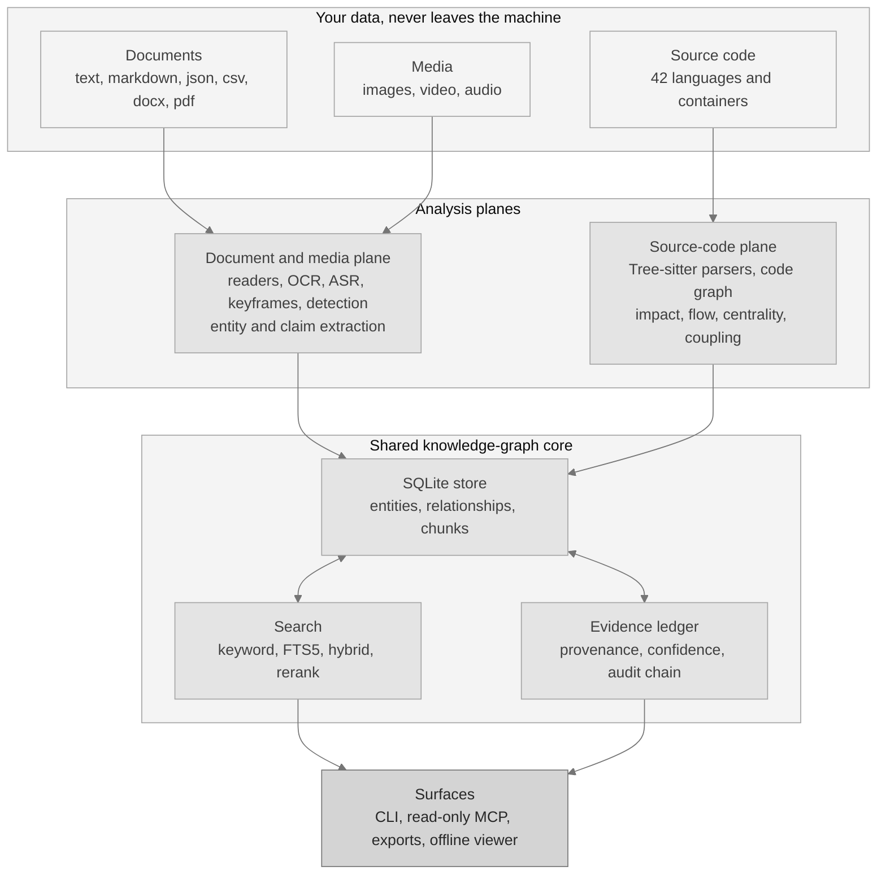

Die beiden Ebenen bleiben mit Absicht getrennt. Sie teilen sich die Grundlage und denselben Beleganspruch, aber nie die Leser der jeweils anderen.

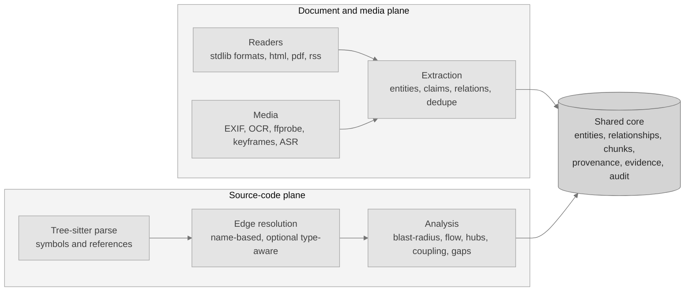

Eine Abfrage rät nie. Sie fächert sich über alle Suchwege auf, verschmilzt die Ergebnisse und liefert zu jedem Treffer den Beleg mit.

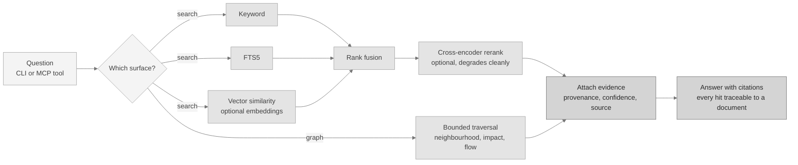

Die Suchqualität wird an 30 Dokumenten und 40 Abfragen gemessen. Stichworte allein erreichen MRR 0.9375 und nDCG@10 0.9473. Mit dem optionalen Einbettungsmodell und dem Neuordner erreichen beide 1.0, bei zusätzlichen 205.84 ms je Abfrage.

### Ein gemessener Vorher-Nachher-Vergleich

Die typbewusste Auflösung ist die deutlichste gemessene Verbesserung im Projekt und zugleich die beste Erklärung dafür, warum das Standardergebnis nur ein Hinweis ist. Ein reiner Namensabgleich löst einen Aufruf auf jede gleichnamige Funktion auf, sodass eine Änderungswirkungsabfrage viel zu viel markiert. Mit einem installierten Sprachserver löst dieselbe Abfrage auf genau ein Ziel auf.

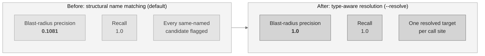

Gemessen an 42 Auswertungsknoten und 24 echten Kanten je Sprache, für Python und JavaScript. Go bleibt auf dem strukturellen Weg, weil hier kein Sprachserver dafür installiert ist. Die Trefferquote beträgt in beiden Fällen 1.0, der gesamte Gewinn liegt also in der Genauigkeit.

### Was eine Änderungswirkungsabfrage tatsächlich berechnet

Sie läuft den Codegraphen rückwärts ab: beim geänderten Symbol beginnen, den eingehenden Verbindungen folgen, an der Tiefengrenze anhalten. Sie meldet mit Absicht zu viel, weshalb das Ergebnis nur ein Hinweis ist und weshalb der Vergleich oben zählt.

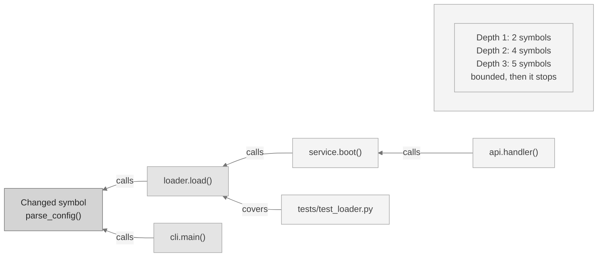

Die Symbolnamen oben zeigen die Form, sie berichten keine Messung.

### Nur das erneut lesen, was sich geändert hat

Ein zweiter Lauf verarbeitet das Repository nicht noch einmal. Der schrittweise Weg fragt die Versionsverwaltung, welche Dateien sich bewegt haben, liest nur diese neu ein und ersetzt allein deren Symbole und Verbindungen.

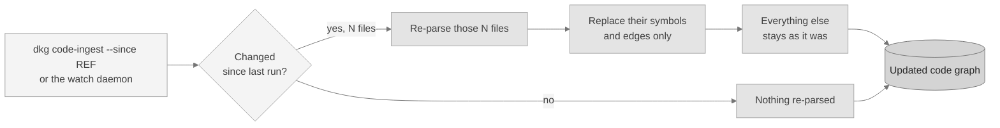

Dieser Weg ist durch Tests abgedeckt, für git wie für Subversion. Seine Geschwindigkeit wurde nie gestoppt, deshalb veröffentlicht dieses Projekt dazu keine Zeitangabe.

### Nach allem fragen, oder nur nach dem Teil, der Ihre Frage beantwortet

Der Weg über den Graphen beantwortet eine strukturelle Frage mit den Knoten, die sie beantworten, plus den Dateien, die diese Knoten nennen. An einer Stichprobe aus 38 Python-Dateien mit 12,620 geschätzten Token, 289 Symbolen und 745 Verbindungen kosten die beiden Wege dies:

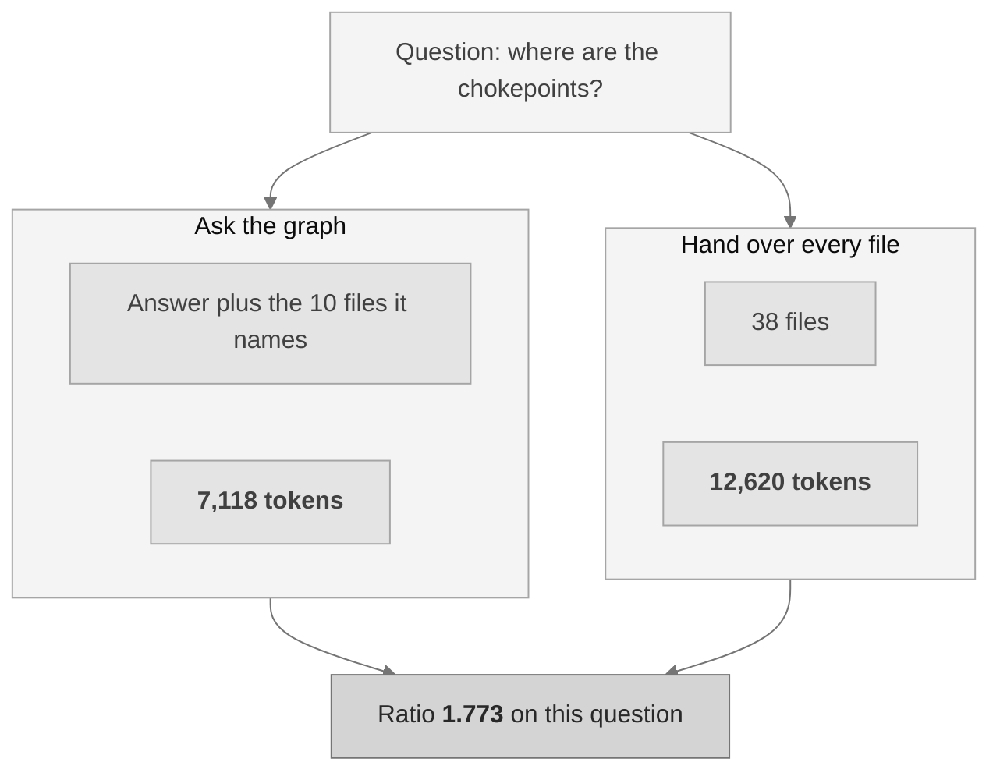

Über die fünf Fragen an dieser Stichprobe liegt das mittlere Verhältnis bei 1.4232, in einer Spanne von 0.6675 bis 1.773. Ein Verhältnis unter 1.0 bedeutet, dass der Weg über den Graphen mehr gekostet hat als das schlichte Übergeben aller Dateien, was genau dann geschieht, wenn die Antwort auf eine Frage das ganze Repository nennt.

Die Abhängigkeit von der Größe ist gemessen und nicht angenommen: bei 13 Dateien liegt das mittlere Verhältnis bei 0.5838, bei 23 Dateien bei 0.9321 und bei 38 Dateien bei 1.4232. **Ein Repository, das klein genug für ein Kontextfenster ist, braucht keinen Graphen, um Token zu sparen.**

## Mnemosyne und Ariadne

Ein Graph von echter Größe ist zu groß zum Lesen. Zwei Detektoren, beide für dieses Projekt geschrieben, machen daraus eine Handvoll Gruppen, mit denen sich wirklich arbeiten lässt. Beide laufen standardmäßig, und die Plattform liefert denjenigen zurück, der in der Messung höher abschneidet.

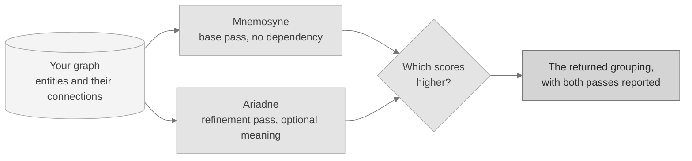

Beide optimieren die Modularität, das etablierte und veröffentlichte Maß dafür, um wie viel besser eine Gruppierung ist als das, was der Zufall hervorbrächte. Die Modularität ist keine Erfindung dieses Projekts und wird nicht als solche dargestellt. Die beiden Detektoren schon.

### Mnemosyne, der Basisdetektor

**Was er tut.** Mnemosyne liest nichts als die Verbindungen und findet die darin verborgenen Gruppen. Er beginnt mit jeder Entität für sich, verschiebt jede in diejenige Nachbargruppe, die den Wert am stärksten verbessert, behandelt dann jede Gruppe als eine einzige Entität und wiederholt das Ganze auf dem kleineren Graphen. Aus kleinen Häufungen werden Themen, aus Themen Bereiche.

**Warum das hilft.** Er braucht kein Modell, keinen Download und keinen optionalen Bestandteil. Auf einer minimalen Installation macht er aus einer Wand von Verbindungen weiterhin eine lesbare Karte. Er ist zudem vollständig deterministisch: derselbe Graph erzeugt immer dieselbe Partition, Byte für Byte.

```bash
dkg community --detector mnemosyne
```

**Gemessen.** An einer Stichprobe aus 80 Entitäten in 16 bekannten Gruppen stellt er die Gruppierung exakt wieder her, Übereinstimmung **Rand 1.0**, bei einer Modularität von 0.846591 in 1.196 ms. An einer Stichprobe aus 40 Entitäten in 5 Themen, deren Verbindungen bewusst symmetrisch angelegt sind, erreicht er Rand 0.641, was das erwartete Ergebnis ist, wenn die Antwort nicht in der Verdrahtung steckt.

Vollständige Erklärung, Mathematik und Ergebnisse: [`docs/MNEMOSYNE.md`](docs/MNEMOSYNE.md).

### Ariadne, der Verfeinerungsdetektor

**Was er tut.** Ariadne nimmt denselben Graphen und behebt drei Dinge, die der Basisdurchgang nicht leisten kann. Er teilt jede Gruppe auf, die sich als zwei unverbundene Hälften entpuppt, sodass jede zurückgegebene Gruppe wirklich zusammenhängt. Er kann jede Verbindung danach gewichten, wie ähnlich sich ihre beiden Enden inhaltlich sind, sofern ein lokales Textmodell installiert ist. Und er kann seine Körnigkeit selbst wählen, indem er eine Reihe von Werten durchprobiert und den besten behält.

**Warum das hilft.** Zwei Häufungen können identisch verdrahtet sein und trotzdem von völlig verschiedenen Dingen handeln. Die Struktur allein kann sie nicht unterscheiden, Ariadne schon.

```bash
dkg community --detector ariadne
```

**Gemessen.** An der strukturellen Stichprobe stehen die beiden Detektoren **gleichauf bei Rand 1.0**: der Basisdurchgang war bereits exakt, und für die Verfeinerung blieb nichts zu beheben. An der semantischen Stichprobe liegt Ariadne vorn, **Rand 0.7641 gegenüber 0.641**, und findet 8 Gruppen gegenüber den tatsächlichen 5, wo der Basisdurchgang 4 findet.

Eine Einzelheit, die ehrlich benannt gehört. Ariadne erreicht an dieser semantischen Stichprobe eine geringere Modularität, 0.42 gegenüber 0.5, und da der Standardweg die höher bewertete Gruppierung zurückgibt, liefert er dort den Basisdurchgang. Die Auswahl erfolgt nach der Messung und nie nach Vorliebe, ein Gleichstand oder ein geringerer Wert behalten also das Basisergebnis bei. Wenn in Ihrem Graphen der Inhalt mehr zählt als die Verdrahtung, fordern Sie Ariadne mit dem Befehl oben direkt an.

Vollständige Erklärung, Mathematik und Ergebnisse: [`docs/ARIADNE.md`](docs/ARIADNE.md).

## Fähigkeiten

Sofern die letzte Spalte kein optionales Zusatzpaket nennt, läuft alles Folgende allein mit der Python-Standardbibliothek. Zusatzpakete sind freiwillig und werden mit `pip install -e ".[name]"` installiert.

| Fähigkeit | Was sie tut | Braucht |
|---|---|---|
| Graphspeicher | SQLite mit Volltextsuche, stabilen Bezeichnern, Herkunftsangabe und einem manipulationssicheren Prüfprotokoll. | Eingebaut |
| Extraktion | Entitäten, Aussagen und Beziehungen, ganz ohne Modell. | Eingebaut |
| Suche | Stichwort, Volltext und ein hybrider Weg, der meldet, welche Maschinen beigetragen haben. | Eingebaut |
| Lokale Einbettungen | Vektorähnlichkeit aus einem lokalen Modell, je Modell getrennt gespeichert, damit sich zwei Modelle nie vermischen. | `embeddings` |
| Neuordnung | Ein lokaler Neuordner über den Suchergebnissen. Tritt sauber zurück, wenn er fehlt. | `reranker` |
| Belege und Zuversicht | Belege je Aussage, eine lesbare Zuversicht und ein Widerspruchsprüfer. | Eingebaut |
| Gruppierung | [Mnemosyne und Ariadne](#mnemosyne-und-ariadne), beide standardmäßig aktiv. | Eingebaut |
| Assistenten-Anbindung | Eine nur lesende Werkzeugfläche für KI-Assistenten, dazu eine rein lokale HTTP-Möglichkeit. | Eingebaut |
| Graphanalyse | Knotenpunkte, Brücken, Engstellen, überraschende Verbindungen, Lücken, Prüffragen und Graphvergleiche. | Eingebaut |
| Editor-Einrichtung | Den Assistenteneintrag für einen Editor schreiben, mit Probelauf und sauberer Deinstallation. | Eingebaut |
| Agentenabläufe | Deterministische Agenten für Recherche, Prüfung, Widerspruch und Sicherheitsdurchsicht. | Eingebaut |
| Quellcode-Ebene | 42 Sprachen und Container, ein Codegraph, Änderungswirkung, Ausführungsverlauf und optionale typbewusste Auflösung. | `code`, `code-extended`, `code-full` |
| Bilderkennung | Lokale Bildbeschriftung ohne vorherige Beispiele. | `media-detect` |
| Medienanreicherung | Bilddekodierung und EXIF, OCR, Videometadaten, Schlüsselbilder und Sprachtranskription. | `media-image`, externe Werkzeuge |
| Auslieferung | Repository-Beobachter, Offline-Graphansicht, Exporte und eine GitHub Action. | Eingebaut; `watch` optional |
| Messwerte | Ein Befehl mit festem Startwert erzeugt jede gemessene Zahl neu. | Eingebaut |

Zu einigen dieser Zeilen gehört noch ein Satz.

**Der Widerspruchsprüfer** fasst Aussagen zum selben Gegenstand zusammen, auch wenn zwei Dokumente sie unterschiedlich formulieren, und prüft sie dann auf Konflikte bei Zahlen, Verneinungen und Gegenwörtern. Er ist ein lexikalischer Prüfer und kein schließendes Modell, seine Ausgabe ist daher ein Hinweis: gemessene Trefferquote 0.6667 und Genauigkeit 0.75.

**Die Auslieferungsschicht ist eingebaut, der Repository-Beobachter ebenfalls.** Der Dienst läuft von sich aus auf einem Abfragemechanismus aus der Standardbibliothek. Das optionale Zusatzpaket `watch` ersetzt diesen durch ereignisgesteuerte Beobachtung, die schneller reagiert und im Leerlauf weniger kostet. Nichts sonst in der Auslieferungsschicht braucht ein Zusatzpaket. Repositories verwalten Sie mit `dkg registry add <name> <path>`, den Beobachter starten Sie mit `dkg daemon`.

**Zu den Exporten gehört ein Obsidian-Tresor.** `dkg export --format obsidian --out ./vault` schreibt Ihren Graphen als Ordner verknüpfter Markdown-Notizen: eine Notiz je Entität, die Verbindungen als `[[wikilinks]]`. Öffnet man diesen Ordner in der Notizanwendung Obsidian, erscheint der Graph in Obsidians eigener Graphansicht. Obsidian ist ein Ziel, in das diese Plattform schreibt, und nichts, was sie ausführt oder benötigt. Die übrigen Formate sind `json`, `markdown`, `csv`, `graphml`, `dot`, `cypher`, `svg` und eine in sich geschlossene `html`-Ansicht.

### Unterstützte Eingaben

Diese Formate brauchen nichts außer der Python-Standardbibliothek:

| Eingebaute Eingabe | Formate |
|---|---|
| Text und Markdown | `.txt`, `.md`, `.markdown`, `.rst`, `.log` |
| Strukturierte Daten | `.json`, `.csv`, `.tsv` |
| Word-Dokumente | `.docx`, gelesen mit der Standardbibliothek und abgeschalteter Auflösung externer Entitäten |
| RSS und Atom | Feed-Auswertung mit dem XML-Parser der Standardbibliothek |

Diese werden zur Laufzeit erkannt. Fehlt das Zusatzpaket oder das externe Werkzeug, tritt die Eingabe mit einer klaren Begründung zurück, statt zu scheitern:

| Optionale Eingabe | Braucht |
|---|---|
| HTML | Zusatzpaket `html` |
| PDF | Zusatzpaket `pdf` |
| Webabruf | Zusatzpaket `web`, dazu ein ausdrückliches `--allow-network` |
| Bilder, EXIF, OCR | Zusatzpaket `media-image`, und tesseract für die OCR |
| Videometadaten, Schlüsselbilder, Szenen | externes ffprobe und ffmpeg |
| Sprachtranskription | ein lokales Modell, benannt über `DKG_ASR_MODEL` |
| Quellcode | Zusatzpaket `code` für den Anfang, siehe die Sprachliste unten |

### Sprachabdeckung

42 Sprachen und Container, in vier freiwilligen Stufen plus einer, die gar keine Stufe braucht, sodass eine minimale Installation minimal bleibt. Alle mitgelieferten Grammatiken sind freizügig lizenziert, und keine davon ist in dieses Repository kopiert.

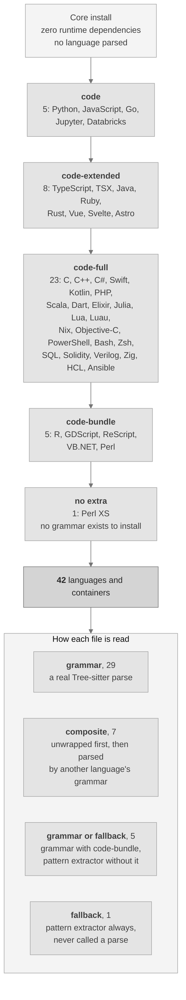

Führen Sie `dkg code-languages` aus, um die tatsächliche Menge auf Ihrem Rechner zu sehen. Das vollständige Verzeichnis mit Dateiendungen und Lizenzen steht in [`docs/LANGUAGES.md`](docs/LANGUAGES.md).

| Zusatzpaket | Sprachen und Container |
|---|---|
| `code` | Python, JavaScript, Go, Jupyter-Notebooks, Databricks-Notebooks |
| `code-extended` | TypeScript, TSX, Java, Ruby, Rust, Vue, Svelte, Astro |
| `code-full` | Ansible, Bash, C, C++, C#, Dart, Elixir, HCL und Terraform, Julia, Kotlin, Lua, Luau, Nix, Objective-C, PHP, PowerShell, Scala, Solidity, SQL, Swift, Verilog, Zig, Zsh |
| `code-bundle` | R, GDScript, ReScript, VB.NET, Perl |
| keines nötig | Perl XS |

Die Auswertungsgenauigkeit wird je Sprache an zwei beschrifteten Stichproben gemessen und in [`docs/BENCHMARKS.md`](docs/BENCHMARKS.md) veröffentlicht. Eine Sprache, deren optionale Grammatik nicht installiert ist, gilt als nicht gemessen und wird nie mit null bewertet.

**Perl XS wird anders gelesen und anders gekennzeichnet.** Für `.xs`-Dateien existiert nirgendwo, wo dieses Projekt hinreicht, eine freizügig lizenzierte Grammatik, deshalb ändert kein Zusatzpaket etwas daran:

| Aspekt | Wie Perl XS behandelt wird |
|---|---|
| Wie es gelesen wird | Ein dokumentierter musterbasierter Extraktor, nie eine vollständige Auswertung |
| Wie es gemeldet wird | Treue `fallback`, am Graphknoten und in jedem Bericht |
| Wirkung auf Ergebnisse | Jede Verbindung aus einer solchen Datei wird in der Zuversicht herabgestuft |
| Gemessene Genauigkeit | Genauigkeit 0.875 und Trefferquote 0.7778 an der zurückgehaltenen Stichprobe |

## Installation

**Voraussetzungen.** Python 3.10 oder neuer. Die Kerninstallation zieht keine Laufzeitabhängigkeit nach sich. macOS und Linux sind die getesteten Ziele.

```bash
# from a clone of the repository
python3 -m venv .venv
./.venv/bin/python -m pip install --upgrade pip
./.venv/bin/python -m pip install -e ".[dev]"
./.venv/bin/dkg --version        # dkg 0.1.0
```

Fügen Sie optionale Zusatzpakete nur hinzu, wenn Sie sie brauchen, etwa `pip install -e ".[embeddings,reranker,code]"`. Jeder optionale Bestandteil nennt den genauen Grund, wenn er nicht verfügbar ist.

### Schnelleinstieg

```bash
dkg init                                   # create a project-local .dkg home
dkg ingest ./my-notes --recursive          # ingest text, markdown, json, csv, docx
dkg status                                 # print counts and configuration
dkg search "confidence formula"            # keyword, fts, or hybrid (default hybrid)
dkg graph "beta" --depth 2                 # bounded graph neighbourhood
dkg evidence <claim-id>                    # evidence packet for a claim
dkg community                              # group the graph with both detectors
dkg code-ingest ./my-repo                  # parse a repository into the code graph
dkg code-hubs                              # most connected symbols and chokepoints
dkg code-gaps                              # isolated symbols and untested hotspots
dkg code-questions                         # review questions generated from the graph
dkg code-architecture                      # component overview with coupling warnings
dkg graph-snapshot before.json             # snapshot now, diff later with graph-diff
dkg export --format html --out graph.html  # offline viewer, or json / csv / dot / cypher / obsidian
dkg audit --verify                         # verify the audit log
dkg mcp-stdio                              # start the read-only assistant server
```

### Wenn Sie die Kommandozeile noch nicht kennen

1. Installieren Sie Python 3.10 oder neuer von python.org und öffnen Sie dann ein Terminal im Projektordner.
2. Kopieren Sie die vier Installationsbefehle oben Zeile für Zeile. Die letzte sollte `dkg 0.1.0` ausgeben.
3. Führen Sie `dkg init` aus, richten Sie dann `dkg ingest` auf einen Ordner mit Ihren Notizen und führen Sie danach `dkg search "a phrase you expect to find"` aus.

Jeder Befehl gibt standardmäßig lesbaren Text aus und mit `--json` maschinenlesbares JSON. Kein Schritt nimmt Verbindung zum Netz auf, sofern Sie nicht `--allow-network` übergeben.

### Eine Installation, alle unterstützten Plattformen

Überall derselbe Installationsweg, weil der Kern nur die Standardbibliothek nutzt. Es gibt kein Paket, das zu Ihrem Betriebssystem passen muss, keinen Übersetzungsschritt und keinen Dienst, der laufen müsste.

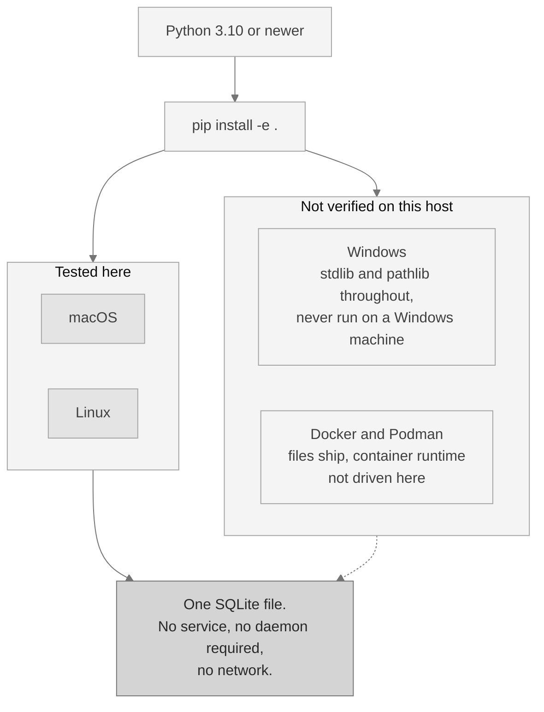

Die gestrichelte Linie steht dort aus einem Grund. macOS und Linux sind die getesteten Ziele. Windows und die Container-Abbilder werden mitgeliefert, wurden auf diesem Rechner aber nicht ausgeführt, und dieses Dokument sagt das, statt den Code für übertragbar zu halten, nur weil er so aussieht.

## Einen KI-Assistenten anbinden

Die Assistenten-Anbindung spricht das Model Context Protocol, kurz MCP: eine standardisierte, nur lesende Verbindung, über die ein KI-Assistent Ihren Graphen abfragen kann. Sie läuft über die Standardein- und -ausgabe, dazu gibt es eine rein lokale HTTP-Möglichkeit, die ein Token verlangt und die Herkunft der Anfrage prüft.

**Nur abfragende Werkzeuge werden registriert. Kein schreibendes Werkzeug wird je bereitgestellt**, sodass ein Assistent, der nach vorgelegten Inhalten handelt, Ihren Graphen über diese Verbindung nicht verändern kann.

```mermaid
%%{init: {"theme":"base","themeVariables":{"primaryColor":"#e4e4e4","primaryTextColor":"#404040","primaryBorderColor":"#a5a5a5","lineColor":"#757575","secondaryColor":"#d4d4d4","tertiaryColor":"#f4f4f4","clusterBkg":"#f4f4f4","clusterBorder":"#a5a5a5","edgeLabelBackground":"#f4f4f4","textColor":"#404040"}}}%%
flowchart LR
    asst["Your assistant<br/>any model, any vendor"]
    asst -->|"JSON-RPC over stdio"| srv["dkg mcp-stdio<br/>read-only tool surface"]

    subgraph guards["Enforced outside the model"]
        direction TB
        g1["Query tools only<br/>no write tool registered"]
        g2["Path reads confined to a root<br/>and size-capped"]
        g3["Node and edge reads bounded together,<br/>truncation reported"]
        g4["Fetched content labelled<br/>untrusted evidence, never instructions"]
    end

    srv --> guards
    guards --> db[("Local SQLite graph<br/>opened read-only")]
    db --> ans["Answer with provenance,<br/>confidence, and the source it came from"]
    ans --> asst

    classDef inner fill:#e4e4e4,stroke:#a5a5a5,color:#404040
    classDef strong fill:#d4d4d4,stroke:#757575,color:#282828
    classDef outer fill:#f4f4f4,stroke:#a5a5a5,color:#404040
    class asst outer
    class g1,g2,g3,g4 inner
    class srv,ans inner
    class db strong
```

Richten Sie einen Editor mit `dkg mcp-install --client <name>` ein, sehen Sie ihn mit `--dry-run` vorab an und machen Sie ihn mit `dkg mcp-uninstall` rückgängig, das nur entfernt, was es selbst geschrieben hat. `dkg mcp-tools` listet die Editoren auf, die es einrichten kann. Die Parameter jedes Werkzeugs stehen in [`docs/COMMANDS.md`](docs/COMMANDS.md).

### Die Werkzeugfläche

| Werkzeug | Was es zurückgibt |
|---|---|
| `dkg.status` | Zählwerte der Datenbank und die Version der Anwendung. |
| `dkg.orient` | Eine knappe Orientierung für einen unbekannten Graphen: seine Form, seine größten Bestandteile und wo man anfängt. |
| `dkg.search` | Hybride Suche über Textabschnitte, die Stichwort und FTS5 verschmilzt und meldet, welche Maschinen beigetragen haben. |
| `dkg.search.keyword` | Stichwortsuche über Textabschnitte. |
| `dkg.search.fts` | FTS5-Suche über Textabschnitte. |
| `dkg.graph.neighbourhood` | Die begrenzte Graphnachbarschaft um eine Entität. |
| `dkg.graph.community` | Gemeinschaften über dem Entitätsgraphen durch Modularitätsoptimierung. |
| `dkg.graph.community.split` | Dasselbe, danach wird jede Gemeinschaft oberhalb einer Schwelle geteilt. |
| `dkg.graph.diff` | Vergleicht zwei Momentaufnahmen des Codegraphen, die `dkg graph-snapshot` geschrieben hat. |
| `dkg.evidence.claim` | Das Belegpaket zu einer Aussage, mit ihrer erklärbaren Zuversicht. |
| `dkg.facets.source` | Jede Quelle mit der Zahl ihrer Textabschnitte. |
| `dkg.code.languages` | Jede Sprache, die die Ebene auswertet, wie jede gelesen wird und ob sie hier verfügbar ist. |
| `dkg.code.symbols` | Wertet eine Quelldatei aus und gibt ihre Symbole zurück, ohne in die Datenbank zu schreiben. |
| `dkg.code.search` | Suche über Codesymbole und Codetext. |
| `dkg.code.impact` | Struktureller Wirkungsradius eines Symbols oder einer Datei. Meldet zu viel und ist ein Hinweis. |
| `dkg.code.impact_radius` | Wirkungsradius, wobei jedes betroffene Symbol seinen eigenen Grund und seinen Abstand erhält. |
| `dkg.code.flow` | Strukturelle Spur des Ausführungsverlaufs, vorwärts gerichtete Aufrufketten ab einem Einstiegssymbol. |
| `dkg.code.flows` | Die erfassten Ausführungsverläufe in geordneter Reihenfolge. |
| `dkg.code.flow.get` | Ein erfasster Verlauf nach Name oder Kennung, mit seinen Schritten. |
| `dkg.code.flows.affected` | Welche erfassten Verläufe durch eine Menge geänderter Dateien führen. |
| `dkg.code.callers` | Symbole, die das genannte aufrufen, als knotengenaue Ausschnitte statt ganzer Dateien. |
| `dkg.code.callees` | Symbole, die das genannte aufruft, als knotengenaue Ausschnitte. |
| `dkg.code.neighbours` | Symbole, die in beide Richtungen verwandt sind, über Aufrufe, Importe und Vererbung. |
| `dkg.code.importers` | Module, die das genannte Modul importieren, jeweils mit ihrer Kantenzuversicht. |
| `dkg.code.base_types` | Typen, von denen der genannte Typ erbt, jeweils mit ihrer Kantenzuversicht. |
| `dkg.code.implementations` | Typen, die vom genannten Typ erben, jeweils mit ihrer Kantenzuversicht. |
| `dkg.code.tests_for` | Tests, die das genannte Symbol ausüben, jeweils mit ihrer Kantenzuversicht. |
| `dkg.code.hubs` | Die am stärksten verbundenen Symbole und die Engstellen der Architektur. |
| `dkg.code.coupling` | Kanten, die angesichts der umgebenden Struktur überraschen. |
| `dkg.code.gaps` | Vereinzelte Symbole, ungetestete Brennpunkte und dünne Gemeinschaften. |
| `dkg.code.questions` | Aus dem Graphen erzeugte Prüffragen, jede benennt die Messung, die sie ausgelöst hat. |
| `dkg.code.architecture` | Eine Karte auf Bauteilebene mit Kopplungswarnungen. |
| `dkg.code.communities` | Vorberechnete Zusammenfassungen je Gemeinschaft: Mitglieder, Dateien und innere Struktur. |
| `dkg.code.change` | Eine strukturelle Zusammenfassung des Repositorys, auf das der Server beschränkt ist. |
| `dkg.code.review_context` | Alles, was ein Prüfer über ein Symbol braucht, in einem einzigen Aufruf. |
| `dkg.code.criticality` | Jeder Ausführungsverlauf ab einem Einstiegspunkt, nach gewichteter Kritikalität bewertet. |
| `dkg.code.risk` | Ein hinweisender Risikowert von 0 bis 1 für eine Änderungsmenge. |
| `dkg.code.risk.index` | Der vorberechnete strukturelle Risikoindex je Symbol, höchster zuerst. |
| `dkg.code.confidence` | Das dreistufige Zuversichtsprofil des Codegraphen. |
| `dkg.code.dead` | Kandidaten für toten Code: Definitionen ohne eingehende Verweiskante. |
| `dkg.code.large` | Symbole, deren erfasste Zeilenspanne mindestens eine gegebene Größe erreicht. |
| `dkg.code.refactor` | Umbauvorschläge, abgeleitet aus der Gemeinschaftsstruktur. |
| `dkg.code.rename.preview` | Eine Symbolumbenennung als nur lesende Änderungsliste. Sie zeigt vorab; sie schreibt nie. |
| `dkg.code.slices` | Antwortförmige knotengenaue Ausschnitte zu einer strukturellen Frage. |
| `dkg.code.traverse` | Freier Durchlauf ab einem beliebigen Knoten, in die Breite oder in die Tiefe. |
| `dkg.code.framework` | Rahmenwerksbeziehungen eines Symbols: `routes_to`, `renders`, `relates_to`. |
| `dkg.repos.list` | Jedes eingetragene Repository mit seinem eigenen Zustand. |
| `dkg.repos.search` | Suche über alle eingetragenen Repositories, mit Ergebnissen je Repository. |
| `dkg.memory.list` | Die festgehaltenen Antworten, die die Gedächtnisschleife bewahrt. |
| `dkg.prompts.list` | Die wiederverwendbaren Vorlagen für die wiederkehrenden Prüfaufgaben. |
| `dkg.prompts.get` | Eine wiederverwendbare Vorlage nach Namen. |
| `dkg.docs.section` | Ein benannter Abschnitt der mitgelieferten Dokumentation, beschränkt auf deren Wurzelverzeichnis. |

Sie alle lesen. Keines schreibt. Der Einrichtungshelfer, der tatsächlich Dateien schreibt, gibt es nur auf der Kommandozeile und er bleibt bewusst außerhalb dieser Fläche.

## Kontinuierliche Integration

Eine fertige GitHub Action führt die Analyse auf einem Repository aus und veröffentlicht eine risikobewertete Durchsicht als einen einzigen Kommentar zur Änderungsanfrage, den sie bei jedem Push aktualisiert, statt einen neuen hinzuzufügen. Kopieren Sie dies nach `.github/workflows/`:

```yaml
name: code-review

on:
  pull_request:
    branches: ["**"]

permissions:
  contents: read
  pull-requests: write

jobs:
  review:
    runs-on: ubuntu-latest
    steps:
      - uses: actions/checkout@11d5960a326750d5838078e36cf38b85af677262 # v4.4.0
        with:
          fetch-depth: 0          # the base ref must be diffable
          persist-credentials: false

      - uses: scorpion1476-lgtm/D-Knowledge_Graph@v0.1.0
        with:
          repository-path: "."
          base-ref: ${{ github.event.pull_request.base.sha }}
          # Pin the analysed tool, not just the action. A floating ref here
          # would silently change what runs against your code.
          dkg-ref: "v0.1.0"
          dkg-repo-url: "https://github.com/scorpion1476-lgtm/D-Knowledge_Graph.git"
          comment: "true"
          pr-number: ${{ github.event.pull_request.number }}
          github-token: ${{ secrets.GITHUB_TOKEN }}
          # Off by default. Set to low, moderate, elevated, or high to gate.
          # Thresholds derive from your repository's own score distribution.
          risk-gate: "off"
```

> [!WARNING]
> Die Einzelablauf-Form oben führt den Code der Änderungsanfrage in einem Auftrag aus, der ein Schreibtoken hält. Das ist sicher, wo nur vertrauenswürdige Mitwirkende Anfragen eröffnen. **Wenn Sie Anfragen aus Abspaltungen annehmen, verwenden Sie stattdessen die zweistufige Form**: ein Ablauf erzeugt die Durchsicht ohne Schreibrecht und ohne jedes Geheimnis, ein zweiter veröffentlicht sie aus einem Auftrag, der den Code der Anfrage nie auscheckt. Beide Dateien werden mit diesem Repository ausgeliefert.

Eingaben, Ausgaben und das Risikomodell der Action sind in [`docs/CONSUMER_ACTION.md`](docs/CONSUMER_ACTION.md) beschrieben. Sie installiert das Werkzeug aus einer festgelegten Version, bindet ihre eigenen Unter-Actions an genaue Commits und braucht weder Dienst noch Konto.

## Sicherheit

Die Plattform ist standardmäßig sicher. Jede Maßnahme unten ist im Quellcode umgesetzt und durch einen Test abgedeckt.

| Maßnahme | Standard | Einzelheit |
|---|---|---|
| Ausgehendes Netz | Aus | Nach außen zu gehen erfordert den ausdrücklichen Schalter `--allow-network` und eine Erlaubnis in der Konfiguration. |
| Telemetrie | Keine | Es gibt nichts abzuschalten; sie lässt sich nur absichtlich einschalten. |
| Assistenten-Anbindung | Nur lesend | Es gibt ausschließlich abfragende Werkzeuge. Die HTTP-Möglichkeit lauscht auf Ihrem eigenen Rechner, verlangt ein Token und begrenzt Größe und Häufigkeit der Anfragen. |
| Anfragefälschung | Blockiert | Adressen werden nach der Auflösung geprüft, und private, lokale und Cloud-Metadatenadressen werden vor jedem Abruf abgewiesen. |
| Geheimnisunterdrückung | An | Protokolle, Prüfzeilen und Exporte laufen durch einen Filter, der Schlüssel, Token und Blöcke privater Schlüssel maskiert. |
| Nicht vertrauenswürdige Inhalte | Erzwungen | Geholte Webinhalte gelten als Beleg, nie als Anweisung, und werden auf Einschleusungsversuche bewertet. |
| Speicherung | Parametergebunden | Jede Datenbankabfrage arbeitet mit Parametern; die Speicherschicht weist aus Zeichenketten zusammengesetzte Abfragen ab. |
| Herkunft und Belege | Immer aktiv | Jeder Datensatz hält fest, woher er stammt, und das Prüfprotokoll wächst nur an und trägt je Zeile eine Hash-Kette. |
| Lieferkette | Gehärtet | Actions sind an genaue Commits gebunden, Abhängigkeiten über eine erzeugte Sperrdatei und Stückliste festgelegt, und Lizenz- und Schwachstellenprüfungen laufen in der CI. |

Das vollständige Modell, samt dem, was bewusst außerhalb des Rahmens liegt, steht in [`docs/SECURITY_MODEL.md`](docs/SECURITY_MODEL.md) und [`docs/THREAT_MODEL.md`](docs/THREAT_MODEL.md).

## Messwerte

Genauigkeit wird hier gemessen statt behauptet. Jede Zahl stammt aus einer dokumentierten Stichprobe mit festem Startwert, und ein einziger Befehl erzeugt sie alle neu:

```bash
python scripts/benchmark.py
```

| Was gemessen wird | Stichprobe | Ergebnis |
|---|---|---|
| Suchqualität | 30 Dokumente, 40 Abfragen | Stichworte allein erreichen MRR 0.9375 und nDCG@10 0.9473. Mit dem optionalen Einbettungsmodell und dem Neuordner erreichen beide 1.0. |
| Genauigkeit der Änderungswirkung | 42 Auswertungsknoten, 24 echte Kanten je Sprache | Genauigkeit 0.1081 im Standard und 1.0 mit `--resolve`, Trefferquote in beiden Fällen 1.0, für Python und JavaScript. |
| Genauigkeit der Codeauswertung | 113 Symbole in 13 Sprachen, beschriftet noch vor jeder Auswertung | Genauigkeit 0.982 und Trefferquote 0.9646. |
| Gruppierungsqualität | 80 Entitäten in 16 Gruppen und 40 Entitäten in 5 Themen | Die beiden Detektoren stehen bei der Struktur gleichauf bei Rand 1.0. Wo der Inhalt zählt, führt die Verfeinerung mit Rand 0.7641 gegenüber 0.641. |
| Genauigkeit des Ausführungsverlaufs | Von Hand beschriftete Aufrufgraphen je Sprache | Genauigkeit und Trefferquote 1.0 für Python, JavaScript und Go. |
| Widerspruchserkennung | 18 zurückgehaltene Fälle | Trefferquote 0.6667 und Genauigkeit 0.75. Ein Hinweis, und lexikalisch statt schließend. |
| Mediengenauigkeit | Gerenderte Stichproben, keine echten Fotografien | Zeichen- und Wortfehlerrate der OCR 0.0 und Bildbeschriftung top-1 bei 0.9375. |

Zwei Dinge wird diese Seite nicht behaupten. Der Weg über den Graphen ist ein Ergebnis der **Richtigkeit** und keine Ersparnis: gegenüber einer fähigen Grundlinie aus Suchen und Lesen verbraucht er etwa doppelt so viele Token, 71,088 gegenüber 34,744, bei einer mittleren Richtigkeit von 1.0 gegenüber 0.6206. Und eine Messung, deren optionales Werkzeug oder Modell nicht installiert ist, gilt hier als nicht ausgeführt, nie als null und nie als bestanden.

Die vollständigen Ergebnisse, die Stichprobengrößen, die Vorgehensweise und die Grenzen jeder Stichprobe stehen in [`docs/BENCHMARKS.md`](docs/BENCHMARKS.md).

## Anwendungsfälle

Die Plattform ist ein privater und nachprüfbarer Unterbau für Recherche und Wissen. Weil sie offline arbeitet und die Herkunft jedes Datensatzes festhält, passt sie zu Arbeiten, bei denen die Quelle einer Antwort genauso zählt wie die Antwort.

| Team oder Rolle | Wofür sie es nutzen | Ergebnis |
|---|---|---|
| Recherche und Analyse | Notizen, Berichte und Feeds einlesen, dann suchen, durchlaufen und Aussagen gegen ihre Quellen prüfen. | Ein durchsuchbarer Graph, in dem jede Aussage auf ihr Dokument zurückverweist. |
| Compliance und juristische Durchsicht | Heikles Material auf einem lokalen oder getrennten Rechner halten und Belege mit lesbarer Zuversicht erzeugen. | Ein belastbarer Offline-Nachweis darüber, was gefunden wurde und wo. |
| Wissensverwaltung | Verstreute Dateien in einen verbundenen Graphen überführen, Zusammengehöriges gruppieren und nach Obsidian oder Graphviz ausgeben. | Eine gepflegte Karte des eigenen Wissens, ohne Bindung an einen Anbieter. |
| Ermittlung und Sorgfaltsprüfung | Widersprüche zwischen Quellen sichtbar machen und begrenzten Abfragen zwischen Entitäten folgen. | Eine nachprüfbare Karte davon, wo Quellen übereinstimmen und wo sie auseinandergehen. |

Führen Sie einen deterministischen Agentenablauf über dem Graphen aus, ganz ohne angebundenes Modell, und melden Sie später ein lokales Modell hinter der Adapterschnittstelle an, wenn Sie mehr Trefferquote wollen:

```bash
dkg agent research        --input '{"query":"knowledge graph"}'
dkg agent contradiction   --input '{}'
dkg agent security-review --input '{"limit":500}'
```

### Für Entwicklungsteams

| Anwendungsfall in der Entwicklung | Wie die Plattform ihn bedient |
|---|---|
| Codeverständnis | Ein Repository in einen Codegraphen überführen und Symbole, Aufrufstruktur und Ausführungsverlauf ab einem Einstiegspunkt abfragen. |
| Architekturdurchsicht | Die am stärksten verbundenen Symbole sichtbar machen, die Punkte, deren Entfernen den Graphen zerteilt, Zyklen zwischen Bauteilen und Verbindungen, die eine Grenze überschreiten. |
| Eine unbekannte Änderung durchsehen | Prüffragen aus dem Graphen erzeugen, jede benennt ein Symbol und die Messung dahinter, und dann zwei Momentaufnahmen vergleichen, um zu sehen, was sich bewegt hat. |
| Durchsicht der Änderungswirkung | Eine hinweisende Wirkungsmenge für die geänderten Dateien berechnen, mit einer optionalen Sperre für die CI, über die GitHub Action oder `dkg code-report`. |
| Offline-Wissensgraphen | Einen Graphen in einer in sich geschlossenen HTML-Ansicht aufbauen und durchsehen, die nichts aus dem Netz lädt. |
| Vom Netz getrennte Installationen | Aus dem Quellcode ohne Laufzeitabhängigkeiten installieren und jede Kernfähigkeit bei abgeschaltetem Netz betreiben. |

Änderungswirkung und Ausführungsverlauf melden auf dem Standardweg absichtlich zu viel. Der optionale Weg `--resolve` engt mehrdeutige Aufrufe durch typbewusste Auflösung ein, wo ein Sprachserver installiert ist.

## Häufige Fragen

Die kurzen Antworten. Die langen, samt der ehrlichen Vergleiche mit einem Sprachserver, der Ähnlichkeitssuche und der einfachen Textsuche, stehen in [`docs/FAQ.md`](docs/FAQ.md).

| Frage | Antwort |
|---|---|
| Ist das quelloffen? | Nein. Dies ist keine quelloffene Lizenz, sondern eine quellzugängliche und nicht kommerzielle. Kommerzielle Nutzung, Veränderung und veränderte Weitergabe sind allesamt untersagt. Siehe den Lizenzabschnitt weiter unten. |
| Ersetzt es einen Sprachserver? | Nein, und es nutzt einen, sobald einer installiert ist. Der Standardweg im Code meldet zu viel; `--resolve` engt ihn ein, wo ein Server vorhanden ist. |
| Ersetzt es die Textsuche? | Nein. Für "wo taucht genau diese Zeichenkette auf" gewinnt die einfache Suche, und nichts hier übertrifft sie. Der Graph ist für Fragen da, die keine Zeichenketten sind. |
| Ersetzt es eine Vektordatenbank? | Nein. Es enthält die Ähnlichkeitssuche als Möglichkeit und legt Struktur, Herkunft und Belege darum. Für einfache inhaltliche Suche über Text ist eine Vektordatenbank schlichter. |
| Funkt es nach Hause? | Nein. Es gibt keine Telemetrie, und der Weg nach außen verlangt den ausdrücklichen Schalter `--allow-network` und eine Erlaubnis in der Konfiguration. |
| Lädt es Modelle herunter? | Während des Betriebs nie. Modelle werden vorab auf die Festplatte gelegt und ausschließlich aus lokalen Dateien geladen; ein fehlendes Modell weicht einem dokumentierten Ersatzweg. |
| Woran erkenne ich eine korrekte Installation? | `dkg --version`, dann `dkg init`, `dkg capabilities`, `dkg doctor`, danach etwas einlesen und suchen. Eine lange Liste nicht verfügbarer optionaler Fähigkeiten auf einer frischen Installation ist richtig und kein Fehler. |
| Wie unterscheide ich ein Installations- von einem Umgebungsproblem? | `python scripts/probe_environment.py` gibt den Interpreter, die installierten Zusatzpakete, die gefundenen externen Werkzeuge und lokalen Modelle sowie die Erreichbarkeit des Paketindexes aus. |
| Wann sollte ich es nicht verwenden? | Wenn Sie Gewissheit statt eines Hinweises brauchen, wenn Ihre Sammlung riesig ist, wenn Sie einen gehosteten Dienst brauchen oder wenn Sie kommerzielle Nutzung brauchen. |

## Fehlerbehebung

Jeder Eintrag in [`docs/TROUBLESHOOTING.md`](docs/TROUBLESHOOTING.md) nennt ein Symptom, eine Ursache und eine Abhilfe, quer über Installations- und Pfadprobleme, Fehlstarts des Servers, Sperren und Veralten der Datenbank, fehlende optionale Bestandteile sowie die Probleme unter Windows und dem Linux-Subsystem. Die Windows-Einträge sind als aus dem Code abgeleitet und nicht beobachtet gekennzeichnet, weil kein Windows-Rechner verwendet wurde.

Zwei Befehle beantworten die meisten Probleme, bevor Sie überhaupt etwas lesen:

```bash
dkg doctor                          # the application's self-check, as JSON
python scripts/probe_environment.py # the environment around it, as JSON
```

Fügen Sie beide in eine Fehlermeldung ein. Die Prüfung des Paketindexes durch den zweiten ist die einzige ausgehende Anfrage, die er stellen kann, er nennt die Adresse in seiner eigenen Ausgabe, und `--offline` überspringt sie.

## Dokumentation

| Dokument | Was darin steht |
|---|---|
| [`docs/QUICKSTART.md`](docs/QUICKSTART.md) | Der kürzeste Weg zu einem laufenden Graphen. |
| [`docs/USER_GUIDE.md`](docs/USER_GUIDE.md) | Durchgearbeitete Abläufe für Recherche, Prüfung, Widerspruch, Export, Sicherung und Wiederherstellung. |
| [`docs/COMMANDS.md`](docs/COMMANDS.md) | Jeder Unterbefehl und jedes Assistenten-Werkzeug, mit Parametern und Vorgabewerten. |
| [`docs/MNEMOSYNE.md`](docs/MNEMOSYNE.md) | Der Basisdetektor für die Gruppierung, in einfacher Sprache und mit allen technischen Einzelheiten. |
| [`docs/ARIADNE.md`](docs/ARIADNE.md) | Der Verfeinerungsdetektor, in einfacher Sprache und mit allen technischen Einzelheiten. |
| [`docs/BENCHMARKS.md`](docs/BENCHMARKS.md) | Jede gemessene Zahl, mit den Stichprobengrößen und dem Startwert. |
| [`docs/LANGUAGES.md`](docs/LANGUAGES.md) | Jede ausgewertete Sprache, ihre Dateiendungen, wie sie gelesen wird und die Lizenz ihrer Grammatik. |
| [`docs/FAQ.md`](docs/FAQ.md) | Ehrliche Vergleiche, was es nicht ersetzt und wie man eine Installation überprüft. |
| [`docs/TROUBLESHOOTING.md`](docs/TROUBLESHOOTING.md) | Symptom, Ursache und Abhilfe für die Probleme, die wirklich auftreten. |
| [`docs/ADMINISTRATOR_GUIDE.md`](docs/ADMINISTRATOR_GUIDE.md) | Eine Installation betreiben: Verzeichnisse, Sicherungen, Aufbewahrung und das Prüfprotokoll. |
| [`docs/DEPLOYMENT_GUIDE.md`](docs/DEPLOYMENT_GUIDE.md) | Lokale, containerbasierte und selbst betriebene Installation, mit Gegenstelle und TLS. |
| [`docs/DEVELOPER_GUIDE.md`](docs/DEVELOPER_GUIDE.md) | Aufbau des Repositorys, lokale Entwicklung, die Testsammlung und wie man einen Befehl oder Adapter ergänzt. |
| [`docs/ARCHITECTURE.md`](docs/ARCHITECTURE.md) | Wie der Kern und die beiden Ebenen zusammenpassen. |
| [`docs/CONSUMER_ACTION.md`](docs/CONSUMER_ACTION.md) | Die GitHub Action: Eingaben, Ausgaben, Risikomodell und die gegen Abspaltungen sichere Form. |
| [`docs/SECURITY_MODEL.md`](docs/SECURITY_MODEL.md) und [`docs/THREAT_MODEL.md`](docs/THREAT_MODEL.md) | Die Maßnahmen und die Gegner, für die sie da sind. |
| [`docs/ROADMAP.md`](docs/ROADMAP.md) | Geliefert, in Arbeit, geplant und nicht geplant. |
| [`CONTRIBUTING.md`](CONTRIBUTING.md) | Entwicklung in einem Klon, die Befehle der Sperren und was eine Änderung erfüllen muss. |
| [`SECURITY.md`](SECURITY.md) | Unterstützte Versionen, der private Meldeweg und die Antwortfristen. |
| [`CODE_OF_CONDUCT.md`](CODE_OF_CONDUCT.md) | Der Maßstab, sein Geltungsbereich und wie man ein Anliegen meldet. |

## Lizenz

Quellzugänglich und kostenlos für persönliche und nicht kommerzielle Nutzung. **Dies ist keine quelloffene Lizenz**: kommerzielle Nutzung ist nicht gestattet, ebenso wenig Veränderung oder die Weitergabe einer veränderten Fassung.

| Bestandteil | Lizenz | Bedingungen |
|---|---|---|
| Das gesamte Repository, Ariadne eingeschlossen | D-Knowledge Graph Source-Available Non-Commercial Licence (PolyForm Noncommercial 1.0.0 zuzüglich einer Klausel gegen Veränderung) | Lesen, ausführen und die Ausgabe zu jedem nicht kommerziellen Zweck nutzen. Wortgleiche Kopien mit `LICENSE` und `NOTICE` weitergeben. Keine kommerzielle Nutzung. Keine Veränderung und keine veränderte Weitergabe. |
| Optionale Abhängigkeiten Dritter | Ihre eigenen freizügigen Lizenzen (Apache-2.0, MIT, BSD, ISC, HPND) | Von den obigen Bedingungen unberührt. Vollständiges Verzeichnis in `THIRD_PARTY_NOTICES.md`. |

Eine Lizenz deckt alles ab. Es gibt keinen getrennt lizenzierten Baustein und keinen Bestandteil, der vom Bau ausgenommen wäre. Die Standardlaufzeit nutzt allein die Python-Standardbibliothek und übernimmt keinen Quellcode aus einem anderen Projekt.

Fassungen, die vor dem 2026-08-05 verteilt wurden, erschienen unter Apache-2.0. Diese Erlaubnis gilt für jene Fassungen und für alle, die unter dieser Lizenz eine Kopie erhalten haben, unverändert weiter; die vorliegenden Bedingungen gelten ab dieser Fassung. Siehe `LICENSE` und `NOTICE`.
