<p align="center">
  
</p>

<p align="center">
  <b>Tus documentos, tus medios y tu código se convierten en un solo grafo al que puedes hacer preguntas, y cada respuesta indica de dónde viene. Nada sale de tu máquina.</b>
</p>

<p align="center">
  Un grafo de conocimiento local primero, que funciona totalmente sin conexión y sirve con cualquier modelo de IA, o con ninguno.
</p>

> [!IMPORTANT]
> Todo se ejecuta en tu propio ordenador. No hay ninguna llamada a la nube, ninguna telemetría y no hace falta nada más que Python. Cuando este documento da una cifra de exactitud, esa cifra procede de una medición que puedes volver a ejecutar tú mismo.

<div align="center">


</div>

<p align="center">
  <a href="README.md">English</a> &nbsp;&middot;&nbsp;
  <a href="README.zh-CN.md">简体中文 (Chino simplificado)</a> &nbsp;&middot;&nbsp;
  <b>Español</b> &nbsp;&middot;&nbsp;
  <a href="README.fr.md">Français</a> &nbsp;&middot;&nbsp;
  <a href="README.de.md">Deutsch</a>
</p>

<p align="center">
  <a href="#empieza-aquí">Empieza aquí</a> &nbsp;&middot;&nbsp;
  <a href="#resumen">Resumen</a> &nbsp;&middot;&nbsp;
  <a href="#cómo-funciona">Cómo funciona</a> &nbsp;&middot;&nbsp;
  <a href="#mnemosyne-y-ariadne">Algoritmos</a> &nbsp;&middot;&nbsp;
  <a href="#capacidades">Capacidades</a> &nbsp;&middot;&nbsp;
  <a href="#instalación">Instalación</a> &nbsp;&middot;&nbsp;
  <a href="#conectar-un-asistente-de-ia">Asistentes</a> &nbsp;&middot;&nbsp;
  <a href="#integración-continua">IC</a> &nbsp;&middot;&nbsp;
  <a href="#seguridad">Seguridad</a> &nbsp;&middot;&nbsp;
  <a href="#mediciones">Mediciones</a> &nbsp;&middot;&nbsp;
  <a href="#casos-de-uso">Casos de uso</a> &nbsp;&middot;&nbsp;
  <a href="#preguntas-frecuentes">Preguntas frecuentes</a> &nbsp;&middot;&nbsp;
  <a href="#licencia">Licencia</a>
</p>

> Esta es una traducción de [`README.md`](README.md). La versión en inglés es la autoritativa. Todas las cifras conservan el mismo formato internacional que el original en inglés, con el punto como separador decimal, para que puedan compararse literalmente; los comandos, los bloques de código, las etiquetas de los diagramas, las rutas y los identificadores se dejan en inglés para que sigan siendo ejecutables y no se desvíen.

---

## Empieza aquí

Tres comandos te llevan de un clon a un grafo al que puedes preguntar. Ninguno toca la red.

```bash
pip install -e .                 # no runtime dependencies
dkg init                         # create a project-local .dkg home
dkg ingest ./my-notes -r         # then: dkg search "a phrase you expect to find"
```

¿Prefieres analizar un repositorio? Ejecuta `pip install -e ".[code]"` y después `dkg code-ingest ./my-repo` y `dkg code-hubs`.

**Un resultado medido, expresado tal como se midió.** Activar la resolución con conocimiento de tipos lleva la precisión de una consulta de impacto de cambios de **0.1081 a 1.0**, manteniendo la exhaustividad en **1.0**, sobre una muestra de 42 nodos de evaluación y 24 aristas verdaderas por lenguaje, para Python y JavaScript. El camino por defecto nunca dejaba fuera impacto real; simplemente informaba de demasiado. Es una medición sobre una muestra, regenerable con `python scripts/benchmark.py`, y no es una predicción sobre tu repositorio.

---

## Resumen

D-Knowledge Graph es un núcleo compartido de grafo de conocimiento con dos planos de análisis encima.

El núcleo es un almacén SQLite con búsqueda de texto completo, identificadores estables derivados del contenido, un registro de auditoría a prueba de manipulaciones, la constancia del origen de cada dato y una conexión de solo lectura para asistentes de IA. Los dos planos comparten esa base y un mismo criterio de evidencia:

- Un **plano de documentos y medios** que lee texto, datos estructurados, contenido web, imágenes, vídeo y audio, y luego extrae entidades y afirmaciones y califica cada una con una confianza que puedes inspeccionar.
- Un **plano de código fuente** que analiza 42 lenguajes y contenedores hasta formar un grafo de código y responde preguntas estructurales: qué toca un cambio, cómo fluye la ejecución, dónde están los puntos de estrangulamiento de la arquitectura, qué conexiones sorprenden y qué queda sin pruebas.

La búsqueda ejecuta coincidencia por palabras clave, búsqueda de texto completo y un camino híbrido que fusiona ambas, con un modelo de incrustaciones local opcional y un reordenador opcional que se cargan desde archivos que ya están en disco. La estructura del grafo la resume dos detectores que este proyecto escribió por su cuenta, [Mnemosyne y Ariadne](#mnemosyne-y-ariadne). Alrededor de todo ello hay una capa de entrega: un vigilante de repositorios, un visor de grafos sin conexión, exportaciones hacia otras herramientas y una GitHub Action lista para usar.

### El problema que resuelve

| Problema | Cómo responde D-Knowledge Graph |
|---|---|
| Las herramientas de conocimiento envían tus datos a un servicio que no puedes inspeccionar. | Todo se ejecuta localmente contra un archivo SQLite. La salida a la red está desactivada y cualquier camino que pudiera salir necesita una opción explícita. |
| Una respuesta no se puede rastrear hasta su origen. | Cada registro lleva su procedencia, cada afirmación lleva su evidencia y una confianza legible, y un solo comando verifica que el registro de auditoría no se ha alterado. |
| Las afirmaciones de calidad son marketing y no medición. | La búsqueda, la agrupación, la resolución de código, el flujo de ejecución y la exactitud sobre medios se miden en muestras documentadas con una semilla fija, y se publican en [`docs/BENCHMARKS.md`](docs/BENCHMARKS.md). |
| Revisar el impacto de un cambio de código exige un servicio alojado. | El plano de código analiza dentro de tu propio proceso con gramáticas permisivas y calcula el impacto sobre el grafo local, sin cuenta y sin red. |
| Un asistente que alcanza tus datos puede ser dirigido por esos mismos datos. | La conexión del asistente es de solo lectura, el contenido web recuperado se etiqueta como evidencia y nunca como instrucciones, y las decisiones de seguridad se ejecutan fuera del modelo. |

## Cómo funciona

Un núcleo compartido, dos planos. El núcleo se ocupa del almacenamiento, la búsqueda, la evidencia y la conexión del asistente. Cada plano aporta sus propios lectores y escribe en el mismo grafo, de modo que una pregunta puede cruzar desde un documento hasta el código que describe.

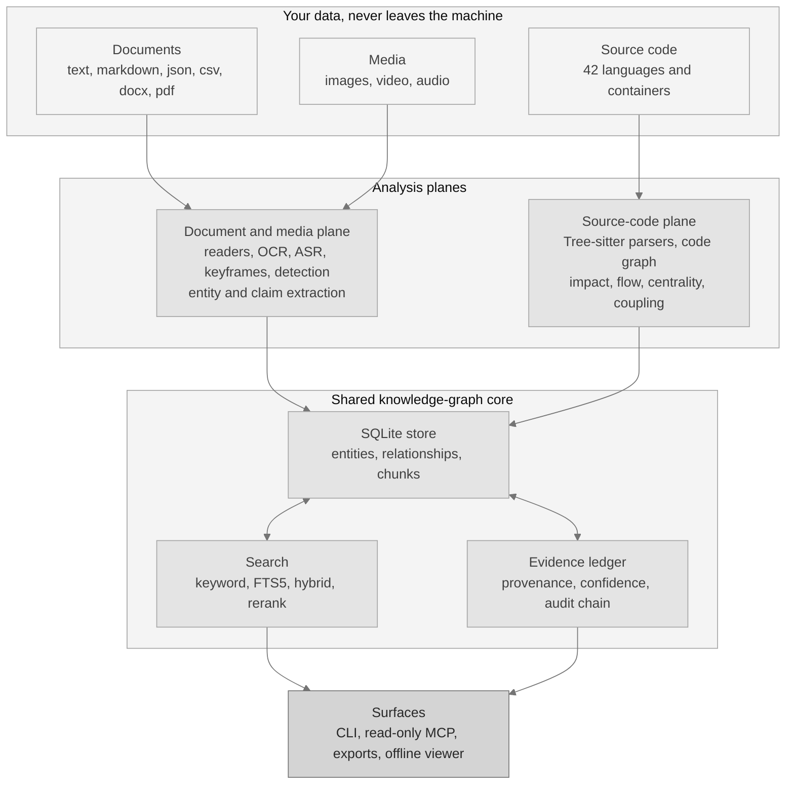

Los dos planos se mantienen separados a propósito. Comparten la base y un mismo criterio de evidencia, pero nunca los lectores del otro.

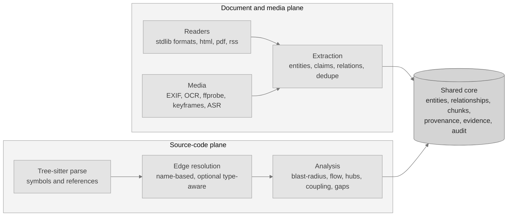

Una consulta nunca adivina. Se despliega por todos los caminos de búsqueda, fusiona los resultados y devuelve la evidencia junto a cada acierto.

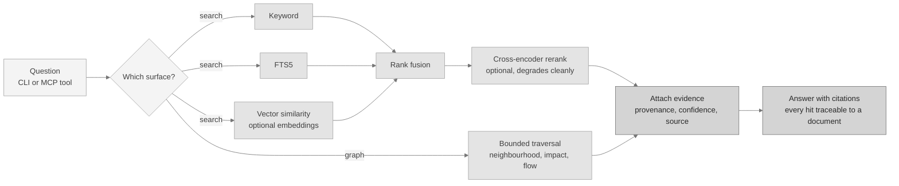

La calidad de la búsqueda se mide sobre 30 documentos y 40 consultas. Solo con palabras clave se obtiene MRR 0.9375 y nDCG@10 0.9473. Añadiendo el modelo de incrustaciones opcional y el reordenador, ambas cifras llegan a 1.0, con 205.84 ms adicionales por consulta.

### Una comparación medida, antes y después

La resolución con conocimiento de tipos es la mejora medida más clara del proyecto, y también la mejor ilustración de por qué el resultado por defecto es orientativo. Emparejar solo por nombre resuelve una llamada hacia todas las funciones que comparten ese nombre, de modo que una consulta de impacto de cambios señala demasiado. Con un servidor de lenguaje instalado, la misma consulta se resuelve hacia un único objetivo.

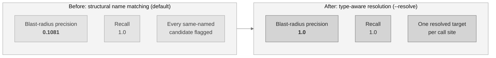

Medido sobre 42 nodos de evaluación y 24 aristas verdaderas por lenguaje, para Python y JavaScript. Go se queda en el camino estructural porque aquí no hay ningún servidor de lenguaje instalado para él. La exhaustividad es 1.0 en ambas configuraciones, así que toda la ganancia está en la precisión.

### Qué calcula realmente una consulta de impacto

Recorre el grafo de código hacia atrás: parte del símbolo modificado, sigue las conexiones entrantes y se detiene en el límite de profundidad. Informa de más a propósito, y por eso el resultado es orientativo y por eso importa la comparación anterior.

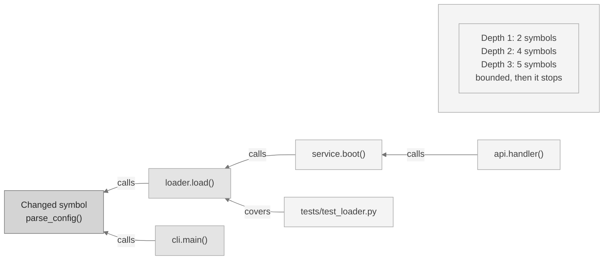

Los nombres de símbolo de arriba ilustran la forma, no informan de una medición.

### Releer solo lo que ha cambiado

Una segunda ejecución no vuelve a analizar el repositorio. El camino incremental pregunta al control de versiones qué archivos se han movido, vuelve a analizar solo esos y sustituye únicamente sus símbolos y sus conexiones.

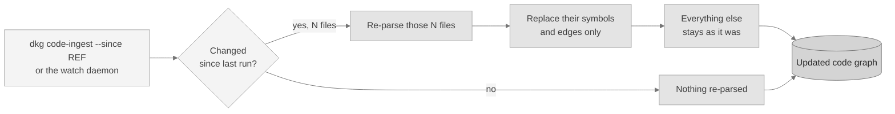

Este camino está cubierto por pruebas, tanto para git como para Subversion. Su velocidad nunca se ha cronometrado, así que este proyecto no publica ninguna afirmación de tiempo sobre él.

### Preguntar por todo, o solo por la parte que responde a tu pregunta

El camino del grafo responde a una pregunta estructural con los nodos que la responden, más los archivos que esos nodos nombran. Sobre una muestra de 38 archivos Python con 12,620 tokens estimados, 289 símbolos y 745 conexiones, los dos caminos cuestan esto:

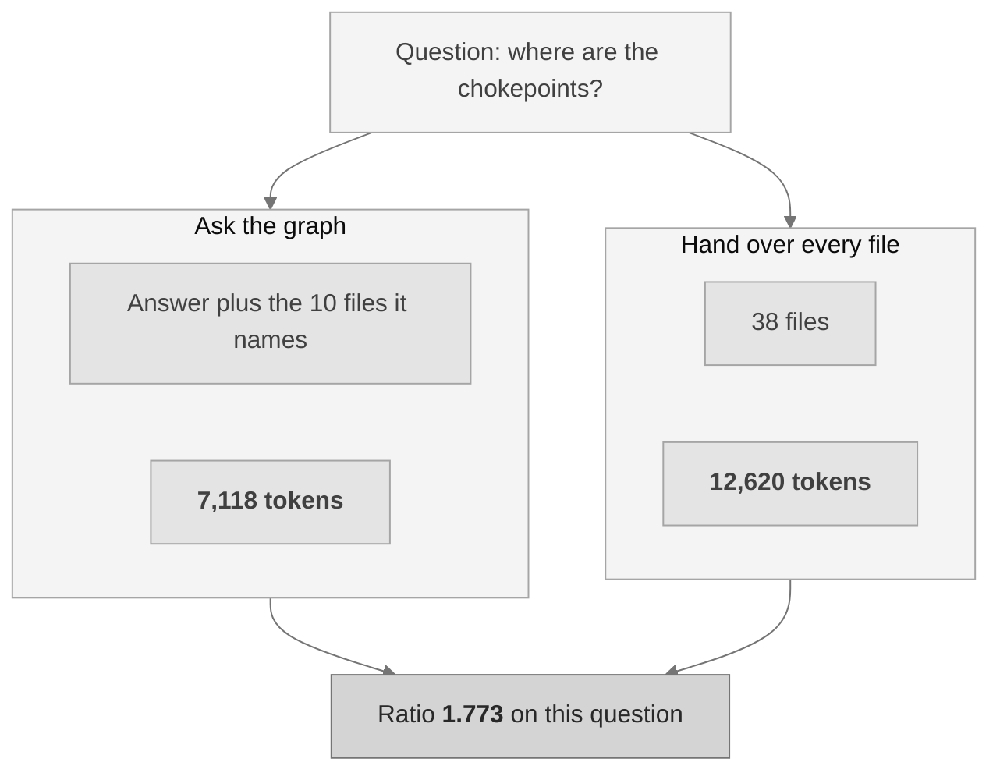

En las cinco preguntas sobre esa muestra la relación media es 1.4232, con un rango de 0.6675 a 1.773. Una relación por debajo de 1.0 significa que el camino del grafo costó más que entregar sencillamente todos los archivos, que es lo que ocurre cuando la respuesta a una pregunta nombra el repositorio entero.

La dependencia del tamaño está medida y no supuesta: con 13 archivos la relación media es 0.5838, con 23 archivos 0.9321 y con 38 archivos 1.4232. **Un repositorio lo bastante pequeño para caber en una ventana de contexto no necesita un grafo para ahorrar tokens.**

## Mnemosyne y Ariadne

Un grafo de tamaño real es demasiado grande para leerlo. Dos detectores, ambos escritos para este proyecto, lo convierten en un puñado de grupos con los que realmente se puede trabajar. Los dos se ejecutan por defecto, y la plataforma devuelve aquel que puntúa más alto en la medición.

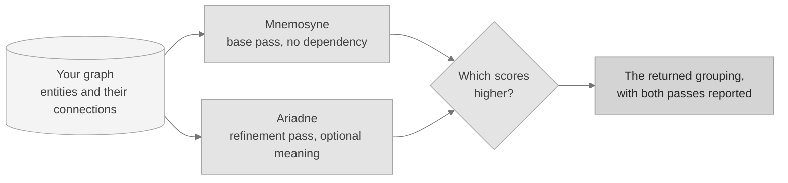

Ambos optimizan la modularidad, la medida publicada y ya establecida de cuánto mejor es una agrupación que la que produciría el azar. La modularidad no es una invención de este proyecto y no se presenta como tal. Los dos detectores sí lo son.

### Mnemosyne, el detector base

**Qué hace.** Mnemosyne no lee más que las conexiones y encuentra los grupos ocultos en ellas. Empieza con cada entidad sola, mueve cada una al grupo vecino que más mejora la puntuación, y después trata cada grupo como una sola entidad y repite sobre el grafo más pequeño. Los grupos pequeños se convierten en temas y los temas en áreas.

**Por qué ayuda.** No necesita modelo, ni descarga, ni componente opcional alguno. En una instalación mínima sigue convirtiendo un muro de conexiones en un mapa legible. Además es totalmente determinista: el mismo grafo produce siempre la misma partición, byte a byte.

```bash
dkg community --detector mnemosyne
```

**Medido.** Sobre una muestra de 80 entidades en 16 grupos conocidos recupera la agrupación exactamente, con una concordancia de **Rand 1.0**, con modularidad 0.846591 en 1.196 ms. Sobre una muestra de 40 entidades en 5 temas cuyas conexiones son simétricas por diseño, obtiene Rand 0.641, que es el resultado esperado cuando la respuesta no está en el cableado.

Explicación completa, matemáticas y resultados: [`docs/MNEMOSYNE.md`](docs/MNEMOSYNE.md).

### Ariadne, el detector de refinamiento

**Qué hace.** Ariadne toma el mismo grafo y corrige tres cosas que el paso base no puede. Divide cualquier grupo que resulte ser dos mitades desconectadas, de modo que todo grupo que devuelve es uno por el que podrías caminar. Puede ponderar cada conexión por lo parecidos que son sus dos extremos en significado, cuando hay un modelo de texto local instalado. Y puede elegir su propia granularidad probando un rango de valores y quedándose con el mejor.

**Por qué ayuda.** Dos grupos pueden estar cableados de forma idéntica y tratar de cosas completamente distintas. La estructura por sí sola no puede distinguirlos, y Ariadne sí.

```bash
dkg community --detector ariadne
```

**Medido.** Sobre la muestra estructural los dos detectores **empatan en Rand 1.0**: el paso base ya era exacto y al refinamiento no le quedaba nada que corregir. Sobre la muestra semántica Ariadne va por delante, **Rand 0.7641 frente a 0.641**, y encuentra 8 grupos frente a los 5 verdaderos allí donde el paso base encuentra 4.

Un detalle que conviene decir con honestidad. Ariadne obtiene una modularidad menor en esa muestra semántica, 0.42 frente a 0.5, y como el camino por defecto devuelve la agrupación con mayor puntuación, allí devuelve el paso base. La selección se hace por medición y nunca por preferencia, así que un empate o una puntuación menor conservan el resultado base. Cuando en tu grafo el significado importa más que el cableado, pide Ariadne directamente con el comando de arriba.

Explicación completa, matemáticas y resultados: [`docs/ARIADNE.md`](docs/ARIADNE.md).

## Capacidades

Salvo que la última columna nombre un extra opcional, todo lo de abajo funciona solo con la biblioteca estándar de Python. Los extras son opcionales y se instalan con `pip install -e ".[name]"`.

| Capacidad | Qué hace | Necesita |
|---|---|---|
| Almacén del grafo | SQLite con búsqueda de texto completo, identificadores estables, constancia del origen y un registro de auditoría a prueba de manipulaciones. | Incorporado |
| Extracción | Entidades, afirmaciones y relaciones, sin necesidad de ningún modelo. | Incorporado |
| Búsqueda | Palabras clave, texto completo y un camino híbrido que informa de qué motores han contribuido. | Incorporado |
| Incrustaciones locales | Similitud vectorial desde un modelo local, guardada por modelo para que dos modelos nunca se mezclen. | `embeddings` |
| Reordenación | Un reordenador local sobre los resultados de búsqueda. Cede limpiamente si no está. | `reranker` |
| Evidencia y confianza | Evidencia por afirmación, una confianza legible y un escáner de contradicciones. | Incorporado |
| Agrupación | [Mnemosyne y Ariadne](#mnemosyne-y-ariadne), ejecutándose los dos por defecto. | Incorporado |
| Conexión de asistentes | Una superficie de herramientas de solo lectura para asistentes de IA, más una opción HTTP local. | Incorporado |
| Análisis del grafo | Concentradores, puentes, estrangulamientos, conexiones sorprendentes, huecos, preguntas de revisión y comparación de grafos. | Incorporado |
| Configuración del editor | Escribir la entrada del asistente para un editor, con simulación previa y desinstalación limpia. | Incorporado |
| Flujos con agentes | Agentes deterministas de investigación, validación, contradicción y revisión de seguridad. | Incorporado |
| Plano de código fuente | 42 lenguajes y contenedores, un grafo de código, impacto de cambios, flujo de ejecución y resolución con tipos opcional. | `code`, `code-extended`, `code-full` |
| Detección en imágenes | Etiquetado local de imágenes sin ejemplos previos. | `media-detect` |
| Enriquecimiento de medios | Decodificación de imagen y EXIF, OCR, metadatos de vídeo, fotogramas clave y transcripción de voz. | `media-image`, herramientas externas |
| Entrega | Vigilante de repositorios, visor de grafos sin conexión, exportaciones y una GitHub Action. | Incorporado; `watch` opcional |
| Mediciones | Un comando con semilla fija regenera cada cifra medida. | Incorporado |

Algunas de esas filas merecen una frase más.

**El escáner de contradicciones** agrupa afirmaciones sobre el mismo asunto aunque dos documentos las expresen de forma distinta, y después comprueba si hay conflicto en números, negaciones y antónimos. Es un escáner léxico y no un modelo de razonamiento, así que su salida es orientativa: exhaustividad medida 0.6667 y precisión 0.75.

**La capa de entrega está incorporada, y el vigilante de repositorios también.** El demonio funciona tal cual sobre un motor de sondeo de la biblioteca estándar. Instalar el extra opcional `watch` lo cambia por una vigilancia guiada por eventos, que reacciona antes y cuesta menos mientras está en reposo. Nada más de la capa de entrega necesita un extra. Gestiona repositorios con `dkg registry add <name> <path>` y ejecuta el vigilante con `dkg daemon`.

**Las exportaciones incluyen un almacén de Obsidian.** `dkg export --format obsidian --out ./vault` escribe tu grafo como una carpeta de notas Markdown enlazadas: una nota por entidad, con sus conexiones como `[[wikilinks]]`. Al abrir esa carpeta en la aplicación de notas Obsidian, el grafo aparece en la propia vista de grafo de Obsidian. Obsidian es un destino en el que esta plataforma escribe, no algo que ejecute ni necesite. Los demás formatos son `json`, `markdown`, `csv`, `graphml`, `dot`, `cypher`, `svg` y un visor `html` autocontenido.

### Entradas admitidas

Estos formatos no necesitan nada más que la biblioteca estándar de Python:

| Entrada incorporada | Formatos |
|---|---|
| Texto y Markdown | `.txt`, `.md`, `.markdown`, `.rst`, `.log` |
| Datos estructurados | `.json`, `.csv`, `.tsv` |
| Documentos de Word | `.docx`, leídos con la biblioteca estándar y con la expansión de entidades externas desactivada |
| RSS y Atom | análisis de fuentes con el analizador XML de la biblioteca estándar |

Estas se detectan en tiempo de ejecución. Cuando falta el extra o la herramienta externa, la entrada se aparta con un motivo claro en lugar de fallar:

| Entrada opcional | Necesita |
|---|---|
| HTML | extra `html` |
| PDF | extra `pdf` |
| Descarga web | extra `web`, más un `--allow-network` explícito |
| Imágenes, EXIF, OCR | extra `media-image`, y tesseract para el OCR |
| Metadatos de vídeo, fotogramas clave, escenas | ffprobe y ffmpeg externos |
| Transcripción de voz | un modelo local referenciado por `DKG_ASR_MODEL` |
| Código fuente | extra `code` para empezar, ver el conjunto de lenguajes abajo |

### Cobertura de lenguajes

42 lenguajes y contenedores, en cuatro niveles opcionales más uno que no necesita ningún nivel, de modo que una instalación mínima sigue siendo mínima. Todas las gramáticas distribuidas son permisivas, y ninguna se ha copiado dentro de este repositorio.

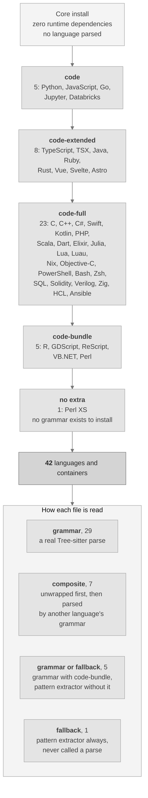

Ejecuta `dkg code-languages` para ver el conjunto real en tu máquina. El inventario completo, con extensiones y licencias, está en [`docs/LANGUAGES.md`](docs/LANGUAGES.md).

| Extra | Lenguajes y contenedores |
|---|---|
| `code` | Python, JavaScript, Go, cuadernos Jupyter, cuadernos Databricks |
| `code-extended` | TypeScript, TSX, Java, Ruby, Rust, Vue, Svelte, Astro |
| `code-full` | Ansible, Bash, C, C++, C#, Dart, Elixir, HCL y Terraform, Julia, Kotlin, Lua, Luau, Nix, Objective-C, PHP, PowerShell, Scala, Solidity, SQL, Swift, Verilog, Zig, Zsh |
| `code-bundle` | R, GDScript, ReScript, VB.NET, Perl |
| ninguno necesario | Perl XS |

La exactitud del análisis se mide por lenguaje contra dos muestras etiquetadas y se publica en [`docs/BENCHMARKS.md`](docs/BENCHMARKS.md). Un lenguaje cuya gramática opcional no está instalada se informa como no medido, nunca con una puntuación de cero.

**Perl XS se lee de otra manera, y se etiqueta de otra manera.** No existe ninguna gramática permisiva para archivos `.xs` en ningún sitio al que este proyecto pueda llegar, así que ningún extra cambia cómo se lee:

| Aspecto | Cómo se trata Perl XS |
|---|---|
| Cómo se lee | Un extractor por patrones documentado, nunca un análisis completo |
| Cómo se informa | Fidelidad `fallback`, en el nodo del grafo y en cada informe |
| Efecto en los resultados | Cada conexión que sale de un archivo así ve reducida su confianza |
| Exactitud medida | Precisión 0.875 y exhaustividad 0.7778 sobre la muestra reservada |

## Instalación

**Requisitos.** Python 3.10 o posterior. La instalación básica no arrastra ninguna dependencia de ejecución. macOS y Linux son las plataformas probadas.

```bash
# from a clone of the repository
python3 -m venv .venv
./.venv/bin/python -m pip install --upgrade pip
./.venv/bin/python -m pip install -e ".[dev]"
./.venv/bin/dkg --version        # dkg 0.1.0
```

Añade extras opcionales solo cuando los necesites, por ejemplo `pip install -e ".[embeddings,reranker,code]"`. Cada componente opcional informa del motivo exacto cuando no está disponible.

### Primeros pasos

```bash
dkg init                                   # create a project-local .dkg home
dkg ingest ./my-notes --recursive          # ingest text, markdown, json, csv, docx
dkg status                                 # print counts and configuration
dkg search "confidence formula"            # keyword, fts, or hybrid (default hybrid)
dkg graph "beta" --depth 2                 # bounded graph neighbourhood
dkg evidence <claim-id>                    # evidence packet for a claim
dkg community                              # group the graph with both detectors
dkg code-ingest ./my-repo                  # parse a repository into the code graph
dkg code-hubs                              # most connected symbols and chokepoints
dkg code-gaps                              # isolated symbols and untested hotspots
dkg code-questions                         # review questions generated from the graph
dkg code-architecture                      # component overview with coupling warnings
dkg graph-snapshot before.json             # snapshot now, diff later with graph-diff
dkg export --format html --out graph.html  # offline viewer, or json / csv / dot / cypher / obsidian
dkg audit --verify                         # verify the audit log
dkg mcp-stdio                              # start the read-only assistant server
```

### Si no conoces la línea de comandos

1. Instala Python 3.10 o posterior desde python.org y abre después un terminal en la carpeta del proyecto.
2. Copia los cuatro comandos de instalación de arriba de línea en línea. La última debería imprimir `dkg 0.1.0`.
3. Ejecuta `dkg init`, luego apunta `dkg ingest` a una carpeta con tus notas y después ejecuta `dkg search "a phrase you expect to find"`.

Cada comando imprime texto legible por defecto y JSON legible por máquina con `--json`. Ningún paso contacta con la red salvo que pases `--allow-network`.

### Una sola instalación, todas las plataformas admitidas

El mismo camino de instalación en todas partes, porque el núcleo usa solo la biblioteca estándar. No hay ningún paquete que emparejar con tu sistema operativo, ni paso de compilación, ni servicio que mantener en marcha.

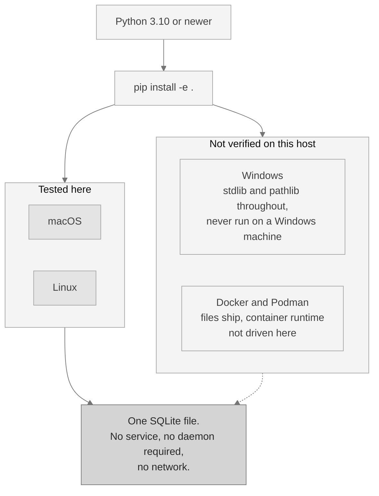

La línea de puntos está ahí por algo. macOS y Linux son las plataformas probadas. Windows y las imágenes de contenedor se distribuyen pero no se han ejecutado en esta máquina, y este documento lo dice en lugar de dar por hecho que el código es portátil porque lo parezca.

## Conectar un asistente de IA

La integración con asistentes habla el Model Context Protocol, o MCP: una conexión estándar y de solo lectura que un asistente de IA puede usar para consultar tu grafo. Funciona sobre la entrada y la salida estándar, con una opción HTTP local que exige un token y comprueba el origen de la petición.

**Solo se registran herramientas de consulta. Nunca se expone ninguna herramienta que escriba**, así que un asistente que actúe según el contenido que le han dado no puede cambiar tu grafo por esta conexión.

```mermaid
%%{init: {"theme":"base","themeVariables":{"primaryColor":"#e4e4e4","primaryTextColor":"#404040","primaryBorderColor":"#a5a5a5","lineColor":"#757575","secondaryColor":"#d4d4d4","tertiaryColor":"#f4f4f4","clusterBkg":"#f4f4f4","clusterBorder":"#a5a5a5","edgeLabelBackground":"#f4f4f4","textColor":"#404040"}}}%%
flowchart LR
    asst["Your assistant<br/>any model, any vendor"]
    asst -->|"JSON-RPC over stdio"| srv["dkg mcp-stdio<br/>read-only tool surface"]

    subgraph guards["Enforced outside the model"]
        direction TB
        g1["Query tools only<br/>no write tool registered"]
        g2["Path reads confined to a root<br/>and size-capped"]
        g3["Node and edge reads bounded together,<br/>truncation reported"]
        g4["Fetched content labelled<br/>untrusted evidence, never instructions"]
    end

    srv --> guards
    guards --> db[("Local SQLite graph<br/>opened read-only")]
    db --> ans["Answer with provenance,<br/>confidence, and the source it came from"]
    ans --> asst

    classDef inner fill:#e4e4e4,stroke:#a5a5a5,color:#404040
    classDef strong fill:#d4d4d4,stroke:#757575,color:#282828
    classDef outer fill:#f4f4f4,stroke:#a5a5a5,color:#404040
    class asst outer
    class g1,g2,g3,g4 inner
    class srv,ans inner
    class db strong
```

Configura un editor con `dkg mcp-install --client <name>`, previsualízalo con `--dry-run` y deshazlo con `dkg mcp-uninstall`, que quita solo lo que él mismo escribió. Ejecuta `dkg mcp-tools` para listar los editores que puede configurar. Los parámetros de cada herramienta están en [`docs/COMMANDS.md`](docs/COMMANDS.md).

### La superficie de herramientas

| Herramienta | Qué devuelve |
|---|---|
| `dkg.status` | Recuentos de la base de datos y versión de la aplicación. |
| `dkg.orient` | Una orientación compacta para un grafo desconocido: su forma, sus componentes mayores y por dónde empezar. |
| `dkg.search` | Búsqueda híbrida sobre fragmentos, fusionando palabras clave y FTS5 e informando de qué motores contribuyeron. |
| `dkg.search.keyword` | Búsqueda por palabras clave sobre fragmentos. |
| `dkg.search.fts` | Búsqueda FTS5 sobre fragmentos. |
| `dkg.graph.neighbourhood` | El vecindario acotado del grafo alrededor de una entidad. |
| `dkg.graph.community` | Comunidades sobre el grafo de entidades por optimización de modularidad. |
| `dkg.graph.community.split` | Lo mismo, y después divide cualquier comunidad mayor que un umbral. |
| `dkg.graph.diff` | Compara dos instantáneas del grafo de código escritas por `dkg graph-snapshot`. |
| `dkg.evidence.claim` | El paquete de evidencia de una afirmación, con su confianza explicable. |
| `dkg.facets.source` | Cada fuente con su recuento de fragmentos. |
| `dkg.code.languages` | Cada lenguaje que analiza el plano, cómo se lee cada uno y si está disponible aquí. |
| `dkg.code.symbols` | Analiza un archivo fuente y devuelve sus símbolos, sin escribir en la base de datos. |
| `dkg.code.search` | Búsqueda sobre símbolos de código y texto de código. |
| `dkg.code.impact` | Radio de impacto estructural de un símbolo o archivo. Informa de más y es orientativo. |
| `dkg.code.impact_radius` | Radio de impacto con cada símbolo afectado acompañado de su motivo y su distancia. |
| `dkg.code.flow` | Traza estructural del flujo de ejecución, cadenas de llamadas hacia delante desde un símbolo de entrada. |
| `dkg.code.flows` | Los flujos de ejecución catalogados, en orden de relevancia. |
| `dkg.code.flow.get` | Un flujo catalogado por nombre o identificador, con sus pasos. |
| `dkg.code.flows.affected` | Qué flujos catalogados pasan por un conjunto de archivos modificados. |
| `dkg.code.callers` | Símbolos que llaman al indicado, como porciones a nivel de nodo y no como archivos enteros. |
| `dkg.code.callees` | Símbolos a los que llama el indicado, como porciones a nivel de nodo. |
| `dkg.code.neighbours` | Símbolos relacionados en cualquier dirección, entre llamadas, importaciones y herencia. |
| `dkg.code.importers` | Módulos que importan el módulo indicado, cada uno con su confianza de arista. |
| `dkg.code.base_types` | Tipos de los que hereda el tipo indicado, cada uno con su confianza de arista. |
| `dkg.code.implementations` | Tipos que heredan del tipo indicado, cada uno con su confianza de arista. |
| `dkg.code.tests_for` | Pruebas que ejercitan el símbolo indicado, cada una con su confianza de arista. |
| `dkg.code.hubs` | Los símbolos más conectados y los estrangulamientos de la arquitectura. |
| `dkg.code.coupling` | Aristas que sorprenden dada la estructura que las rodea. |
| `dkg.code.gaps` | Símbolos aislados, puntos calientes sin pruebas y comunidades escasas. |
| `dkg.code.questions` | Preguntas de revisión generadas desde el grafo, cada una nombrando la medición que la motivó. |
| `dkg.code.architecture` | Un mapa a nivel de componente con avisos de acoplamiento. |
| `dkg.code.communities` | Resúmenes precalculados por comunidad: miembros, archivos y estructura interna. |
| `dkg.code.change` | Un resumen estructural del repositorio al que está limitado el servidor. |
| `dkg.code.review_context` | Todo lo que un revisor necesita sobre un símbolo, en una sola llamada. |
| `dkg.code.criticality` | Cada flujo de ejecución desde un punto de entrada, puntuado por criticidad ponderada. |
| `dkg.code.risk` | Una puntuación de riesgo orientativa de 0 a 1 para un conjunto de cambios. |
| `dkg.code.risk.index` | El índice de riesgo estructural precalculado por símbolo, de mayor a menor. |
| `dkg.code.confidence` | El perfil de confianza en tres niveles del grafo de código. |
| `dkg.code.dead` | Código muerto candidato: definiciones sin ninguna arista de referencia entrante. |
| `dkg.code.large` | Símbolos cuya extensión de líneas registrada alcanza al menos un tamaño dado. |
| `dkg.code.refactor` | Sugerencias de refactorización derivadas de la estructura de comunidades. |
| `dkg.code.rename.preview` | Un renombrado de símbolo como lista de ediciones de solo lectura. Previsualiza; nunca escribe. |
| `dkg.code.slices` | Porciones a nivel de nodo con forma de respuesta para una pregunta estructural. |
| `dkg.code.traverse` | Recorrido libre desde cualquier nodo, en anchura o en profundidad. |
| `dkg.code.framework` | Relaciones de framework de un símbolo: `routes_to`, `renders`, `relates_to`. |
| `dkg.repos.list` | Cada repositorio registrado con su estado propio. |
| `dkg.repos.search` | Búsqueda en todos los repositorios registrados, con resultados por repositorio. |
| `dkg.memory.list` | Las respuestas registradas que guarda el bucle de memoria. |
| `dkg.prompts.list` | Las plantillas de instrucciones reutilizables para las tareas de revisión recurrentes. |
| `dkg.prompts.get` | Una plantilla de instrucciones reutilizable por nombre. |
| `dkg.docs.section` | Una sección concreta de la documentación distribuida, limitada a la raíz de documentación. |

Todas ellas leen. Ninguna escribe. El ayudante de configuración que sí escribe archivos está disponible solo en la línea de comandos y se mantiene fuera de esta superficie a propósito.

## Integración continua

Una GitHub Action lista para usar ejecuta el análisis sobre un repositorio y publica una revisión con puntuación de riesgo como un único comentario de la solicitud de incorporación, actualizando ese mismo comentario en cada envío en lugar de añadir uno nuevo. Copia esto en `.github/workflows/`:

```yaml
name: code-review

on:
  pull_request:
    branches: ["**"]

permissions:
  contents: read
  pull-requests: write

jobs:
  review:
    runs-on: ubuntu-latest
    steps:
      - uses: actions/checkout@11d5960a326750d5838078e36cf38b85af677262 # v4.4.0
        with:
          fetch-depth: 0          # the base ref must be diffable
          persist-credentials: false

      - uses: scorpion1476-lgtm/D-Knowledge_Graph@v0.1.0
        with:
          repository-path: "."
          base-ref: ${{ github.event.pull_request.base.sha }}
          # Pin the analysed tool, not just the action. A floating ref here
          # would silently change what runs against your code.
          dkg-ref: "v0.1.0"
          dkg-repo-url: "https://github.com/scorpion1476-lgtm/D-Knowledge_Graph.git"
          comment: "true"
          pr-number: ${{ github.event.pull_request.number }}
          github-token: ${{ secrets.GITHUB_TOKEN }}
          # Off by default. Set to low, moderate, elevated, or high to gate.
          # Thresholds derive from your repository's own score distribution.
          risk-gate: "off"
```

> [!WARNING]
> La forma de un solo flujo de arriba ejecuta el código de la solicitud de incorporación en un trabajo que tiene un token de escritura. Eso es seguro donde solo abren solicitudes colaboradores de confianza. **Si aceptas solicitudes desde bifurcaciones, usa en su lugar la forma en dos etapas**: un flujo genera la revisión sin permiso de escritura y sin ningún secreto, y un segundo la publica desde un trabajo que nunca descarga el código de la solicitud. Los dos archivos se distribuyen con este repositorio.

Las entradas, las salidas y el modelo de riesgo de la Action están documentados en [`docs/CONSUMER_ACTION.md`](docs/CONSUMER_ACTION.md). Instala la herramienta desde una versión fijada, fija sus propias sub-acciones a confirmaciones exactas y no necesita ningún servicio ni cuenta.

## Seguridad

La plataforma es segura por defecto. Cada control de abajo está implementado en el código fuente y cubierto por una prueba.

| Control | Por defecto | Detalle |
|---|---|---|
| Red saliente | Desactivada | Salir requiere la opción explícita `--allow-network` y un permiso en la configuración. |
| Telemetría | Ninguna | No hay nada que apagar; solo puede encenderse deliberadamente. |
| Conexión de asistentes | Solo lectura | Solo existen herramientas de consulta. La opción HTTP escucha en tu propia máquina, exige un token y limita el tamaño y la frecuencia de las peticiones. |
| Falsificación de peticiones | Bloqueada | Las direcciones se comprueban tras resolverse, y las privadas, de bucle local y de metadatos de nube se rechazan antes de cualquier descarga. |
| Ocultación de secretos | Activada | Registros, líneas de auditoría y exportaciones pasan por un ocultador que enmascara claves, tokens y bloques de clave privada. |
| Contenido no confiable | Obligatorio | El contenido web recuperado se etiqueta como evidencia, nunca como instrucciones, y se evalúa por intentos de inyección. |
| Almacenamiento | Con parámetros | Cada consulta a la base de datos usa parámetros; la capa de almacenamiento rechaza consultas construidas con cadenas. |
| Procedencia y evidencia | Siempre activas | Cada registro anota de dónde viene, y el registro de auditoría solo admite añadidos y lleva una cadena de hash por fila. |
| Cadena de suministro | Endurecida | Las acciones se fijan a confirmaciones exactas, las dependencias se fijan con un archivo de bloqueo y una lista de materiales generados, y los análisis de licencias y vulnerabilidades se ejecutan en IC. |

El modelo completo, incluido lo que queda fuera de alcance a propósito, está en [`docs/SECURITY_MODEL.md`](docs/SECURITY_MODEL.md) y [`docs/THREAT_MODEL.md`](docs/THREAT_MODEL.md).

## Mediciones

Aquí la exactitud se mide en lugar de afirmarse. Cada cifra procede de una muestra documentada con una semilla fija, y un solo comando las regenera todas:

```bash
python scripts/benchmark.py
```

| Qué se mide | Muestra | Resultado |
|---|---|---|
| Calidad de la búsqueda | 30 documentos, 40 consultas | Solo con palabras clave se obtiene MRR 0.9375 y nDCG@10 0.9473. Con el modelo de incrustaciones opcional y el reordenador, ambas llegan a 1.0. |
| Precisión del impacto de cambios | 42 nodos de evaluación, 24 aristas verdaderas por lenguaje | Precisión 0.1081 por defecto y 1.0 con `--resolve`, exhaustividad 1.0 en ambos casos, para Python y JavaScript. |
| Exactitud del análisis de código | 113 símbolos en 13 lenguajes, etiquetados antes de analizarse jamás | Precisión 0.982 y exhaustividad 0.9646. |
| Calidad de la agrupación | 80 entidades en 16 grupos, y 40 entidades en 5 temas | Los dos detectores empatan en estructura con Rand 1.0. Donde importa el significado, el refinamiento va por delante con Rand 0.7641 frente a 0.641. |
| Exactitud del flujo de ejecución | Grafos de llamadas etiquetados a mano por lenguaje | Precisión y exhaustividad 1.0 para Python, JavaScript y Go. |
| Detección de contradicciones | 18 casos reservados | Exhaustividad 0.6667 y precisión 0.75. Orientativa, y léxica en vez de razonada. |
| Exactitud sobre medios | Muestras renderizadas, no fotografías reales | Tasa de error de caracteres y de palabras del OCR 0.0, y etiquetado de imágenes top-1 0.9375. |

Dos cosas que esta página no va a afirmar. El camino del grafo es un resultado de **corrección** y no un ahorro: frente a una base de referencia competente de buscar y leer usa aproximadamente el doble de tokens, 71,088 frente a 34,744, mientras obtiene una corrección media de 1.0 frente a 0.6206. Y una medición cuya herramienta o modelo opcional no está instalado se informa como no ejecutada aquí, nunca como un cero y nunca como un aprobado.

Los resultados completos, los tamaños de muestra, la metodología y las limitaciones de cada muestra están en [`docs/BENCHMARKS.md`](docs/BENCHMARKS.md).

## Casos de uso

La plataforma es un sustrato privado y verificable de investigación y conocimiento. Como funciona sin conexión y anota el origen de cada registro, encaja en trabajos donde la fuente de una respuesta importa tanto como la respuesta.

| Equipo o función | Para qué lo usan | Resultado |
|---|---|---|
| Investigación y análisis | Ingerir notas, informes y fuentes, y luego buscar, recorrer y contrastar afirmaciones con sus fuentes. | Un grafo consultable donde cada afirmación enlaza con su documento. |
| Cumplimiento y revisión legal | Mantener material sensible en una máquina local o desconectada y producir evidencia con una confianza legible. | Un registro defendible y sin conexión de qué se encontró y dónde. |
| Gestión del conocimiento | Convertir archivos dispersos en un grafo conectado, agrupar material relacionado y exportarlo a Obsidian o Graphviz. | Un mapa mantenido de tu propio conocimiento, sin quedar atado a nadie. |
| Investigación y diligencia debida | Sacar a la luz contradicciones entre fuentes y seguir consultas acotadas entre entidades. | Un mapa revisable de dónde coinciden y dónde discrepan las fuentes. |

Ejecuta un flujo de agentes determinista sobre el grafo sin ningún modelo conectado, y registra después un modelo local detrás de la interfaz de adaptadores cuando quieras más exhaustividad:

```bash
dkg agent research        --input '{"query":"knowledge graph"}'
dkg agent contradiction   --input '{}'
dkg agent security-review --input '{"limit":500}'
```

### Para equipos de ingeniería

| Caso de ingeniería | Cómo lo sirve la plataforma |
|---|---|
| Comprensión del código | Analizar un repositorio hasta un grafo de código y consultar símbolos, estructura de llamadas y flujo de ejecución desde un punto de entrada. |
| Revisión de arquitectura | Sacar a la luz los símbolos más conectados, los puntos cuya retirada parte el grafo, los ciclos entre componentes y las conexiones que cruzan una frontera. |
| Revisar un cambio desconocido | Generar preguntas de revisión desde el grafo, cada una nombrando un símbolo y la medición que hay detrás, y comparar después dos instantáneas para ver qué se ha movido. |
| Revisión del impacto de un cambio | Calcular un conjunto de impacto orientativo para los archivos modificados, con una barrera opcional para IC, mediante la GitHub Action o `dkg code-report`. |
| Grafos de conocimiento sin conexión | Construir y explorar un grafo en un visor HTML autocontenido que no carga nada de la red. |
| Despliegues aislados de la red | Instalar desde el código fuente sin dependencias de ejecución y ejecutar cada capacidad básica con la red apagada. |

El impacto de cambios y el flujo de ejecución informan de más por diseño en el camino por defecto. El camino opcional `--resolve` estrecha las llamadas ambiguas con resolución por tipos allí donde haya un servidor de lenguaje instalado.

## Preguntas frecuentes

Las respuestas cortas. Las largas, incluidas las comparaciones honestas frente a un servidor de lenguaje, la búsqueda por similitud y la búsqueda de texto simple, están en [`docs/FAQ.md`](docs/FAQ.md).

| Pregunta | Respuesta |
|---|---|
| ¿Esto es código abierto? | No. Esta no es una licencia de código abierto, sino de código disponible y no comercial. El uso comercial, la modificación y la redistribución modificada están todos prohibidos. Ver la sección de licencia más abajo. |
| ¿Sustituye a un servidor de lenguaje? | No, y lo usa cuando hay uno instalado. El camino de código por defecto informa de más; `--resolve` lo estrecha donde haya un servidor. |
| ¿Sustituye a la búsqueda de texto? | No. Para "dónde aparece exactamente esta cadena", la búsqueda simple gana y nada de aquí la supera. El grafo sirve para preguntas que no son cadenas. |
| ¿Sustituye a una base de datos vectorial? | No. Incluye la búsqueda por similitud como opción y le añade estructura, procedencia y evidencia alrededor. Para búsqueda semántica simple sobre texto, una base vectorial es más sencilla. |
| ¿Llama a casa? | No. No hay telemetría, y salir a la red requiere la opción explícita `--allow-network` y un permiso en la configuración. |
| ¿Descarga modelos? | Nunca mientras se ejecuta. Los modelos se colocan antes en disco y se cargan solo desde archivos locales; un modelo ausente cede a un camino alternativo documentado. |
| ¿Cómo sé si se instaló bien? | `dkg --version`, luego `dkg init`, `dkg capabilities`, `dkg doctor`, y después ingiere y busca algo. Una lista larga de capacidades opcionales no disponibles en una instalación nueva es lo correcto, no un fallo. |
| ¿Cómo distingo un problema de instalación de uno del entorno? | `python scripts/probe_environment.py` imprime el intérprete, los extras instalados, las herramientas externas y los modelos locales que encontró, y si el índice de paquetes es alcanzable. |
| ¿Cuándo no debería usarlo? | Cuando necesites certeza y no un resultado orientativo, cuando tu colección sea enorme, cuando necesites un servicio alojado o cuando necesites uso comercial. |

## Resolución de problemas

Cada entrada de [`docs/TROUBLESHOOTING.md`](docs/TROUBLESHOOTING.md) lleva un síntoma, una causa y una solución, cubriendo problemas de instalación y de rutas, fallos al arrancar el servidor, bloqueos y obsolescencia de la base de datos, componentes opcionales ausentes y los problemas de Windows y del subsistema de Linux. Las entradas de Windows están marcadas como deducidas del código y no observadas, porque no se usó ninguna máquina Windows.

Dos comandos responden a la mayoría de los problemas antes de que leas nada:

```bash
dkg doctor                          # the application's self-check, as JSON
python scripts/probe_environment.py # the environment around it, as JSON
```

Pega los dos en un informe de fallo. La comprobación del índice de paquetes del segundo es la única petición saliente que puede hacer, nombra la dirección en su propia salida y `--offline` la omite.

## Documentación

| Documento | Qué contiene |
|---|---|
| [`docs/QUICKSTART.md`](docs/QUICKSTART.md) | El camino más corto hasta un grafo funcionando. |
| [`docs/USER_GUIDE.md`](docs/USER_GUIDE.md) | Flujos completos de investigación, verificación, contradicción, exportación, copia y restauración. |
| [`docs/COMMANDS.md`](docs/COMMANDS.md) | Cada subcomando y cada herramienta de asistente, con parámetros y valores por defecto. |
| [`docs/MNEMOSYNE.md`](docs/MNEMOSYNE.md) | El detector base de agrupación, en lenguaje llano y con todo el detalle técnico. |
| [`docs/ARIADNE.md`](docs/ARIADNE.md) | El detector de refinamiento, en lenguaje llano y con todo el detalle técnico. |
| [`docs/BENCHMARKS.md`](docs/BENCHMARKS.md) | Cada cifra medida, con los tamaños de muestra y la semilla. |
| [`docs/LANGUAGES.md`](docs/LANGUAGES.md) | Cada lenguaje analizado, sus extensiones, cómo se lee y la licencia de su gramática. |
| [`docs/FAQ.md`](docs/FAQ.md) | Comparaciones honestas, a qué no sustituye y cómo verificar una instalación. |
| [`docs/TROUBLESHOOTING.md`](docs/TROUBLESHOOTING.md) | Síntoma, causa y solución de los problemas que ocurren de verdad. |
| [`docs/ADMINISTRATOR_GUIDE.md`](docs/ADMINISTRATOR_GUIDE.md) | Llevar una instalación: directorios, copias, retención y el registro de auditoría. |
| [`docs/DEPLOYMENT_GUIDE.md`](docs/DEPLOYMENT_GUIDE.md) | Despliegue local, en contenedor y autoalojado, con proxy inverso y TLS. |
| [`docs/DEVELOPER_GUIDE.md`](docs/DEVELOPER_GUIDE.md) | Estructura del repositorio, desarrollo local, el conjunto de pruebas y cómo añadir un comando o un adaptador. |
| [`docs/ARCHITECTURE.md`](docs/ARCHITECTURE.md) | Cómo encajan el núcleo y los dos planos. |
| [`docs/CONSUMER_ACTION.md`](docs/CONSUMER_ACTION.md) | La GitHub Action: entradas, salidas, modelo de riesgo y forma segura frente a bifurcaciones. |
| [`docs/SECURITY_MODEL.md`](docs/SECURITY_MODEL.md) y [`docs/THREAT_MODEL.md`](docs/THREAT_MODEL.md) | Los controles, y los adversarios para los que existen. |
| [`docs/ROADMAP.md`](docs/ROADMAP.md) | Entregado, en curso, planificado y no planificado. |
| [`CONTRIBUTING.md`](CONTRIBUTING.md) | Desarrollo en un clon, los comandos de las barreras y qué debe satisfacer un cambio. |
| [`SECURITY.md`](SECURITY.md) | Versiones admitidas, el canal privado de aviso y los plazos de respuesta. |
| [`CODE_OF_CONDUCT.md`](CODE_OF_CONDUCT.md) | La norma, su alcance y cómo comunicar un problema. |

## Licencia

Código disponible y gratuito para uso personal y no comercial. **Esta no es una licencia de código abierto**: el uso comercial no está permitido, y tampoco la modificación ni la distribución de una versión modificada.

| Componente | Licencia | Términos |
|---|---|---|
| Todo el repositorio, Ariadne incluido | D-Knowledge Graph Source-Available Non-Commercial Licence (PolyForm Noncommercial 1.0.0 más una cláusula de no modificación) | Leer, ejecutar y usar la salida para cualquier fin no comercial. Redistribuir copias literales con `LICENSE` y `NOTICE`. Sin uso comercial. Sin modificación y sin redistribución modificada. |
| Dependencias de terceros opcionales | Sus propias licencias permisivas (Apache-2.0, MIT, BSD, ISC, HPND) | No se ven afectadas por los términos de arriba. Inventario completo en `THIRD_PARTY_NOTICES.md`. |

Una sola licencia cubre todo. No hay ningún módulo con licencia aparte ni ningún componente excluido de la compilación. El tiempo de ejecución por defecto usa solo la biblioteca estándar de Python y no copia código de ningún otro proyecto.

Las versiones distribuidas antes del 2026-08-05 se publicaron bajo Apache-2.0. Esa concesión sigue vigente para aquellas versiones y para quien recibiera una copia bajo ella; estos términos rigen desde esta versión en adelante. Ver `LICENSE` y `NOTICE`.
