<p align="center">
  
</p>

<p align="center">
  <b>Vos documents, vos médias et votre code deviennent un seul graphe auquel vous pouvez poser des questions, et chaque réponse indique d'où elle vient. Rien ne quitte votre machine.</b>
</p>

<p align="center">
  Un graphe de connaissances local d'abord, qui fonctionne entièrement hors ligne et s'accommode de n'importe quel modèle d'IA, ou d'aucun.
</p>

> [!IMPORTANT]
> Tout s'exécute sur votre propre ordinateur. Aucun appel au nuage, aucune télémétrie, et rien d'autre que Python n'est nécessaire. Lorsque ce document donne un chiffre d'exactitude, ce chiffre provient d'une mesure que vous pouvez relancer vous-même.

<div align="center">


</div>

<p align="center">
  <a href="README.md">English</a> &nbsp;&middot;&nbsp;
  <a href="README.zh-CN.md">简体中文 (Chinois simplifié)</a> &nbsp;&middot;&nbsp;
  <a href="README.es.md">Español</a> &nbsp;&middot;&nbsp;
  <b>Français</b> &nbsp;&middot;&nbsp;
  <a href="README.de.md">Deutsch</a>
</p>

<p align="center">
  <a href="#commencer-ici">Commencer ici</a> &nbsp;&middot;&nbsp;
  <a href="#aperçu">Aperçu</a> &nbsp;&middot;&nbsp;
  <a href="#comment-cela-fonctionne">Comment cela fonctionne</a> &nbsp;&middot;&nbsp;
  <a href="#mnemosyne-et-ariadne">Algorithmes</a> &nbsp;&middot;&nbsp;
  <a href="#capacités">Capacités</a> &nbsp;&middot;&nbsp;
  <a href="#installation">Installation</a> &nbsp;&middot;&nbsp;
  <a href="#connecter-un-assistant-ia">Assistants</a> &nbsp;&middot;&nbsp;
  <a href="#intégration-continue">IC</a> &nbsp;&middot;&nbsp;
  <a href="#sécurité">Sécurité</a> &nbsp;&middot;&nbsp;
  <a href="#mesures">Mesures</a> &nbsp;&middot;&nbsp;
  <a href="#cas-dusage">Cas d'usage</a> &nbsp;&middot;&nbsp;
  <a href="#questions-fréquentes">Questions fréquentes</a> &nbsp;&middot;&nbsp;
  <a href="#licence">Licence</a>
</p>

> Ceci est une traduction de [`README.md`](README.md). La version anglaise fait foi. Tous les chiffres conservent le même format international que l'original anglais, avec le point comme séparateur décimal, afin qu'ils puissent être comparés à la lettre ; les commandes, les blocs de code, les libellés des diagrammes, les chemins et les identifiants restent en anglais pour qu'ils demeurent exécutables et ne dérivent pas.

---

## Commencer ici

Trois commandes vous mènent d'un clone à un graphe que vous pouvez interroger. Aucune ne touche au réseau.

```bash
pip install -e .                 # no runtime dependencies
dkg init                         # create a project-local .dkg home
dkg ingest ./my-notes -r         # then: dkg search "a phrase you expect to find"
```

Vous préférez analyser un dépôt ? Lancez `pip install -e ".[code]"`, puis `dkg code-ingest ./my-repo` et `dkg code-hubs`.

**Un résultat mesuré, énoncé tel qu'il a été mesuré.** Activer la résolution tenant compte des types fait passer la précision d'une requête d'impact de changement de **0.1081 à 1.0**, le rappel restant à **1.0**, sur un échantillon de 42 nœuds d'évaluation et 24 arêtes vraies par langage, pour Python et JavaScript. Le chemin par défaut ne manquait jamais d'impact réel ; il en signalait simplement beaucoup trop. C'est une mesure sur un échantillon, régénérable par `python scripts/benchmark.py`, et ce n'est pas une prédiction sur votre dépôt.

---

## Aperçu

D-Knowledge Graph est un noyau partagé de graphe de connaissances surmonté de deux plans d'analyse.

Le noyau est un magasin SQLite doté d'une recherche en texte intégral, d'identifiants stables dérivés du contenu, d'un journal d'audit inviolable, de la trace de l'origine de chaque fait, et d'une connexion en lecture seule pour les assistants IA. Les deux plans partagent cette base et une même exigence de preuve :

- Un **plan documents et médias** qui lit du texte, des données structurées, du contenu web, des images, de la vidéo et de l'audio, puis extrait entités et assertions en attribuant à chacune une confiance que vous pouvez examiner.
- Un **plan code source** qui analyse 42 langages et conteneurs pour en faire un graphe de code et répond à des questions structurelles : ce qu'un changement touche, comment l'exécution circule, où se trouvent les points d'étranglement de l'architecture, quelles connexions surprennent et ce qui reste sans tests.

La recherche exécute la correspondance par mots-clés, la recherche en texte intégral et un chemin hybride qui fusionne les deux, avec un modèle de plongements local optionnel et un réordonnanceur optionnel, tous deux chargés depuis des fichiers déjà présents sur le disque. La structure du graphe est résumée par deux détecteurs que ce projet a écrits lui-même, [Mnemosyne et Ariadne](#mnemosyne-et-ariadne). Autour de tout cela vient une couche de livraison : un surveillant de dépôts, une visionneuse de graphe hors ligne, des exports vers d'autres outils et une GitHub Action prête à l'emploi.

### Le problème qu'il résout

| Problème | La réponse de D-Knowledge Graph |
|---|---|
| Les outils de connaissance envoient vos données vers un service que vous ne pouvez pas examiner. | Tout s'exécute localement sur un fichier SQLite. La sortie réseau est coupée, et tout chemin susceptible de sortir exige une option explicite. |
| Une réponse ne peut pas être remontée jusqu'à sa source. | Chaque enregistrement porte son origine, chaque assertion porte sa preuve et une confiance lisible, et une seule commande vérifie que le journal d'audit n'a pas été altéré. |
| Les affirmations de qualité relèvent du marketing et non de la mesure. | La recherche, le regroupement, la résolution de code, le flux d'exécution et l'exactitude sur les médias sont mesurés sur des échantillons documentés avec une graine fixe, et publiés dans [`docs/BENCHMARKS.md`](docs/BENCHMARKS.md). |
| Examiner l'impact d'un changement de code exige un service hébergé. | Le plan code analyse dans votre propre processus avec des grammaires permissives et calcule l'impact sur le graphe local, sans compte et sans réseau. |
| Un assistant qui atteint vos données peut être piloté par ces mêmes données. | La connexion de l'assistant est en lecture seule, le contenu web récupéré est étiqueté comme preuve et jamais comme instructions, et les décisions de sécurité s'exécutent hors du modèle. |

## Comment cela fonctionne

Un noyau partagé, deux plans. Le noyau gère le stockage, la recherche, la preuve et la connexion de l'assistant. Chaque plan apporte ses propres lecteurs et écrit dans le même graphe, de sorte qu'une question peut passer d'un document au code qu'il décrit.

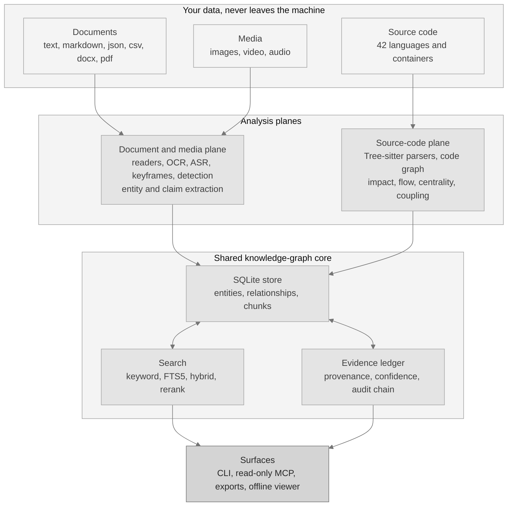

Les deux plans restent séparés à dessein. Ils partagent la base et une même exigence de preuve, mais jamais les lecteurs de l'autre.

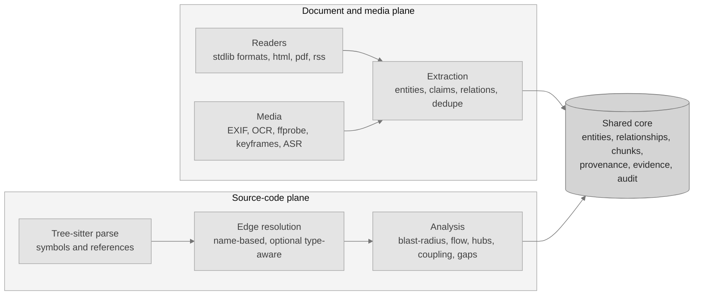

Une requête ne devine jamais. Elle se déploie sur tous les chemins de recherche, fusionne les résultats et renvoie la preuve avec chaque correspondance.

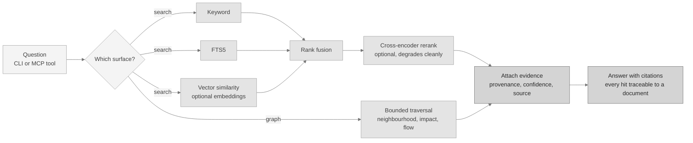

La qualité de la recherche est mesurée sur 30 documents et 40 requêtes. Les seuls mots-clés donnent un MRR de 0.9375 et un nDCG@10 de 0.9473. En ajoutant le modèle de plongements optionnel et le réordonnanceur, les deux atteignent 1.0, au prix de 205.84 ms supplémentaires par requête.

### Une comparaison mesurée, avant et après

La résolution tenant compte des types est l'amélioration mesurée la plus nette du projet, et c'est aussi la meilleure illustration de la raison pour laquelle le résultat par défaut est indicatif. La correspondance par nom seul résout un appel vers toutes les fonctions qui portent ce nom, si bien qu'une requête d'impact signale beaucoup trop. Avec un serveur de langage installé, la même requête se résout vers une seule cible.

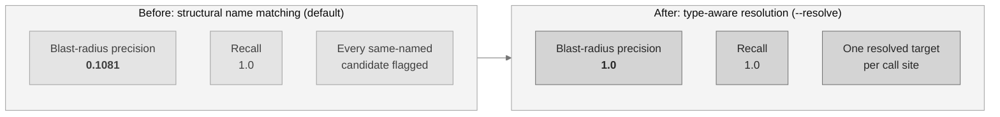

Mesuré sur 42 nœuds d'évaluation et 24 arêtes vraies par langage, pour Python et JavaScript. Go reste sur le chemin structurel car aucun serveur de langage n'est installé ici pour lui. Le rappel vaut 1.0 dans les deux configurations, donc tout le gain porte sur la précision.

### Ce que calcule vraiment une requête d'impact

Elle parcourt le graphe de code à rebours : partir du symbole modifié, suivre les connexions entrantes, s'arrêter à la limite de profondeur. Elle signale trop à dessein, d'où le caractère indicatif du résultat et l'importance de la comparaison précédente.

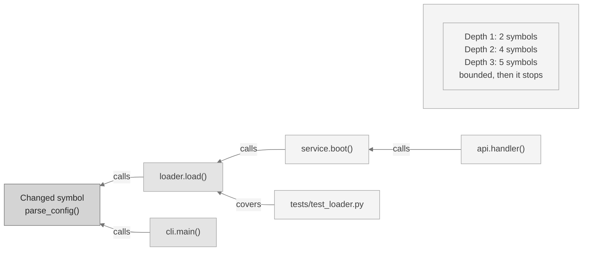

Les noms de symboles ci-dessus illustrent la forme, ils ne rapportent pas une mesure.

### Ne relire que ce qui a changé

Une deuxième exécution ne réanalyse pas le dépôt. Le chemin incrémental demande au gestionnaire de versions quels fichiers ont bougé, ne réanalyse que ceux-là et ne remplace que leurs symboles et leurs connexions.

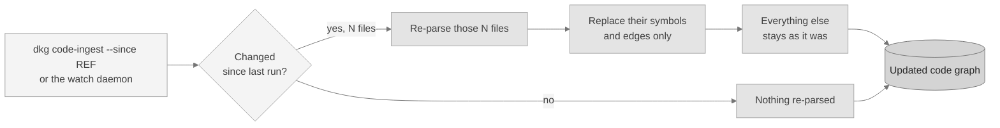

Ce chemin est couvert par des tests, pour git comme pour Subversion. Sa vitesse n'a jamais été chronométrée, ce projet ne publie donc aucune affirmation de temps à son sujet.

### Tout demander, ou seulement la partie qui répond à votre question

Le chemin par le graphe répond à une question structurelle avec les nœuds qui y répondent, plus les fichiers que ces nœuds nomment. Sur un échantillon de 38 fichiers Python totalisant 12,620 jetons estimés, 289 symboles et 745 connexions, les deux chemins coûtent ceci :

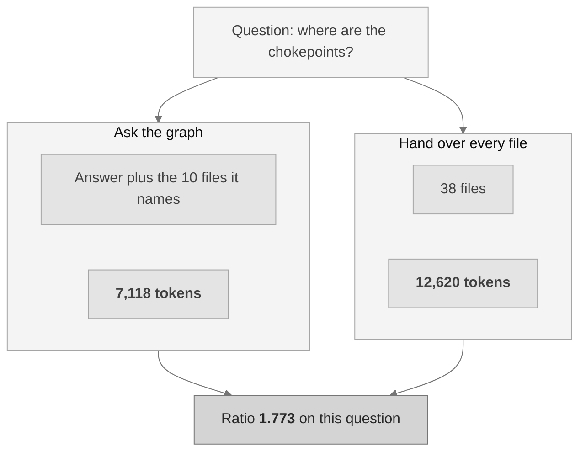

Sur les cinq questions posées à cet échantillon, le rapport moyen est de 1.4232, dans une fourchette allant de 0.6675 à 1.773. Un rapport inférieur à 1.0 signifie que le chemin par le graphe a coûté plus cher que de fournir simplement tous les fichiers, ce qui arrive quand la réponse à une question nomme le dépôt entier.

La dépendance à la taille est mesurée et non supposée : à 13 fichiers le rapport moyen est de 0.5838, à 23 fichiers de 0.9321 et à 38 fichiers de 1.4232. **Un dépôt assez petit pour tenir dans une fenêtre de contexte n'a pas besoin d'un graphe pour économiser des jetons.**

## Mnemosyne et Ariadne

Un graphe de taille réelle est trop grand pour être lu. Deux détecteurs, tous deux écrits pour ce projet, le transforment en une poignée de groupes avec lesquels on peut vraiment travailler. Les deux s'exécutent par défaut, et la plateforme renvoie celui qui obtient le meilleur score à la mesure.

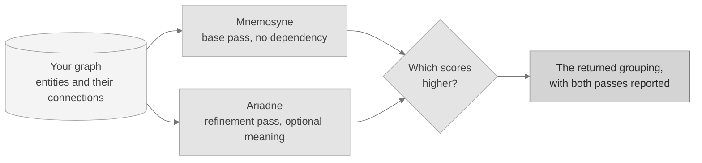

Les deux optimisent la modularité, la mesure publiée et déjà établie de l'écart entre un regroupement et ce que le hasard produirait. La modularité n'est pas une invention de ce projet et n'est pas présentée comme telle. Les deux détecteurs, eux, le sont.

### Mnemosyne, le détecteur de base

**Ce qu'il fait.** Mnemosyne ne lit rien d'autre que les connexions et y trouve les groupes qui s'y cachent. Il commence avec chaque entité seule, déplace chacune vers le groupe voisin qui améliore le plus le score, puis traite chaque groupe comme une entité unique et recommence sur le graphe réduit. Les petites grappes deviennent des thèmes, les thèmes deviennent des domaines.

**Pourquoi c'est utile.** Il n'a besoin d'aucun modèle, d'aucun téléchargement et d'aucun composant optionnel. Sur une installation minimale, il transforme encore un mur de connexions en une carte lisible. Il est de plus entièrement déterministe : le même graphe produit toujours la même partition, octet pour octet.

```bash
dkg community --detector mnemosyne
```

**Mesuré.** Sur un échantillon de 80 entités réparties en 16 groupes connus, il retrouve exactement le regroupement, avec un accord de **Rand 1.0**, pour une modularité de 0.846591 en 1.196 ms. Sur un échantillon de 40 entités réparties en 5 thèmes dont les connexions sont symétriques par construction, il obtient un Rand de 0.641, ce qui est le résultat attendu quand la réponse ne se trouve pas dans le câblage.

Explication complète, mathématiques et résultats : [`docs/MNEMOSYNE.md`](docs/MNEMOSYNE.md).

### Ariadne, le détecteur de raffinement

**Ce qu'il fait.** Ariadne reprend le même graphe et corrige trois choses que la passe de base ne peut pas traiter. Il scinde tout groupe qui se révèle être deux moitiés déconnectées, de sorte que chaque groupe rendu en est vraiment un. Il peut pondérer chaque connexion par la proximité de sens de ses deux extrémités, lorsqu'un modèle de texte local est installé. Et il peut choisir lui-même sa granularité en essayant une plage de valeurs et en retenant la meilleure.

**Pourquoi c'est utile.** Deux grappes peuvent être câblées de façon identique et porter pourtant sur des sujets tout à fait différents. La structure seule ne peut pas les distinguer, Ariadne le peut.

```bash
dkg community --detector ariadne
```

**Mesuré.** Sur l'échantillon structurel, les deux détecteurs **font jeu égal à Rand 1.0** : la passe de base était déjà exacte et le raffinement n'avait rien à corriger. Sur l'échantillon sémantique, Ariadne prend l'avantage, **Rand 0.7641 contre 0.641**, en trouvant 8 groupes contre 5 réels là où la passe de base en trouve 4.

Un détail à énoncer honnêtement. Ariadne obtient une modularité plus faible sur cet échantillon sémantique, 0.42 contre 0.5, et comme le chemin par défaut renvoie le regroupement au meilleur score, c'est la passe de base qui est rendue là. La sélection se fait par la mesure et jamais par préférence, si bien qu'une égalité ou un score plus faible conservent le résultat de base. Quand le sens compte plus que le câblage dans votre graphe, demandez Ariadne directement avec la commande ci-dessus.

Explication complète, mathématiques et résultats : [`docs/ARIADNE.md`](docs/ARIADNE.md).

## Capacités

Sauf si la dernière colonne nomme un supplément optionnel, tout ce qui suit fonctionne avec la seule bibliothèque standard de Python. Les suppléments sont optionnels et s'installent avec `pip install -e ".[name]"`.

| Capacité | Ce qu'elle fait | Nécessite |
|---|---|---|
| Magasin du graphe | SQLite avec recherche en texte intégral, identifiants stables, trace de l'origine et journal d'audit inviolable. | Intégré |
| Extraction | Entités, assertions et relations, sans aucun modèle. | Intégré |
| Recherche | Mots-clés, texte intégral et un chemin hybride qui indique quels moteurs ont contribué. | Intégré |
| Plongements locaux | Similarité vectorielle issue d'un modèle local, stockée par modèle pour que deux modèles ne se mélangent jamais. | `embeddings` |
| Réordonnancement | Un réordonnanceur local sur les résultats de recherche. S'efface proprement en son absence. | `reranker` |
| Preuve et confiance | Preuve par assertion, une confiance lisible et un détecteur de contradictions. | Intégré |
| Regroupement | [Mnemosyne et Ariadne](#mnemosyne-et-ariadne), les deux s'exécutant par défaut. | Intégré |
| Connexion des assistants | Une surface d'outils en lecture seule pour les assistants IA, plus une option HTTP locale. | Intégré |
| Analyse du graphe | Pivots, ponts, points d'étranglement, connexions surprenantes, lacunes, questions de revue et comparaison de graphes. | Intégré |
| Configuration de l'éditeur | Écrire l'entrée de l'assistant pour un éditeur, avec simulation et désinstallation propre. | Intégré |
| Flux d'agents | Agents déterministes de recherche, de validation, de contradiction et de revue de sécurité. | Intégré |
| Plan code source | 42 langages et conteneurs, un graphe de code, l'impact des changements, le flux d'exécution et la résolution typée optionnelle. | `code`, `code-extended`, `code-full` |
| Détection d'images | Étiquetage local d'images sans exemple préalable. | `media-detect` |
| Enrichissement des médias | Décodage d'image et EXIF, OCR, métadonnées vidéo, images clés et transcription de la parole. | `media-image`, outils externes |
| Livraison | Surveillant de dépôts, visionneuse de graphe hors ligne, exports et une GitHub Action. | Intégré ; `watch` optionnel |
| Mesures | Une commande à graine fixe régénère chaque chiffre mesuré. | Intégré |

Quelques-unes de ces lignes méritent une phrase de plus.

**Le détecteur de contradictions** rassemble les assertions portant sur le même sujet même lorsque deux documents les formulent différemment, puis vérifie si elles s'opposent sur des nombres, des négations ou des antonymes. C'est un détecteur lexical et non un modèle de raisonnement, sa sortie est donc indicative : rappel mesuré de 0.6667 et précision de 0.75.

**La couche de livraison est intégrée, le surveillant de dépôts aussi.** Le démon fonctionne tel quel sur un moteur d'interrogation périodique issu de la bibliothèque standard. Installer le supplément optionnel `watch` le remplace par une surveillance événementielle, qui réagit plus vite et coûte moins au repos. Rien d'autre dans la couche de livraison ne demande un supplément. Gérez les dépôts avec `dkg registry add <name> <path>` et lancez le surveillant avec `dkg daemon`.

**Les exports comprennent un coffre Obsidian.** `dkg export --format obsidian --out ./vault` écrit votre graphe sous forme de dossier de notes Markdown reliées : une note par entité, avec ses connexions en `[[wikilinks]]`. Ouvrir ce dossier dans l'application de notes Obsidian montre le graphe dans la vue graphe d'Obsidian. Obsidian est une destination vers laquelle cette plateforme écrit, pas quelque chose qu'elle exécute ou exige. Les autres formats sont `json`, `markdown`, `csv`, `graphml`, `dot`, `cypher`, `svg` et une visionneuse `html` autonome.

### Entrées prises en charge

Ces formats n'ont besoin de rien d'autre que la bibliothèque standard de Python :

| Entrée intégrée | Formats |
|---|---|
| Texte et Markdown | `.txt`, `.md`, `.markdown`, `.rst`, `.log` |
| Données structurées | `.json`, `.csv`, `.tsv` |
| Documents Word | `.docx`, lus avec la bibliothèque standard et l'expansion d'entités externes désactivée |
| RSS et Atom | analyse de flux avec l'analyseur XML de la bibliothèque standard |

Ces entrées sont détectées à l'exécution. Quand le supplément ou l'outil externe manque, l'entrée s'efface en indiquant clairement pourquoi, au lieu d'échouer :

| Entrée optionnelle | Nécessite |
|---|---|
| HTML | supplément `html` |
| PDF | supplément `pdf` |
| Récupération web | supplément `web`, plus un `--allow-network` explicite |
| Images, EXIF, OCR | supplément `media-image`, et tesseract pour l'OCR |
| Métadonnées vidéo, images clés, scènes | ffprobe et ffmpeg externes |
| Transcription de la parole | un modèle local désigné par `DKG_ASR_MODEL` |
| Code source | supplément `code` pour commencer, voir l'ensemble des langages ci-dessous |

### Couverture des langages

42 langages et conteneurs, en quatre niveaux optionnels plus un qui n'a besoin d'aucun niveau, de sorte qu'une installation minimale le reste. Toutes les grammaires livrées sont permissives, et aucune n'est recopiée dans ce dépôt.

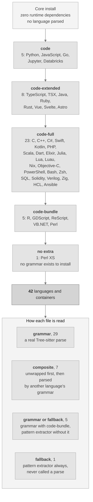

Lancez `dkg code-languages` pour connaître l'ensemble réel sur votre machine. L'inventaire complet, avec les extensions et les licences, se trouve dans [`docs/LANGUAGES.md`](docs/LANGUAGES.md).

| Supplément | Langages et conteneurs |
|---|---|
| `code` | Python, JavaScript, Go, carnets Jupyter, carnets Databricks |
| `code-extended` | TypeScript, TSX, Java, Ruby, Rust, Vue, Svelte, Astro |
| `code-full` | Ansible, Bash, C, C++, C#, Dart, Elixir, HCL et Terraform, Julia, Kotlin, Lua, Luau, Nix, Objective-C, PHP, PowerShell, Scala, Solidity, SQL, Swift, Verilog, Zig, Zsh |
| `code-bundle` | R, GDScript, ReScript, VB.NET, Perl |
| aucun nécessaire | Perl XS |

L'exactitude de l'analyse est mesurée par langage sur deux échantillons étiquetés et publiée dans [`docs/BENCHMARKS.md`](docs/BENCHMARKS.md). Un langage dont la grammaire optionnelle n'est pas installée est rapporté comme non mesuré, jamais noté zéro.

**Perl XS se lit autrement, et s'étiquette autrement.** Il n'existe aucune grammaire permissive pour les fichiers `.xs` où que ce projet puisse aller, aucun supplément ne change donc sa lecture :

| Aspect | Traitement de Perl XS |
|---|---|
| Comment il est lu | Un extracteur par motifs documenté, jamais une analyse complète |
| Comment il est rapporté | Fidélité `fallback`, sur le nœud du graphe et dans chaque rapport |
| Effet sur les résultats | Chaque connexion issue d'un tel fichier voit sa confiance réduite |
| Exactitude mesurée | Précision de 0.875 et rappel de 0.7778 sur l'échantillon réservé |

## Installation

**Prérequis.** Python 3.10 ou plus récent. L'installation de base n'entraîne aucune dépendance d'exécution. macOS et Linux sont les cibles testées.

```bash
# from a clone of the repository
python3 -m venv .venv
./.venv/bin/python -m pip install --upgrade pip
./.venv/bin/python -m pip install -e ".[dev]"
./.venv/bin/dkg --version        # dkg 0.1.0
```

N'ajoutez des suppléments optionnels que lorsque vous en avez besoin, par exemple `pip install -e ".[embeddings,reranker,code]"`. Chaque composant optionnel indique la raison exacte de son indisponibilité.

### Prise en main

```bash
dkg init                                   # create a project-local .dkg home
dkg ingest ./my-notes --recursive          # ingest text, markdown, json, csv, docx
dkg status                                 # print counts and configuration
dkg search "confidence formula"            # keyword, fts, or hybrid (default hybrid)
dkg graph "beta" --depth 2                 # bounded graph neighbourhood
dkg evidence <claim-id>                    # evidence packet for a claim
dkg community                              # group the graph with both detectors
dkg code-ingest ./my-repo                  # parse a repository into the code graph
dkg code-hubs                              # most connected symbols and chokepoints
dkg code-gaps                              # isolated symbols and untested hotspots
dkg code-questions                         # review questions generated from the graph
dkg code-architecture                      # component overview with coupling warnings
dkg graph-snapshot before.json             # snapshot now, diff later with graph-diff
dkg export --format html --out graph.html  # offline viewer, or json / csv / dot / cypher / obsidian
dkg audit --verify                         # verify the audit log
dkg mcp-stdio                              # start the read-only assistant server
```

### Si vous débutez en ligne de commande

1. Installez Python 3.10 ou plus récent depuis python.org, puis ouvrez un terminal dans le dossier du projet.
2. Copiez les quatre commandes d'installation ci-dessus, une ligne à la fois. La dernière doit afficher `dkg 0.1.0`.
3. Lancez `dkg init`, puis pointez `dkg ingest` vers un dossier contenant vos notes, puis lancez `dkg search "a phrase you expect to find"`.

Chaque commande affiche du texte lisible par défaut et du JSON lisible par une machine avec `--json`. Aucune étape ne contacte le réseau, sauf si vous passez `--allow-network`.

### Une seule installation, toutes les plateformes prises en charge

Le même chemin d'installation partout, parce que le noyau n'utilise que la bibliothèque standard. Aucun paquet à faire correspondre à votre système d'exploitation, aucune étape de compilation et aucun service à faire tourner.

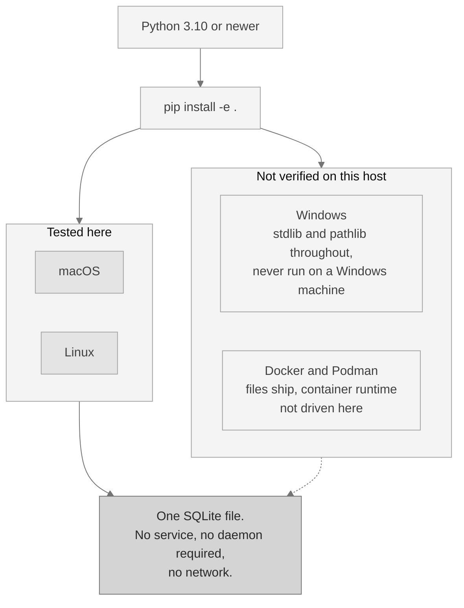

La ligne pointillée est là pour une raison. macOS et Linux sont les cibles testées. Windows et les images de conteneur sont livrés mais n'ont pas été exécutés sur cette machine, et ce document le dit plutôt que de supposer le code portable parce qu'il en a l'air.

## Connecter un assistant IA

L'intégration des assistants parle le Model Context Protocol, ou MCP : une connexion standard, en lecture seule, qu'un assistant IA peut utiliser pour interroger votre graphe. Elle passe par l'entrée et la sortie standard, avec une option HTTP locale qui exige un jeton et vérifie l'origine de la requête.

**Seuls des outils de consultation sont enregistrés. Aucun outil qui écrit n'est jamais exposé**, si bien qu'un assistant qui agirait d'après le contenu qu'on lui a donné ne peut pas modifier votre graphe par cette connexion.

```mermaid
%%{init: {"theme":"base","themeVariables":{"primaryColor":"#e4e4e4","primaryTextColor":"#404040","primaryBorderColor":"#a5a5a5","lineColor":"#757575","secondaryColor":"#d4d4d4","tertiaryColor":"#f4f4f4","clusterBkg":"#f4f4f4","clusterBorder":"#a5a5a5","edgeLabelBackground":"#f4f4f4","textColor":"#404040"}}}%%
flowchart LR
    asst["Your assistant<br/>any model, any vendor"]
    asst -->|"JSON-RPC over stdio"| srv["dkg mcp-stdio<br/>read-only tool surface"]

    subgraph guards["Enforced outside the model"]
        direction TB
        g1["Query tools only<br/>no write tool registered"]
        g2["Path reads confined to a root<br/>and size-capped"]
        g3["Node and edge reads bounded together,<br/>truncation reported"]
        g4["Fetched content labelled<br/>untrusted evidence, never instructions"]
    end

    srv --> guards
    guards --> db[("Local SQLite graph<br/>opened read-only")]
    db --> ans["Answer with provenance,<br/>confidence, and the source it came from"]
    ans --> asst

    classDef inner fill:#e4e4e4,stroke:#a5a5a5,color:#404040
    classDef strong fill:#d4d4d4,stroke:#757575,color:#282828
    classDef outer fill:#f4f4f4,stroke:#a5a5a5,color:#404040
    class asst outer
    class g1,g2,g3,g4 inner
    class srv,ans inner
    class db strong
```

Configurez un éditeur avec `dkg mcp-install --client <name>`, prévisualisez avec `--dry-run` et annulez avec `dkg mcp-uninstall`, qui ne retire que ce qu'il a écrit. Lancez `dkg mcp-tools` pour lister les éditeurs qu'il sait configurer. Les paramètres de chaque outil sont dans [`docs/COMMANDS.md`](docs/COMMANDS.md).

### La surface d'outils

| Outil | Ce qu'il renvoie |
|---|---|
| `dkg.status` | Les comptages de la base de données et la version de l'application. |
| `dkg.orient` | Une orientation compacte pour un graphe inconnu : sa forme, ses plus grandes composantes et par où commencer. |
| `dkg.search` | Recherche hybride sur les fragments, fusionnant mots-clés et FTS5 et indiquant quels moteurs ont contribué. |
| `dkg.search.keyword` | Recherche par mots-clés sur les fragments. |
| `dkg.search.fts` | Recherche FTS5 sur les fragments. |
| `dkg.graph.neighbourhood` | Le voisinage borné du graphe autour d'une entité. |
| `dkg.graph.community` | Communautés sur le graphe d'entités par optimisation de la modularité. |
| `dkg.graph.community.split` | La même chose, puis scinde toute communauté dépassant un seuil. |
| `dkg.graph.diff` | Compare deux instantanés du graphe de code écrits par `dkg graph-snapshot`. |
| `dkg.evidence.claim` | Le dossier de preuve d'une assertion, avec sa confiance explicable. |
| `dkg.facets.source` | Chaque source avec son nombre de fragments. |
| `dkg.code.languages` | Chaque langage analysé par le plan, la façon dont chacun est lu et sa disponibilité ici. |
| `dkg.code.symbols` | Analyse un fichier source et renvoie ses symboles, sans écrire dans la base de données. |
| `dkg.code.search` | Recherche sur les symboles de code et le texte du code. |
| `dkg.code.impact` | Rayon d'impact structurel d'un symbole ou d'un fichier. Signale trop et reste indicatif. |
| `dkg.code.impact_radius` | Rayon d'impact avec, pour chaque symbole touché, son propre motif et sa distance. |
| `dkg.code.flow` | Trace structurelle du flux d'exécution, chaînes d'appels vers l'avant depuis un symbole d'entrée. |
| `dkg.code.flows` | Les flux d'exécution catalogués, classés par ordre. |
| `dkg.code.flow.get` | Un flux catalogué par nom ou identifiant, avec ses étapes. |
| `dkg.code.flows.affected` | Quels flux catalogués traversent un ensemble de fichiers modifiés. |
| `dkg.code.callers` | Les symboles qui appellent celui indiqué, en tranches au niveau des nœuds plutôt qu'en fichiers entiers. |
| `dkg.code.callees` | Les symboles qu'appelle celui indiqué, en tranches au niveau des nœuds. |
| `dkg.code.neighbours` | Symboles liés dans un sens ou dans l'autre, par appels, imports et héritage. |
| `dkg.code.importers` | Les modules qui importent le module indiqué, chacun avec sa confiance d'arête. |
| `dkg.code.base_types` | Les types dont hérite le type indiqué, chacun avec sa confiance d'arête. |
| `dkg.code.implementations` | Les types qui héritent du type indiqué, chacun avec sa confiance d'arête. |
| `dkg.code.tests_for` | Les tests qui exercent le symbole indiqué, chacun avec sa confiance d'arête. |
| `dkg.code.hubs` | Les symboles les plus connectés et les points d'étranglement de l'architecture. |
| `dkg.code.coupling` | Les arêtes qui surprennent au regard de la structure environnante. |
| `dkg.code.gaps` | Symboles isolés, points chauds sans tests et communautés clairsemées. |
| `dkg.code.questions` | Questions de revue engendrées depuis le graphe, chacune nommant la mesure qui l'a suscitée. |
| `dkg.code.architecture` | Une carte au niveau des composants, assortie d'alertes de couplage. |
| `dkg.code.communities` | Résumés précalculés par communauté : membres, fichiers et structure interne. |
| `dkg.code.change` | Un résumé structurel du dépôt auquel le serveur est confiné. |
| `dkg.code.review_context` | Tout ce dont un relecteur a besoin sur un symbole, en un seul appel. |
| `dkg.code.criticality` | Chaque flux d'exécution depuis un point d'entrée, noté par criticité pondérée. |
| `dkg.code.risk` | Un score de risque indicatif de 0 à 1 pour un ensemble de changements. |
| `dkg.code.risk.index` | L'indice de risque structurel précalculé par symbole, du plus élevé au plus faible. |
| `dkg.code.confidence` | Le profil de confiance à trois niveaux du graphe de code. |
| `dkg.code.dead` | Code mort candidat : définitions sans aucune arête de référence entrante. |
| `dkg.code.large` | Symboles dont l'étendue de lignes enregistrée atteint au moins une taille donnée. |
| `dkg.code.refactor` | Suggestions de remaniement tirées de la structure des communautés. |
| `dkg.code.rename.preview` | Un renommage de symbole sous forme de liste d'éditions en lecture seule. Il prévisualise ; il n'écrit jamais. |
| `dkg.code.slices` | Tranches au niveau des nœuds, en forme de réponse, pour une question structurelle. |
| `dkg.code.traverse` | Parcours libre depuis n'importe quel nœud, en largeur ou en profondeur. |
| `dkg.code.framework` | Les relations de cadriciel d'un symbole : `routes_to`, `renders`, `relates_to`. |
| `dkg.repos.list` | Chaque dépôt enregistré avec son état propre. |
| `dkg.repos.search` | Recherche sur tous les dépôts enregistrés, avec des résultats par dépôt. |
| `dkg.memory.list` | Les réponses enregistrées que conserve la boucle de mémoire. |
| `dkg.prompts.list` | Les modèles d'invite réutilisables pour les tâches de revue récurrentes. |
| `dkg.prompts.get` | Un modèle d'invite réutilisable, par son nom. |
| `dkg.docs.section` | Une section nommée de la documentation livrée, confinée à la racine de la documentation. |

Toutes lisent. Aucune n'écrit. L'assistant de configuration qui, lui, écrit des fichiers n'est disponible qu'en ligne de commande et reste volontairement hors de cette surface.

## Intégration continue

Une GitHub Action prête à l'emploi exécute l'analyse sur un dépôt et publie une revue notée par risque sous forme d'un commentaire unique de demande de fusion, en mettant à jour ce même commentaire à chaque envoi plutôt qu'en en ajoutant un nouveau. Copiez ceci dans `.github/workflows/` :

```yaml
name: code-review

on:
  pull_request:
    branches: ["**"]

permissions:
  contents: read
  pull-requests: write

jobs:
  review:
    runs-on: ubuntu-latest
    steps:
      - uses: actions/checkout@11d5960a326750d5838078e36cf38b85af677262 # v4.4.0
        with:
          fetch-depth: 0          # the base ref must be diffable
          persist-credentials: false

      - uses: scorpion1476-lgtm/D-Knowledge_Graph@v0.1.0
        with:
          repository-path: "."
          base-ref: ${{ github.event.pull_request.base.sha }}
          # Pin the analysed tool, not just the action. A floating ref here
          # would silently change what runs against your code.
          dkg-ref: "v0.1.0"
          dkg-repo-url: "https://github.com/scorpion1476-lgtm/D-Knowledge_Graph.git"
          comment: "true"
          pr-number: ${{ github.event.pull_request.number }}
          github-token: ${{ secrets.GITHUB_TOKEN }}
          # Off by default. Set to low, moderate, elevated, or high to gate.
          # Thresholds derive from your repository's own score distribution.
          risk-gate: "off"
```

> [!WARNING]
> La forme à flux unique ci-dessus exécute le code de la demande de fusion dans une tâche qui détient un jeton d'écriture. C'est sûr là où seuls des contributeurs de confiance ouvrent des demandes. **Si vous acceptez des demandes venues de bifurcations, utilisez plutôt la forme en deux étapes** : un flux produit la revue sans droit d'écriture et sans aucun secret, et un second la publie depuis une tâche qui ne récupère jamais le code de la demande. Les deux fichiers sont livrés avec ce dépôt.

Les entrées, les sorties et le modèle de risque de l'Action sont documentés dans [`docs/CONSUMER_ACTION.md`](docs/CONSUMER_ACTION.md). Elle installe l'outil depuis une version épinglée, épingle ses propres sous-actions à des commits exacts, et n'a besoin d'aucun service ni d'aucun compte.

## Sécurité

La plateforme est sûre par défaut. Chaque contrôle ci-dessous est implémenté dans le code source et couvert par un test.

| Contrôle | Par défaut | Détail |
|---|---|---|
| Réseau sortant | Coupé | Sortir exige l'option explicite `--allow-network` et une autorisation dans la configuration. |
| Télémétrie | Aucune | Il n'y a rien à désactiver ; cela ne peut être activé que délibérément. |
| Connexion des assistants | Lecture seule | Seuls des outils de consultation existent. L'option HTTP écoute sur votre propre machine, exige un jeton et borne la taille et la fréquence des requêtes. |
| Falsification de requête | Bloquée | Les adresses sont vérifiées après résolution, et les adresses privées, de bouclage et de métadonnées de nuage sont refusées avant toute récupération. |
| Masquage des secrets | Actif | Journaux, lignes d'audit et exports passent par un masqueur qui cache clés, jetons et blocs de clé privée. |
| Contenu non fiable | Imposé | Le contenu web récupéré est étiqueté comme preuve, jamais comme instructions, et il est évalué pour détecter des tentatives d'injection. |
| Stockage | Paramétré | Chaque requête à la base de données est paramétrée ; la couche de stockage refuse les requêtes construites par concaténation. |
| Origine et preuve | Toujours actives | Chaque enregistrement note d'où il vient, et le journal d'audit n'accepte que des ajouts, avec une chaîne d'empreintes par ligne. |
| Chaîne d'approvisionnement | Durcie | Les actions sont épinglées à des commits exacts, les dépendances sont figées par un fichier de verrouillage et une nomenclature engendrés, et les analyses de licences et de vulnérabilités s'exécutent en IC. |

Le modèle complet, y compris ce qui est volontairement hors périmètre, se trouve dans [`docs/SECURITY_MODEL.md`](docs/SECURITY_MODEL.md) et [`docs/THREAT_MODEL.md`](docs/THREAT_MODEL.md).

## Mesures

Ici l'exactitude est mesurée plutôt qu'affirmée. Chaque chiffre provient d'un échantillon documenté avec une graine fixe, et une seule commande les régénère tous :

```bash
python scripts/benchmark.py
```

| Ce qui est mesuré | Échantillon | Résultat |
|---|---|---|
| Qualité de la recherche | 30 documents, 40 requêtes | Les seuls mots-clés donnent MRR 0.9375 et nDCG@10 0.9473. Avec le modèle de plongements optionnel et le réordonnanceur, les deux atteignent 1.0. |
| Précision de l'impact des changements | 42 nœuds d'évaluation, 24 arêtes vraies par langage | Précision de 0.1081 par défaut et de 1.0 avec `--resolve`, rappel de 1.0 dans les deux cas, pour Python et JavaScript. |
| Exactitude de l'analyse de code | 113 symboles répartis sur 13 langages, étiquetés avant toute analyse | Précision de 0.982 et rappel de 0.9646. |
| Qualité du regroupement | 80 entités en 16 groupes, et 40 entités en 5 thèmes | Les deux détecteurs font jeu égal sur la structure à Rand 1.0. Là où le sens compte, le raffinement mène à Rand 0.7641 contre 0.641. |
| Exactitude du flux d'exécution | Graphes d'appels étiquetés à la main par langage | Précision et rappel de 1.0 pour Python, JavaScript et Go. |
| Détection des contradictions | 18 cas réservés | Rappel de 0.6667 et précision de 0.75. Indicative, et lexicale plutôt que raisonnée. |
| Exactitude sur les médias | Échantillons rendus, non des photographies réelles | Taux d'erreur sur les caractères et sur les mots de l'OCR à 0.0, et étiquetage d'images top-1 à 0.9375. |

Deux choses que cette page n'affirmera pas. Le chemin par le graphe est un résultat de **justesse** et non une économie : face à une base de référence compétente qui cherche et lit, il consomme environ deux fois plus de jetons, 71,088 contre 34,744, tout en obtenant une justesse moyenne de 1.0 contre 0.6206. Et une mesure dont l'outil ou le modèle optionnel n'est pas installé est rapportée comme non exécutée ici, jamais comme un zéro et jamais comme une réussite.

Les résultats complets, les tailles d'échantillon, la méthode et les limites de chaque échantillon sont dans [`docs/BENCHMARKS.md`](docs/BENCHMARKS.md).

## Cas d'usage

La plateforme est un socle de recherche et de connaissance privé et vérifiable. Parce qu'elle fonctionne hors ligne et note l'origine de chaque enregistrement, elle convient aux travaux où la source d'une réponse compte autant que la réponse.

| Équipe ou fonction | À quoi ils s'en servent | Bénéfice |
|---|---|---|
| Recherche et analyse | Ingérer notes, rapports et flux, puis rechercher, parcourir et recouper les assertions avec leurs sources. | Un graphe interrogeable où chaque assertion renvoie à son document. |
| Conformité et revue juridique | Garder les documents sensibles sur une machine locale ou déconnectée et produire des preuves assorties d'une confiance lisible. | Une trace hors ligne et défendable de ce qui a été trouvé et où. |
| Gestion des connaissances | Transformer des fichiers épars en un graphe connecté, regrouper les documents liés et les exporter vers Obsidian ou Graphviz. | Une carte entretenue de vos propres connaissances, sans dépendance à un fournisseur. |
| Enquête et diligence raisonnable | Faire remonter les contradictions entre sources et suivre des requêtes bornées entre entités. | Une carte relisible de ce sur quoi les sources s'accordent et divergent. |

Exécutez un flux d'agents déterministe sur le graphe sans aucun modèle connecté, puis enregistrez un modèle local derrière l'interface d'adaptateurs quand vous voulez plus de rappel :

```bash
dkg agent research        --input '{"query":"knowledge graph"}'
dkg agent contradiction   --input '{}'
dkg agent security-review --input '{"limit":500}'
```

### Pour les équipes d'ingénierie

| Cas d'ingénierie | Ce que la plateforme apporte |
|---|---|
| Compréhension du code | Analyser un dépôt en un graphe de code et interroger symboles, structure d'appels et flux d'exécution depuis un point d'entrée. |
| Revue d'architecture | Faire remonter les symboles les plus connectés, les points dont le retrait scinde le graphe, les cycles entre composants et les connexions qui franchissent une frontière. |
| Relire un changement inconnu | Engendrer des questions de revue depuis le graphe, chacune nommant un symbole et la mesure qui la motive, puis comparer deux instantanés pour voir ce qui a bougé. |
| Revue de l'impact d'un changement | Calculer un ensemble d'impact indicatif pour les fichiers modifiés, avec une barrière optionnelle pour l'IC, via la GitHub Action ou `dkg code-report`. |
| Graphes de connaissances hors ligne | Construire et parcourir un graphe dans une visionneuse HTML autonome qui ne charge rien depuis le réseau. |
| Déploiements coupés du réseau | Installer depuis les sources sans dépendance d'exécution et faire tourner chaque capacité de base réseau éteint. |

L'impact des changements et le flux d'exécution signalent trop par conception sur le chemin par défaut. Le chemin optionnel `--resolve` resserre les appels ambigus par résolution typée là où un serveur de langage est installé.

## Questions fréquentes

Les réponses courtes. Les longues, y compris les comparaisons honnêtes face à un serveur de langage, à la recherche par similarité et à la recherche textuelle simple, sont dans [`docs/FAQ.md`](docs/FAQ.md).

| Question | Réponse |
|---|---|
| Est-ce un projet libre ? | Non. Ceci n'est pas une licence open source : le code est disponible mais non commercial. L'usage commercial, la modification et la redistribution modifiée sont tous interdits. Voir la section licence ci-dessous. |
| Cela remplace-t-il un serveur de langage ? | Non, et il en utilise un lorsqu'il y en a un d'installé. Le chemin de code par défaut signale trop ; `--resolve` le resserre là où un serveur est présent. |
| Cela remplace-t-il la recherche textuelle ? | Non. Pour "où apparaît exactement cette chaîne", la recherche simple gagne et rien ici ne la dépasse. Le graphe sert aux questions qui ne sont pas des chaînes. |
| Cela remplace-t-il une base vectorielle ? | Non. Il inclut la recherche par similarité en option et lui ajoute structure, origine et preuve. Pour une simple recherche sémantique sur du texte, une base vectorielle est plus simple. |
| Cela appelle-t-il chez l'éditeur ? | Non. Il n'y a aucune télémétrie, et sortir sur le réseau exige l'option explicite `--allow-network` et une autorisation dans la configuration. |
| Cela télécharge-t-il des modèles ? | Jamais pendant l'exécution. Les modèles sont placés au préalable sur le disque et chargés depuis des fichiers locaux uniquement ; un modèle absent cède la place à une solution de repli documentée. |
| Comment savoir si l'installation est correcte ? | `dkg --version`, puis `dkg init`, `dkg capabilities`, `dkg doctor`, puis ingérez et cherchez quelque chose. Une longue liste de capacités optionnelles indisponibles sur une installation neuve est normale et non un défaut. |
| Comment distinguer un problème d'installation d'un problème d'environnement ? | `python scripts/probe_environment.py` affiche l'interpréteur, les suppléments installés, les outils externes et les modèles locaux trouvés, et si l'index des paquets est joignable. |
| Quand vaut-il mieux ne pas l'utiliser ? | Quand vous avez besoin de certitude et non d'un résultat indicatif, quand votre collection est immense, quand il vous faut un service hébergé, ou quand il vous faut un usage commercial. |

## Dépannage

Chaque entrée de [`docs/TROUBLESHOOTING.md`](docs/TROUBLESHOOTING.md) porte un symptôme, une cause et un remède, couvrant les problèmes d'installation et de chemins, les échecs au démarrage du serveur, les verrous et la péremption de la base de données, les composants optionnels absents, et les problèmes de Windows et du sous-système Linux. Les entrées Windows sont signalées comme déduites du code et non observées, car aucune machine Windows n'a été utilisée.

Deux commandes répondent à la plupart des problèmes avant même toute lecture :

```bash
dkg doctor                          # the application's self-check, as JSON
python scripts/probe_environment.py # the environment around it, as JSON
```

Collez les deux dans un rapport d'anomalie. La vérification de l'index des paquets par la seconde est la seule requête sortante qu'elle puisse faire, elle en nomme l'adresse dans sa propre sortie, et `--offline` la saute.

## Documentation

| Document | Ce qu'il contient |
|---|---|
| [`docs/QUICKSTART.md`](docs/QUICKSTART.md) | Le chemin le plus court vers un graphe qui marche. |
| [`docs/USER_GUIDE.md`](docs/USER_GUIDE.md) | Flux complets de recherche, vérification, contradiction, export, sauvegarde et restauration. |
| [`docs/COMMANDS.md`](docs/COMMANDS.md) | Chaque sous-commande et chaque outil d'assistant, avec paramètres et valeurs par défaut. |
| [`docs/MNEMOSYNE.md`](docs/MNEMOSYNE.md) | Le détecteur de regroupement de base, en langage simple et avec tout le détail technique. |
| [`docs/ARIADNE.md`](docs/ARIADNE.md) | Le détecteur de raffinement, en langage simple et avec tout le détail technique. |
| [`docs/BENCHMARKS.md`](docs/BENCHMARKS.md) | Chaque chiffre mesuré, avec les tailles d'échantillon et la graine. |
| [`docs/LANGUAGES.md`](docs/LANGUAGES.md) | Chaque langage analysé, ses extensions, sa façon d'être lu et la licence de sa grammaire. |
| [`docs/FAQ.md`](docs/FAQ.md) | Comparaisons honnêtes, ce qu'il ne remplace pas et comment vérifier une installation. |
| [`docs/TROUBLESHOOTING.md`](docs/TROUBLESHOOTING.md) | Symptôme, cause et remède pour les problèmes qui surviennent vraiment. |
| [`docs/ADMINISTRATOR_GUIDE.md`](docs/ADMINISTRATOR_GUIDE.md) | Faire tourner une installation : dossiers, sauvegardes, rétention et journal d'audit. |
| [`docs/DEPLOYMENT_GUIDE.md`](docs/DEPLOYMENT_GUIDE.md) | Déploiement local, en conteneur et auto-hébergé, avec proxy inverse et TLS. |
| [`docs/DEVELOPER_GUIDE.md`](docs/DEVELOPER_GUIDE.md) | Organisation du dépôt, développement local, la suite de tests et comment ajouter une commande ou un adaptateur. |
| [`docs/ARCHITECTURE.md`](docs/ARCHITECTURE.md) | Comment le noyau et les deux plans s'assemblent. |
| [`docs/CONSUMER_ACTION.md`](docs/CONSUMER_ACTION.md) | La GitHub Action : entrées, sorties, modèle de risque et forme sûre face aux bifurcations. |
| [`docs/SECURITY_MODEL.md`](docs/SECURITY_MODEL.md) et [`docs/THREAT_MODEL.md`](docs/THREAT_MODEL.md) | Les contrôles, et les adversaires auxquels ils répondent. |
| [`docs/ROADMAP.md`](docs/ROADMAP.md) | Livré, en cours, prévu et non prévu. |
| [`CONTRIBUTING.md`](CONTRIBUTING.md) | Développer dans un clone, les commandes des barrières et ce qu'un changement doit satisfaire. |
| [`SECURITY.md`](SECURITY.md) | Versions prises en charge, canal de signalement privé et délais de réponse. |
| [`CODE_OF_CONDUCT.md`](CODE_OF_CONDUCT.md) | La règle, sa portée et comment signaler un problème. |

## Licence

Source disponible et gratuite pour un usage personnel et non commercial. **Ceci n'est pas une licence open source** : l'usage commercial n'est pas permis, ni la modification, ni la distribution d'une version modifiée.

| Composant | Licence | Conditions |
|---|---|---|
| Le dépôt entier, Ariadne compris | D-Knowledge Graph Source-Available Non-Commercial Licence (PolyForm Noncommercial 1.0.0 plus une clause de non-modification) | Lire, exécuter et utiliser la sortie à toute fin non commerciale. Redistribuer des copies conformes avec `LICENSE` et `NOTICE`. Aucun usage commercial. Aucune modification et aucune redistribution modifiée. |
| Dépendances tierces optionnelles | Leurs propres licences permissives (Apache-2.0, MIT, BSD, ISC, HPND) | Non affectées par les conditions ci-dessus. Inventaire complet dans `THIRD_PARTY_NOTICES.md`. |

Une seule licence couvre l'ensemble. Il n'y a aucun module sous licence distincte ni aucun composant exclu de la construction. L'exécution par défaut n'utilise que la bibliothèque standard de Python et ne copie le code d'aucun autre projet.

Les versions distribuées avant le 2026-08-05 ont été publiées sous Apache-2.0. Cette concession reste en vigueur pour ces versions et pour quiconque a reçu une copie à ce titre ; les présentes conditions régissent cette version et les suivantes. Voir `LICENSE` et `NOTICE`.
