<p align="center">
  
</p>

<p align="center">
  <b>Your documents, media, and code become one graph you can ask questions of, and every answer shows where it came from. Nothing leaves your machine.</b>
</p>

<p align="center">
  A local-first knowledge graph that runs fully offline and works with any AI model, or none at all.
</p>

> [!IMPORTANT]
> Everything runs on your own computer. There is no cloud call, no telemetry, and nothing required beyond Python itself. Where this document gives an accuracy figure, that figure comes from a measurement you can run again yourself.

<div align="center">


</div>

<p align="center">
  <b>English</b> &nbsp;&middot;&nbsp;
  <a href="README.zh-CN.md">简体中文 (Simplified Chinese)</a> &nbsp;&middot;&nbsp;
  <a href="README.es.md">Español</a> &nbsp;&middot;&nbsp;
  <a href="README.fr.md">Français</a> &nbsp;&middot;&nbsp;
  <a href="README.de.md">Deutsch</a>
</p>

<p align="center">
  <a href="#start-here">Start here</a> &nbsp;&middot;&nbsp;
  <a href="#overview">Overview</a> &nbsp;&middot;&nbsp;
  <a href="#how-it-works">How it works</a> &nbsp;&middot;&nbsp;
  <a href="#mnemosyne-and-ariadne">Algorithms</a> &nbsp;&middot;&nbsp;
  <a href="#capabilities">Capabilities</a> &nbsp;&middot;&nbsp;
  <a href="#install">Install</a> &nbsp;&middot;&nbsp;
  <a href="#connect-an-ai-assistant">Assistants</a> &nbsp;&middot;&nbsp;
  <a href="#continuous-integration">CI</a> &nbsp;&middot;&nbsp;
  <a href="#security">Security</a> &nbsp;&middot;&nbsp;
  <a href="#benchmarks">Benchmarks</a> &nbsp;&middot;&nbsp;
  <a href="#use-cases">Use cases</a> &nbsp;&middot;&nbsp;
  <a href="#faq">FAQ</a> &nbsp;&middot;&nbsp;
  <a href="#licence">Licence</a>
</p>

---

## Start here

Three commands take you from a clone to a graph you can question. None of them touches the network.

```bash
pip install -e .                 # no runtime dependencies
dkg init                         # create a project-local .dkg home
dkg ingest ./my-notes -r         # then: dkg search "a phrase you expect to find"
```

Analysing a repository instead? Run `pip install -e ".[code]"`, then `dkg code-ingest ./my-repo` and `dkg code-hubs`.

**One measured result, stated the way it was measured.** Turning on type-aware resolution takes the precision of a change-impact query from **0.1081 to 1.0**, with recall held at **1.0**, on a sample of 42 evaluation nodes and 24 true edges per language, for Python and JavaScript. The default was never missing real impact; it was reporting far too much of it. That is one measurement on one sample, regenerated by `python scripts/benchmark.py`, and it is not a prediction about your repository.

---

## Overview

D-Knowledge Graph is one shared knowledge-graph core with two analysis planes on top of it.

The core is a SQLite store with full-text search, stable content-derived identifiers, a tamper-evident audit log, a record of where every fact came from, and a read-only connection for AI assistants. The two planes share that foundation and one standard of evidence:

- A **document and media plane** that reads text, structured data, web content, images, video, and audio, then extracts entities and claims and grades each one with a confidence you can inspect.
- A **source-code plane** that parses 42 languages and containers into a code graph and answers structural questions: what a change touches, how execution flows, where the architectural chokepoints are, which connections are surprising, and what is untested.

Search runs keyword matching, full-text search, and a hybrid path that fuses the two, with an optional local embedding model and an optional reranker that load from files already on disk. Graph structure is summarized by two detectors this project wrote itself, [Mnemosyne and Ariadne](#mnemosyne-and-ariadne). Around all of it sits a delivery layer: a repository watcher, an offline graph viewer, exports to other tools, and a ready-made GitHub Action.

### The problem it solves

| Problem | How D-Knowledge Graph answers it |
|---|---|
| Knowledge tools send your data to a service you cannot inspect. | Everything runs locally against a SQLite file. Outbound network is off, and every path that could reach out needs an explicit flag. |
| An answer cannot be traced back to its source. | Every record carries where it came from, every claim carries its evidence and a confidence you can read, and one command verifies the audit log has not been altered. |
| Quality claims are marketing rather than measurement. | Search, grouping, code resolution, execution flow, and media accuracy are measured on documented samples with a fixed seed, and published in [`docs/BENCHMARKS.md`](docs/BENCHMARKS.md). |
| Reviewing the impact of a code change needs a hosted service. | The code plane parses in your own process with permissive grammars and computes impact over the local graph, with no account and no network. |
| An assistant reaching your data can be instructed by that data. | The assistant connection is read-only, fetched web content is labelled as evidence and never as instructions, and security decisions run outside the model. |

## How it works

One shared core, two planes. The core owns storage, search, evidence, and the assistant connection. Each plane brings its own readers and writes into the same graph, so a question can cross from a document to the code it describes.

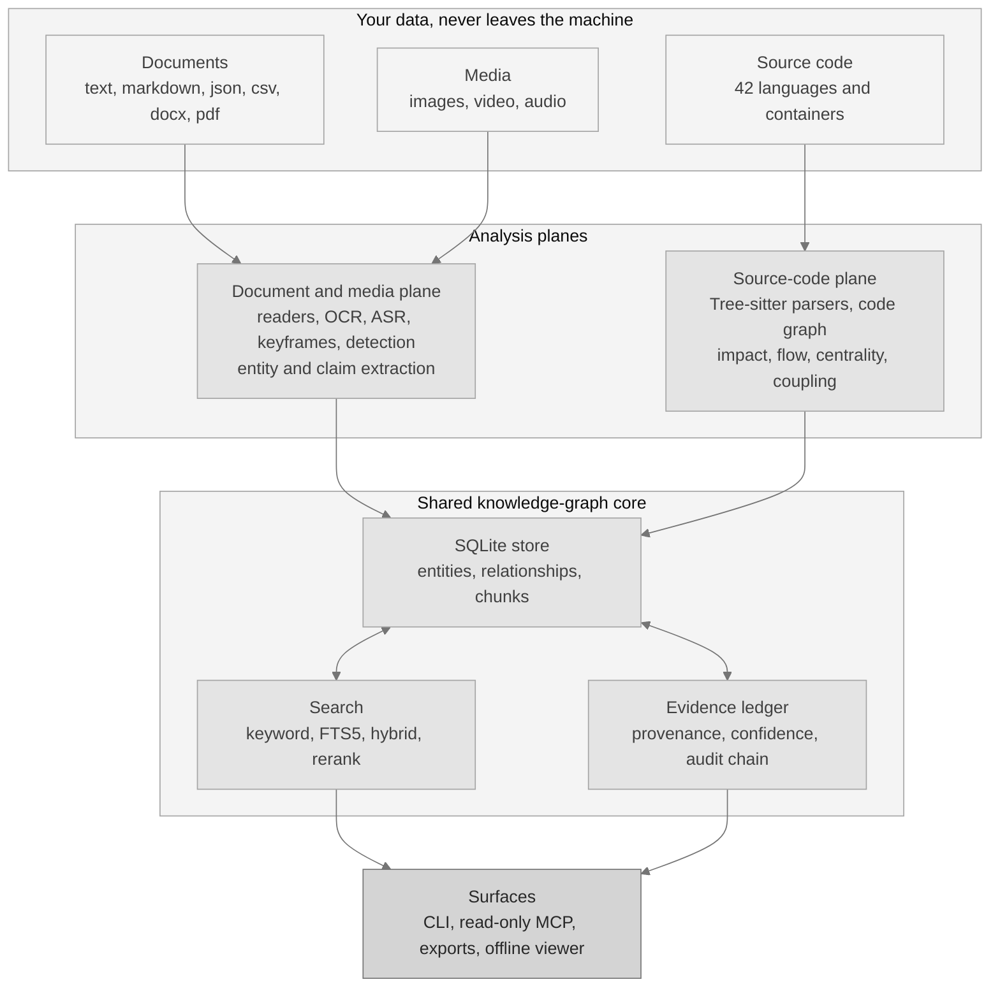

The two planes stay separate on purpose. They share the foundation and one standard of evidence, but never each other's readers.

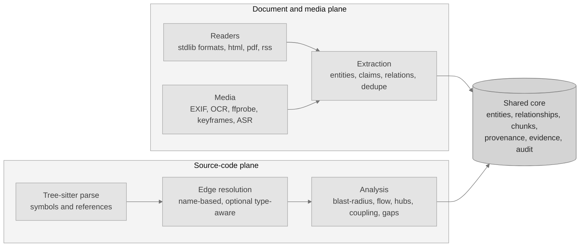

A query never guesses. It fans out across the search paths, fuses the results, and returns the evidence with every hit.

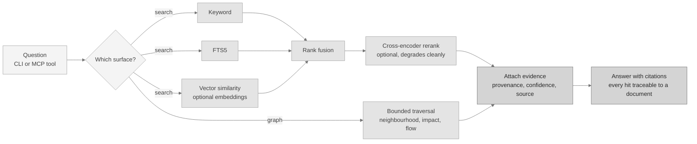

Search quality is measured on 30 documents and 40 queries. Keyword matching alone scores MRR 0.9375 and nDCG@10 0.9473. Adding the optional embedding model and reranker takes both to 1.0, at an added 205.84 ms per query.

### One measured before and after

Type-aware resolution is the clearest measured improvement in the project, and it is also the clearest illustration of why the default result is advisory. Matching by name alone resolves a call to every function that shares the name, so a change-impact query flags far too much. With a language server installed, the same query resolves to one target.

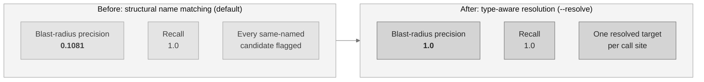

Measured on 42 evaluation nodes and 24 true edges per language, for Python and JavaScript. Go stays structural because no language server is installed for it here. Recall is 1.0 in both settings, so the whole gain is in precision.

### What a change-impact query actually computes

It walks the code graph backwards: start at the changed symbol, follow inbound connections, stop at the depth limit. It deliberately over-reports, which is why the result is advisory and why the comparison above matters.

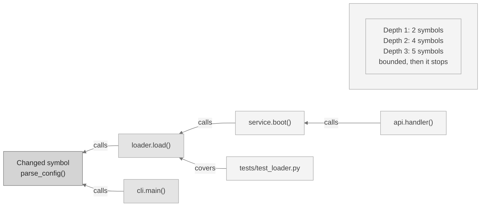

The symbol names above illustrate the shape rather than report a measurement.

### Re-reading only what changed

A second run does not re-parse the repository. The incremental path asks version control which files moved, re-parses those, and replaces only their symbols and connections.

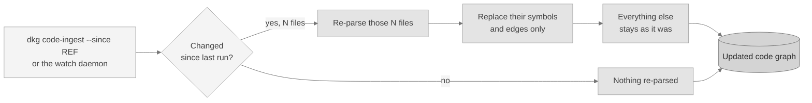

This path is covered by tests, for both git and Subversion. Its speed has never been timed, so this project publishes no timing claim for it.

### Asking about everything, or just the part that answers your question

The graph route answers a structural question with the nodes that answer it, plus the files those nodes name. On a sample of 38 Python files holding 12,620 estimated tokens, 289 symbols, and 745 connections, the two routes cost this:

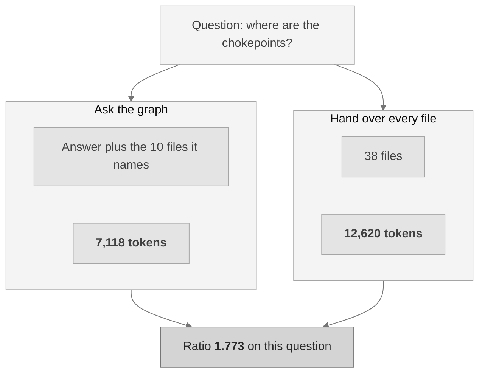

Across five questions on that sample the mean ratio is 1.4232, ranging from 0.6675 to 1.773. A ratio below 1.0 means the graph route cost more than simply handing over every file, which is what happens when a question's answer names the whole repository.

The size dependence is measured rather than assumed: at 13 files the mean ratio is 0.5838, at 23 files 0.9321, at 38 files 1.4232. **A repository small enough to fit in a context window does not need a graph to save tokens.**

## Mnemosyne and Ariadne

A graph of any real size is too large to read. Two detectors, both written for this project, turn it into a handful of groups you can actually work with. Both run by default, and the platform returns whichever one scores higher on the measurement.

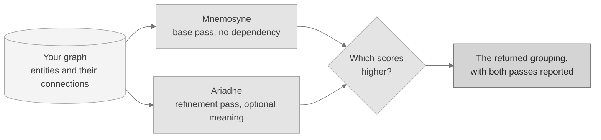

Both optimise modularity, the established published measure of how much better a grouping is than chance would produce. Modularity is not this project's invention and is not claimed as one. The two detectors are.

### Mnemosyne, the base detector

**What it does.** Mnemosyne reads nothing but the connections and finds the groups hidden in them. It starts with every entity alone, moves each one into whichever neighbouring group improves the score most, then treats each group as a single entity and repeats on the smaller graph. Small clusters become topics, topics become areas.

**Why it helps.** It needs no model, no download, and no optional component. On a bare install it still turns a wall of connections into a readable map. It is also fully deterministic: the same graph always produces the same partition, byte for byte.

```bash
dkg community --detector mnemosyne
```

**Measured.** On a sample of 80 entities in 16 known groups it recovers the grouping exactly, agreement **Rand 1.0**, at modularity 0.846591 in 1.196 ms. On a sample of 40 entities in 5 topics whose connections are symmetric by design, it scores Rand 0.641, which is the expected result when the answer is not in the wiring.

Full explanation, mathematics, and results: [`docs/MNEMOSYNE.md`](docs/MNEMOSYNE.md).

### Ariadne, the refinement detector

**What it does.** Ariadne takes the same graph and fixes three things the base pass cannot. It splits any group that turns out to be two disconnected halves, so every group it returns is one you could walk around. It can weight each connection by how similar the two ends are in meaning, when a local text model is installed. And it can choose its own granularity by trying a range of settings and keeping the best.

**Why it helps.** Two clusters can be wired identically and still be about completely different things. Structure alone cannot tell them apart, and Ariadne can.

```bash
dkg community --detector ariadne
```

**Measured.** On the structural sample the two detectors **tie at Rand 1.0**: the base pass was already exact and the refinement had nothing to fix. On the semantic sample Ariadne leads, **Rand 0.7641 against 0.641**, finding 8 groups against a true 5 where the base pass finds 4.

One detail worth knowing. Ariadne scores lower modularity on that semantic sample, 0.42 against 0.5, and since the default path returns the higher-scoring grouping, it returns the base pass there. Selection is by measurement and never by preference, so a tie or a lower score keeps the base result. When meaning matters more than wiring on your graph, ask for Ariadne directly with the command above.

Full explanation, mathematics, and results: [`docs/ARIADNE.md`](docs/ARIADNE.md).

## Capabilities

Everything below runs on the Python standard library alone unless the last column names an optional extra. Extras are opt-in and install with `pip install -e ".[name]"`.

| Capability | What it does | Needs |
|---|---|---|
| Knowledge-graph store | SQLite with full-text search, stable identifiers, source tracking, and a tamper-evident audit log. | Built in |
| Extraction | Entities, claims, and relationships, with no model required. | Built in |
| Search | Keyword, full-text, and a hybrid path that reports which engines contributed. | Built in |
| Local embeddings | Vector similarity from a local model, stored per model so two models never mix. | `embeddings` |
| Reranking | A local reranker over search results. Falls back cleanly when absent. | `reranker` |
| Evidence and confidence | Per-claim evidence, a confidence you can read, and a contradiction scanner. | Built in |
| Grouping | [Mnemosyne and Ariadne](#mnemosyne-and-ariadne), both running by default. | Built in |
| Assistant connection | A read-only tool surface for AI assistants, plus a local-only HTTP option. | Built in |
| Graph analysis | Hubs, bridges, chokepoints, surprising connections, gaps, review questions, and graph diffing. | Built in |
| Editor setup | Write the assistant entry for an editor, with a dry run and a clean uninstall. | Built in |
| Agent workflows | Deterministic research, validation, contradiction, and security-review agents. | Built in |
| Source-code plane | 42 languages and containers, a code graph, change impact, execution flow, and optional type-aware resolution. | `code`, `code-extended`, `code-full` |
| Image detection | Local zero-shot image tagging. | `media-detect` |
| Media enrichment | Image decode and EXIF, OCR, video metadata, keyframes, and speech-to-text. | `media-image`, external tools |
| Delivery | Repository watcher, offline graph viewer, exports, and a GitHub Action. | Built in; `watch` optional |
| Benchmarks | One seeded command regenerates every measured number. | Built in |

A few of those rows deserve a sentence more.

**The contradiction scanner** groups claims about the same subject even when two documents phrase them differently, then tests them for conflicting numbers, negations, and opposites. It is a lexical scanner rather than a reasoning model, so its output is advisory: measured recall 0.6667 and precision 0.75.

**The delivery layer is built in, including the repository watcher.** The daemon runs out of the box on a polling backend from the standard library. Installing the optional `watch` extra swaps that for event-driven watching, which reacts faster and costs less while idle. Nothing else in the delivery layer needs an extra. Manage repositories with `dkg registry add <name> <path>` and run the watcher with `dkg daemon`.

**Exports include an Obsidian vault.** `dkg export --format obsidian --out ./vault` writes your graph as a folder of linked Markdown notes: one note per entity, with its connections as `[[wikilinks]]`. Opening that folder in the Obsidian note-taking app shows the graph in Obsidian's own graph view. Obsidian is a destination this platform writes to, not something it runs or requires. The other formats are `json`, `markdown`, `csv`, `graphml`, `dot`, `cypher`, `svg`, and a self-contained `html` viewer.

### Supported inputs

These formats need nothing beyond the Python standard library:

| Built-in input | Formats |
|---|---|
| Text and Markdown | `.txt`, `.md`, `.markdown`, `.rst`, `.log` |
| Structured data | `.json`, `.csv`, `.tsv` |
| Word documents | `.docx`, read with the standard library and external entity expansion disabled |
| RSS and Atom | feed parsing with the standard-library XML parser |

These are detected at run time. When the extra or the external tool is absent, the input steps aside with a clear reason rather than failing:

| Optional input | Needs |
|---|---|
| HTML | `html` extra |
| PDF | `pdf` extra |
| Web fetch | `web` extra, plus an explicit `--allow-network` |
| Images, EXIF, OCR | `media-image` extra, and tesseract for OCR |
| Video metadata, keyframes, scenes | external ffprobe and ffmpeg |
| Speech-to-text | a local model referenced by `DKG_ASR_MODEL` |
| Source code | `code` extra to start, see the language set below |

### Language coverage

42 languages and containers, in four opt-in tiers plus one that needs no tier at all, so a minimal install stays minimal. Every grammar shipped is permissive, and none is copied into this repository.

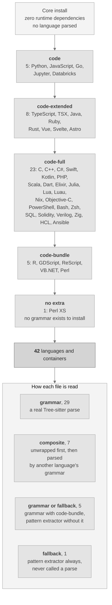

Run `dkg code-languages` for the live set on your machine. The full inventory, with extensions and licences, is in [`docs/LANGUAGES.md`](docs/LANGUAGES.md).

| Extra | Languages and containers |
|---|---|
| `code` | Python, JavaScript, Go, Jupyter notebooks, Databricks notebooks |
| `code-extended` | TypeScript, TSX, Java, Ruby, Rust, Vue, Svelte, Astro |
| `code-full` | Ansible, Bash, C, C++, C#, Dart, Elixir, HCL and Terraform, Julia, Kotlin, Lua, Luau, Nix, Objective-C, PHP, PowerShell, Scala, Solidity, SQL, Swift, Verilog, Zig, Zsh |
| `code-bundle` | R, GDScript, ReScript, VB.NET, Perl |
| none needed | Perl XS |

Parse accuracy is measured per language against two labelled samples and published in [`docs/BENCHMARKS.md`](docs/BENCHMARKS.md). A language whose optional grammar is not installed is reported as not measured, never scored zero.

**Perl XS is read differently, and labelled differently.** No permissive grammar for `.xs` files exists anywhere this project can reach, so no extra changes how it is read:

| Aspect | How Perl XS is handled |
|---|---|
| How it is read | A documented pattern extractor, never a full parse |
| How it is reported | `fallback` fidelity, on the graph node and in every report |
| Effect on results | Every connection leaving such a file is scaled down in confidence |
| Measured accuracy | Precision 0.875 and recall 0.7778 on the held-out sample |

## Install

**Requirements.** Python 3.10 or newer. The core install pulls no runtime dependencies. macOS and Linux are the tested targets.

```bash
# from a clone of the repository
python3 -m venv .venv
./.venv/bin/python -m pip install --upgrade pip
./.venv/bin/python -m pip install -e ".[dev]"
./.venv/bin/dkg --version        # dkg 0.1.0
```

Add optional extras only when you need them, for example `pip install -e ".[embeddings,reranker,code]"`. Every optional component reports the exact reason when it is unavailable.

### Quick start

```bash
dkg init                                   # create a project-local .dkg home
dkg ingest ./my-notes --recursive          # ingest text, markdown, json, csv, docx
dkg status                                 # print counts and configuration
dkg search "confidence formula"            # keyword, fts, or hybrid (default hybrid)
dkg graph "beta" --depth 2                 # bounded graph neighbourhood
dkg evidence <claim-id>                    # evidence packet for a claim
dkg community                              # group the graph with both detectors
dkg code-ingest ./my-repo                  # parse a repository into the code graph
dkg code-hubs                              # most connected symbols and chokepoints
dkg code-gaps                              # isolated symbols and untested hotspots
dkg code-questions                         # review questions generated from the graph
dkg code-architecture                      # component overview with coupling warnings
dkg graph-snapshot before.json             # snapshot now, diff later with graph-diff
dkg export --format html --out graph.html  # offline viewer, or json / csv / dot / cypher / obsidian
dkg audit --verify                         # verify the audit log
dkg mcp-stdio                              # start the read-only assistant server
```

### If you are new to the command line

1. Install Python 3.10 or newer from python.org, then open a terminal in the project folder.
2. Copy the four install commands above one line at a time. The last line should print `dkg 0.1.0`.
3. Run `dkg init`, then `dkg ingest` pointed at a folder of your notes, then `dkg search "a phrase you expect to find"`.

Every command prints readable text by default and machine-readable JSON with `--json`. No step contacts the network unless you pass `--allow-network`.

### One install, every supported platform

The same install path everywhere, because the core is standard library only. There is no wheel to match to your operating system, no compiler step, and no service to run.

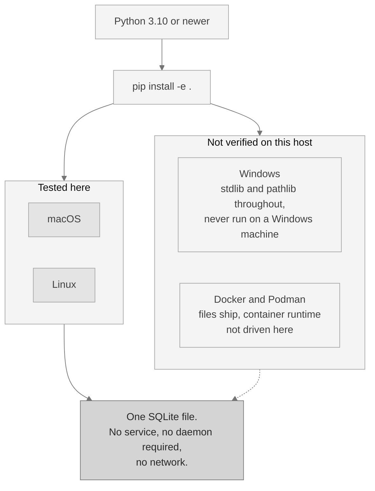

The dotted line is there for a reason. macOS and Linux are the tested targets. Windows and the container images ship but have not been run on this machine, and this document says so rather than assuming the code is portable because it looks portable.

## Connect an AI assistant

The assistant integration speaks the Model Context Protocol, or MCP: a standard, read-only connection an AI assistant can use to query your graph. It runs over standard input and output, with an optional local-only HTTP surface that requires a token and checks the request origin.

**Only query tools are registered. No tool that writes is ever exposed**, so an assistant acting on content it was fed cannot change your graph through this connection.

```mermaid
%%{init: {"theme":"base","themeVariables":{"primaryColor":"#e4e4e4","primaryTextColor":"#404040","primaryBorderColor":"#a5a5a5","lineColor":"#757575","secondaryColor":"#d4d4d4","tertiaryColor":"#f4f4f4","clusterBkg":"#f4f4f4","clusterBorder":"#a5a5a5","edgeLabelBackground":"#f4f4f4","textColor":"#404040"}}}%%
flowchart LR
    asst["Your assistant<br/>any model, any vendor"]
    asst -->|"JSON-RPC over stdio"| srv["dkg mcp-stdio<br/>read-only tool surface"]

    subgraph guards["Enforced outside the model"]
        direction TB
        g1["Query tools only<br/>no write tool registered"]
        g2["Path reads confined to a root<br/>and size-capped"]
        g3["Node and edge reads bounded together,<br/>truncation reported"]
        g4["Fetched content labelled<br/>untrusted evidence, never instructions"]
    end

    srv --> guards
    guards --> db[("Local SQLite graph<br/>opened read-only")]
    db --> ans["Answer with provenance,<br/>confidence, and the source it came from"]
    ans --> asst

    classDef inner fill:#e4e4e4,stroke:#a5a5a5,color:#404040
    classDef strong fill:#d4d4d4,stroke:#757575,color:#282828
    classDef outer fill:#f4f4f4,stroke:#a5a5a5,color:#404040
    class asst outer
    class g1,g2,g3,g4 inner
    class srv,ans inner
    class db strong
```

Set up an editor with `dkg mcp-install --client <name>`, preview it with `--dry-run`, and undo it with `dkg mcp-uninstall`, which removes only what it wrote. Run `dkg mcp-tools` to list the editors it can configure. Parameters for every tool are in [`docs/COMMANDS.md`](docs/COMMANDS.md).

### The tool surface

| Tool | What it returns |
|---|---|
| `dkg.status` | Database counts and the application version. |
| `dkg.orient` | A compact orientation for an unfamiliar graph: its shape, its largest components, and where to start. |
| `dkg.search` | Hybrid search over chunks, fusing keyword and FTS5 and reporting which engines contributed. |
| `dkg.search.keyword` | Keyword search over chunks. |
| `dkg.search.fts` | FTS5 search over chunks. |
| `dkg.graph.neighbourhood` | The bounded graph neighbourhood around an entity. |
| `dkg.graph.community` | Communities over the entity graph by modularity optimization. |
| `dkg.graph.community.split` | The same, then splits any community larger than a threshold. |
| `dkg.graph.diff` | Compares two code-graph snapshots written by `dkg graph-snapshot`. |
| `dkg.evidence.claim` | The evidence packet for one claim, with its explainable confidence. |
| `dkg.facets.source` | Every source with its per-source chunk count. |
| `dkg.code.languages` | Every language the plane parses, how each is read, and whether it is available here. |
| `dkg.code.symbols` | Parses one source file and returns its symbols, without writing to the database. |
| `dkg.code.search` | Search over code symbols and code text. |
| `dkg.code.impact` | Structural blast-radius for a symbol or file. Over-approximate and advisory. |
| `dkg.code.impact_radius` | Blast radius with each impacted symbol given its own reason and distance. |
| `dkg.code.flow` | Structural execution-flow trace, forward call chains from an entry symbol. |
| `dkg.code.flows` | The catalogued execution flows in ranked order. |
| `dkg.code.flow.get` | One catalogued flow by name or identifier, with its steps. |
| `dkg.code.flows.affected` | Which catalogued flows pass through a changed file set. |
| `dkg.code.callers` | Symbols that call the named one, as node-level slices rather than whole files. |
| `dkg.code.callees` | Symbols the named one calls, as node-level slices. |
| `dkg.code.neighbours` | Symbols related in either direction, across calls, imports, and inheritance. |
| `dkg.code.importers` | Modules that import the named module, each with its edge confidence. |
| `dkg.code.base_types` | Types the named type inherits from, each with its edge confidence. |
| `dkg.code.implementations` | Types that inherit from the named type, each with its edge confidence. |
| `dkg.code.tests_for` | Tests that exercise the named symbol, each with its edge confidence. |
| `dkg.code.hubs` | The most connected symbols and the architectural chokepoints. |
| `dkg.code.coupling` | Edges that are surprising given the surrounding structure. |
| `dkg.code.gaps` | Isolated symbols, untested hotspots, and thin communities. |
| `dkg.code.questions` | Review questions generated from the graph, each naming the measurement that prompted it. |
| `dkg.code.architecture` | A component-level map with coupling warnings. |
| `dkg.code.communities` | Precomputed per-community summaries: members, files, and internal structure. |
| `dkg.code.change` | A structural summary of the repository the server is confined to. |
| `dkg.code.review_context` | Everything a reviewer needs about one symbol, in a single call. |
| `dkg.code.criticality` | Every execution flow from an entry point, scored by weighted criticality. |
| `dkg.code.risk` | An advisory risk score in 0 to 1 for a change set. |
| `dkg.code.risk.index` | The precomputed per-symbol structural risk index, highest first. |
| `dkg.code.confidence` | The three-tier confidence profile of the code graph. |
| `dkg.code.dead` | Candidate dead code: definitions with no inbound reference edge. |
| `dkg.code.large` | Symbols whose recorded line span is at least a given size. |
| `dkg.code.refactor` | Refactoring suggestions derived from the community structure. |
| `dkg.code.rename.preview` | A symbol rename as a read-only edit list. It previews; it never writes. |
| `dkg.code.slices` | Answer-shaped node-level slices for one structural question. |
| `dkg.code.traverse` | Free-form traversal from any node, breadth-first or depth-first. |
| `dkg.code.framework` | Framework relations for a symbol: `routes_to`, `renders`, `relates_to`. |
| `dkg.repos.list` | Every registered repository with its per-repository status. |
| `dkg.repos.search` | Search across every registered repository, with per-repository results. |
| `dkg.memory.list` | The recorded answers held in the memory loop. |
| `dkg.prompts.list` | The reusable prompt templates for the recurring review tasks. |
| `dkg.prompts.get` | One reusable prompt template by name. |
| `dkg.docs.section` | A named section of the shipped documentation, confined to the docs root. |

Every one of these reads. None of them writes. The setup helper that does write files is available on the command line only and is kept off this surface on purpose.

## Continuous integration

A ready-made GitHub Action runs the analysis on a repository and posts a risk-scored review as a single pull-request comment, updating that same comment on every push rather than adding a new one. Copy this into `.github/workflows/`:

```yaml
name: code-review

on:
  pull_request:
    branches: ["**"]

permissions:
  contents: read
  pull-requests: write

jobs:
  review:
    runs-on: ubuntu-latest
    steps:
      - uses: actions/checkout@11d5960a326750d5838078e36cf38b85af677262 # v4.4.0
        with:
          fetch-depth: 0          # the base ref must be diffable
          persist-credentials: false

      - uses: scorpion1476-lgtm/D-Knowledge_Graph@v0.1.0
        with:
          repository-path: "."
          base-ref: ${{ github.event.pull_request.base.sha }}
          # Pin the analysed tool, not just the action. A floating ref here
          # would silently change what runs against your code.
          dkg-ref: "v0.1.0"
          dkg-repo-url: "https://github.com/scorpion1476-lgtm/D-Knowledge_Graph.git"
          comment: "true"
          pr-number: ${{ github.event.pull_request.number }}
          github-token: ${{ secrets.GITHUB_TOKEN }}
          # Off by default. Set to low, moderate, elevated, or high to gate.
          # Thresholds derive from your repository's own score distribution.
          risk-gate: "off"
```

> [!WARNING]
> The single-workflow form above runs pull-request code in a job that holds a write token. That is safe where only trusted contributors open pull requests. **If you accept pull requests from forks, use the two-stage form instead**: one workflow renders the review with no write permission and no secret, and a second posts it from a job that never checks out the pull request's code. Both files ship in this repository.

The action's inputs, outputs, and risk model are documented in [`docs/CONSUMER_ACTION.md`](docs/CONSUMER_ACTION.md). It installs the tool from a pinned version, pins its own sub-actions to exact commits, and needs no service and no account.

## Security

The platform is secure by default. Each control below is implemented in the source and covered by a test.

| Control | Default | Detail |
|---|---|---|
| Outbound network | Off | Reaching out needs an explicit `--allow-network` flag and a configuration allowance. |
| Telemetry | None | There is nothing to switch off; it can only ever be switched on deliberately. |
| Assistant connection | Read-only | Only query tools exist. The HTTP option binds to your own machine, needs a token, and caps request size and rate. |
| Request forgery | Blocked | Addresses are checked after resolution, and private, loopback, and cloud-metadata addresses are refused before any fetch. |
| Secret redaction | On | Logs, audit lines, and exports pass through a redactor that masks keys, tokens, and private-key blocks. |
| Untrusted content | Enforced | Fetched web content is labelled as evidence, never as instructions, and is scored for injection attempts. |
| Storage | Parameter-bound | Every database query is parameterized; the storage layer refuses string-built queries. |
| Provenance and evidence | Always on | Every record records where it came from, and the audit log is append-only with a per-row hash chain. |
| Supply chain | Hardened | Actions are pinned to exact commits, dependencies are pinned with a generated lockfile and bill of materials, and licence and vulnerability scans run in CI. |

The full model, including what is deliberately out of scope, is in [`docs/SECURITY_MODEL.md`](docs/SECURITY_MODEL.md) and [`docs/THREAT_MODEL.md`](docs/THREAT_MODEL.md).

## Benchmarks

Accuracy here is measured rather than asserted. Every figure comes from a documented sample with a fixed seed, and one command regenerates all of them:

```bash
python scripts/benchmark.py
```

| What is measured | Sample | Result |
|---|---|---|
| Search quality | 30 documents, 40 queries | Keyword alone scores MRR 0.9375 and nDCG@10 0.9473. With the optional embedding model and reranker, both reach 1.0. |
| Change-impact precision | 42 evaluation nodes, 24 true edges per language | Precision 0.1081 by default and 1.0 with `--resolve`, recall 1.0 either way, for Python and JavaScript. |
| Code parse accuracy | 113 symbols across 13 languages, labelled before ever being parsed | Precision 0.982 and recall 0.9646. |
| Grouping quality | 80 entities in 16 groups, and 40 entities in 5 topics | The two detectors tie on structure at Rand 1.0. Where meaning matters, the refinement leads at Rand 0.7641 against 0.641. |
| Execution-flow accuracy | Hand-labelled call graphs per language | Precision and recall 1.0 for Python, JavaScript, and Go. |
| Contradiction detection | 18 held-out cases | Recall 0.6667 and precision 0.75. Advisory, and lexical rather than reasoning. |
| Media accuracy | Rendered samples, not natural photographs | OCR character and word error rate 0.0, and image tagging top-1 0.9375. |

Two things this page will not claim. The graph route is a **correctness** result rather than a saving: against a capable search-and-read baseline it uses roughly twice the tokens, 71,088 against 34,744, while scoring 1.0 mean correctness against 0.6206. And a benchmark whose optional tool or model is not installed is reported as not run here, never as a zero and never as a pass.

Full results, sample sizes, methodology, and the limitations of each sample are in [`docs/BENCHMARKS.md`](docs/BENCHMARKS.md).

## Use cases

The platform is a private, checkable research and knowledge substrate. Because it runs offline and records the origin of every record, it fits work where the source of an answer matters as much as the answer.

| Team or role | What they use it for | Outcome |
|---|---|---|
| Research and analysis | Ingest notes, reports, and feeds, then search, traverse, and cross-check claims against their sources. | A searchable graph where every claim links back to its document. |
| Compliance and legal review | Keep sensitive material on a local or disconnected machine and produce evidence with a readable confidence. | A defensible offline record of what was found and where. |
| Knowledge management | Turn scattered files into a connected graph, group related material, and export it to Obsidian or Graphviz. | A maintained map of your own knowledge, with nothing locked in. |
| Investigation and due diligence | Surface contradictions across sources and follow bounded queries between entities. | A reviewable map of where sources agree and disagree. |

Run a deterministic agent workflow over the graph with no model connected at all, then register a local model behind the adapter interface when you want higher recall:

```bash
dkg agent research        --input '{"query":"knowledge graph"}'
dkg agent contradiction   --input '{}'
dkg agent security-review --input '{"limit":500}'
```

### For engineering teams

| Engineering use case | How the platform serves it |
|---|---|
| Code intelligence | Parse a repository into a code graph and query symbols, call structure, and execution flow from an entry point. |
| Architecture review | Surface the most connected symbols, the points whose removal splits the graph, cycles between components, and connections that cross a boundary. |
| Reviewing an unfamiliar change | Generate review questions from the graph, each naming a symbol and the measurement behind it, then diff two snapshots to see what moved. |
| Change-impact review | Compute an advisory impact set for the changed files, with an opt-in gate for CI, through the GitHub Action or `dkg code-report`. |
| Offline knowledge graphs | Build and browse a graph in a self-contained HTML viewer that loads nothing from the network. |
| Air-gapped deployments | Install from source with no runtime dependencies and run every core capability with the network off. |

Change impact and execution flow over-report by design in the default path. The optional `--resolve` path narrows ambiguous calls with type-aware resolution wherever a language server is installed.

## FAQ

The short answers. The longer ones, including honest comparisons against a language server, similarity search, and plain text search, are in [`docs/FAQ.md`](docs/FAQ.md).

| Question | Answer |
|---|---|
| Is this open source? | No. It is source-available and non-commercial. Commercial use, modification, and modified redistribution are all prohibited. See the licence section below. |
| Does it replace a language server? | No, and it uses one when one is installed. The default code path over-reports; `--resolve` narrows it where a server is present. |
| Does it replace text search? | No. For "where does this exact string appear", plain search wins and nothing here beats it. The graph is for questions that are not strings. |
| Does it replace a vector database? | No. It includes similarity search as an option and adds structure, evidence, and a record of where everything came from. For plain semantic search over text, a vector database is simpler. |
| Does it phone home? | No. There is no telemetry, and reaching out needs an explicit `--allow-network` flag and a configuration allowance. |
| Does it download models? | Never while running. Models are placed on disk ahead of time and loaded from local files only; an absent model steps aside to a documented fallback. |
| How do I know it installed correctly? | `dkg --version`, then `dkg init`, `dkg capabilities`, `dkg doctor`, then ingest and search something. A long list of unavailable optional capabilities on a fresh install is correct, not broken. |
| How do I tell an install problem from an environment problem? | `python scripts/probe_environment.py` prints the interpreter, the installed extras, the external tools and local models it found, and whether the package index is reachable. |
| When should I not use it? | When you need certainty rather than an advisory result, when your collection is enormous, when you need a hosted service, or when you need commercial use. |

## Troubleshooting

Every entry in [`docs/TROUBLESHOOTING.md`](docs/TROUBLESHOOTING.md) carries a symptom, a cause, and a fix, across install and path problems, server start-up failures, database locking and staleness, missing optional components, and the Windows and Linux-subsystem issues. The Windows entries are marked as inferred from the code rather than observed, because no Windows machine was used.

Two commands answer most problems before you read anything:

```bash
dkg doctor                          # the application's self-check, as JSON
python scripts/probe_environment.py # the environment around it, as JSON
```

Paste both into a bug report. The second one's package-index check is the only outbound request it can make, it names the address in its own output, and `--offline` skips it.

## Documentation

| Document | What is in it |
|---|---|
| [`docs/QUICKSTART.md`](docs/QUICKSTART.md) | The shortest path to a working graph. |
| [`docs/USER_GUIDE.md`](docs/USER_GUIDE.md) | Worked workflows for research, verification, contradiction, export, backup, and restore. |
| [`docs/COMMANDS.md`](docs/COMMANDS.md) | Every subcommand and every assistant tool, with parameters and defaults. |
| [`docs/MNEMOSYNE.md`](docs/MNEMOSYNE.md) | The base grouping detector, in plain language and in full technical detail. |
| [`docs/ARIADNE.md`](docs/ARIADNE.md) | The refinement detector, in plain language and in full technical detail. |
| [`docs/BENCHMARKS.md`](docs/BENCHMARKS.md) | Every measured number, with sample sizes and the seed. |
| [`docs/LANGUAGES.md`](docs/LANGUAGES.md) | Every parsed language, its extensions, how it is read, and its grammar licence. |
| [`docs/FAQ.md`](docs/FAQ.md) | Honest comparisons, what it does not replace, and how to verify an install. |
| [`docs/TROUBLESHOOTING.md`](docs/TROUBLESHOOTING.md) | Symptom, cause, and fix for the problems that actually happen. |
| [`docs/ADMINISTRATOR_GUIDE.md`](docs/ADMINISTRATOR_GUIDE.md) | Running an installation: homes, backups, retention, and the audit log. |
| [`docs/DEPLOYMENT_GUIDE.md`](docs/DEPLOYMENT_GUIDE.md) | Local, container, and self-hosted deployment, with reverse proxy and TLS. |
| [`docs/DEVELOPER_GUIDE.md`](docs/DEVELOPER_GUIDE.md) | Repository layout, local development, the test suite, and how to add a command or adapter. |
| [`docs/ARCHITECTURE.md`](docs/ARCHITECTURE.md) | How the core and the two planes fit together. |
| [`docs/CONSUMER_ACTION.md`](docs/CONSUMER_ACTION.md) | The GitHub Action: inputs, outputs, the risk model, and the fork-safe form. |
| [`docs/SECURITY_MODEL.md`](docs/SECURITY_MODEL.md) and [`docs/THREAT_MODEL.md`](docs/THREAT_MODEL.md) | The controls, and the adversaries they are for. |
| [`docs/ROADMAP.md`](docs/ROADMAP.md) | Shipped, in progress, planned, and not planned. |
| [`CONTRIBUTING.md`](CONTRIBUTING.md) | Development in a clone, the gate commands, and what a change must satisfy. |
| [`SECURITY.md`](SECURITY.md) | Supported versions, the private reporting channel, and response timelines. |
| [`CODE_OF_CONDUCT.md`](CODE_OF_CONDUCT.md) | The standard, its scope, and how to report a concern. |

## Licence

Source-available and free for personal and non-commercial use. **This is not an open-source licence**: commercial use is not permitted, and neither is modification or distributing a modified version.

| Component | Licence | Terms |
|---|---|---|
| The entire repository, Ariadne included | D-Knowledge Graph Source-Available Non-Commercial Licence (PolyForm Noncommercial 1.0.0 plus a no-modification term) | Read, run, and use the output for any non-commercial purpose. Redistribute verbatim copies with `LICENSE` and `NOTICE`. No commercial use. No modification and no modified redistribution. |
| Optional third-party dependencies | Their own permissive licences (Apache-2.0, MIT, BSD, ISC, HPND) | Unaffected by the terms above. Full inventory in `THIRD_PARTY_NOTICES.md`. |

One licence covers everything. There is no separately licensed module and no component excluded from the build. The default runtime uses only the Python standard library and copies no source from any other project.

Versions distributed before 2026-08-05 were released under Apache-2.0. That grant remains in force for those versions and for anyone who received a copy under it; these terms govern this version onward. See `LICENSE` and `NOTICE`.
