<p align="center">
  
</p>

<p align="center">
  <b>你的文档、媒体与代码汇聚成一张可以提问的图谱，每个答案都会告诉你它来自哪里。没有任何内容离开你的机器。</b>
</p>

<p align="center">
  一个本地优先的知识图谱，完全离线运行，可搭配任意 AI 模型，也可以完全不用模型。
</p>

> [!IMPORTANT]
> 一切都运行在你自己的电脑上。没有云端调用，没有遥测，除 Python 本身以外不需要任何东西。本文给出的每一个准确度数字，都来自你可以自己重新运行的测量。

<div align="center">


</div>

<p align="center">
  <a href="README.md">English</a> &nbsp;&middot;&nbsp;
  <b>简体中文 (Simplified Chinese)</b> &nbsp;&middot;&nbsp;
  <a href="README.es.md">Español</a> &nbsp;&middot;&nbsp;
  <a href="README.fr.md">Français</a> &nbsp;&middot;&nbsp;
  <a href="README.de.md">Deutsch</a>
</p>

<p align="center">
  <a href="#从这里开始">从这里开始</a> &nbsp;&middot;&nbsp;
  <a href="#概述">概述</a> &nbsp;&middot;&nbsp;
  <a href="#工作原理">工作原理</a> &nbsp;&middot;&nbsp;
  <a href="#mnemosyne-与-ariadne">算法</a> &nbsp;&middot;&nbsp;
  <a href="#能力">能力</a> &nbsp;&middot;&nbsp;
  <a href="#安装">安装</a> &nbsp;&middot;&nbsp;
  <a href="#接入-ai-助手">助手接入</a> &nbsp;&middot;&nbsp;
  <a href="#持续集成">持续集成</a> &nbsp;&middot;&nbsp;
  <a href="#安全">安全</a> &nbsp;&middot;&nbsp;
  <a href="#基准测试">基准测试</a> &nbsp;&middot;&nbsp;
  <a href="#使用场景">使用场景</a> &nbsp;&middot;&nbsp;
  <a href="#常见问题">常见问题</a> &nbsp;&middot;&nbsp;
  <a href="#许可">许可</a>
</p>

> 本文是 [`README.md`](README.md) 的译文。英文原版具有权威性。所有数字均保持与英文原版相同的国际格式（以句点作为小数点），以便可以逐字比对；命令、代码块、图表标签、路径和标识符保持英文原样，以便它们可以直接执行并且不会产生偏移。

---

## 从这里开始

三条命令就能把一个克隆变成一张可以提问的图谱。它们都不接触网络。

```bash
pip install -e .                 # no runtime dependencies
dkg init                         # create a project-local .dkg home
dkg ingest ./my-notes -r         # then: dkg search "a phrase you expect to find"
```

想分析代码仓库？先执行 `pip install -e ".[code]"`，然后运行 `dkg code-ingest ./my-repo` 与 `dkg code-hubs`。

**一项实测结果，按照它被测量的方式陈述。** 开启类型感知解析后，变更影响查询的精确率从 **0.1081 提升到 1.0**，召回率保持在 **1.0**，样本为每种语言 42 个评估节点与 24 条真实边，覆盖 Python 与 JavaScript。默认路径从未遗漏真实影响，它只是报告得太多。这是在一个样本上的一次测量，可由 `python scripts/benchmark.py` 重新生成，它并不是对你的仓库的预测。

---

## 概述

D-Knowledge Graph 是一个共享的知识图谱内核，之上叠加两个分析平面。

内核是一个 SQLite 存储，具备全文检索、稳定的内容派生标识符、可发现篡改的审计日志、每条事实来源的记录，以及一个供 AI 助手使用的只读连接。两个平面共享这一基础，并遵循同一套证据标准：

- **文档与媒体平面**，读取文本、结构化数据、网页内容、图像、视频与音频，抽取实体与论断，并为每一项给出可供检视的置信度。
- **源代码平面**，将 42 种语言与容器格式解析成代码图谱，回答结构性问题：一次改动会波及什么、执行如何流转、架构上的咽喉点在哪里、哪些连接出人意料、哪些部分没有测试。

检索同时运行关键词匹配、全文检索，以及融合两者的混合路径，并可选启用本地嵌入模型与重排模型，二者都从磁盘上已有的文件加载。图谱结构由本项目自研的两个检测器归纳，即 [Mnemosyne 与 Ariadne](#mnemosyne-与-ariadne)。围绕这一切还有一层交付能力：仓库监视器、离线图谱查看器、面向其他工具的导出，以及一个开箱即用的 GitHub Action。

### 它解决的问题

| 问题 | D-Knowledge Graph 的回答 |
|---|---|
| 知识工具把你的数据送往你无法检视的服务。 | 一切都在本地针对一个 SQLite 文件运行。对外网络默认关闭，任何可能对外的路径都需要显式开关。 |
| 一个答案无法追溯到它的来源。 | 每条记录都带有来源，每条论断都带有证据和可读的置信度，一条命令即可验证审计日志未被改动。 |
| 质量宣称是营销而非测量。 | 检索、分组、代码解析、执行流转与媒体准确度都在有文档记录的样本上以固定随机种子测量，并发布于 [`docs/BENCHMARKS.md`](docs/BENCHMARKS.md)。 |
| 审查一次代码改动的影响需要托管服务。 | 代码平面在你自己的进程中用宽松许可的语法解析，并在本地图谱上计算影响，无需账号也无需网络。 |
| 能读到你数据的助手，可能被这些数据反过来指挥。 | 助手连接是只读的，抓取的网页内容被标注为证据而绝非指令，安全判断在模型之外执行。 |

## 工作原理

一个共享内核，两个平面。内核负责存储、检索、证据与助手连接。每个平面自带读取器，并写入同一张图谱，因此一个问题可以从文档跨越到它所描述的代码。

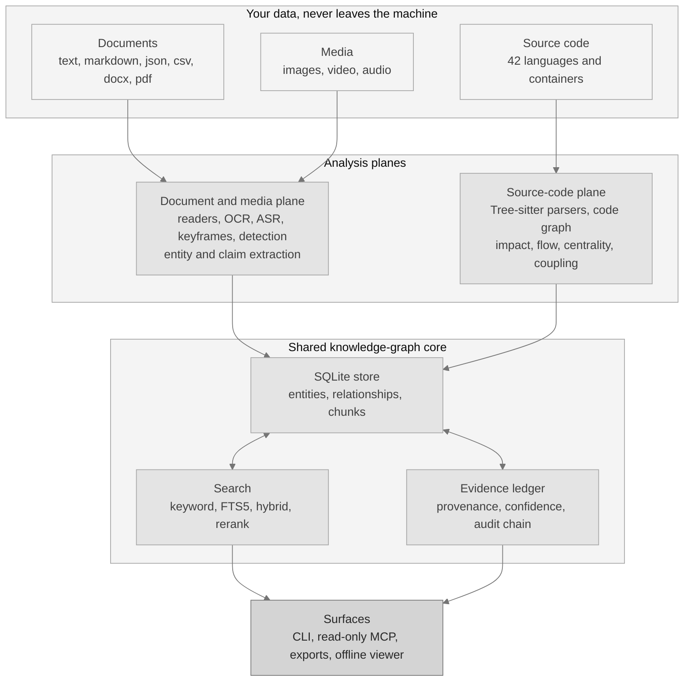

两个平面刻意保持分离。它们共享同一基础和同一套证据标准，但绝不共用彼此的读取器。

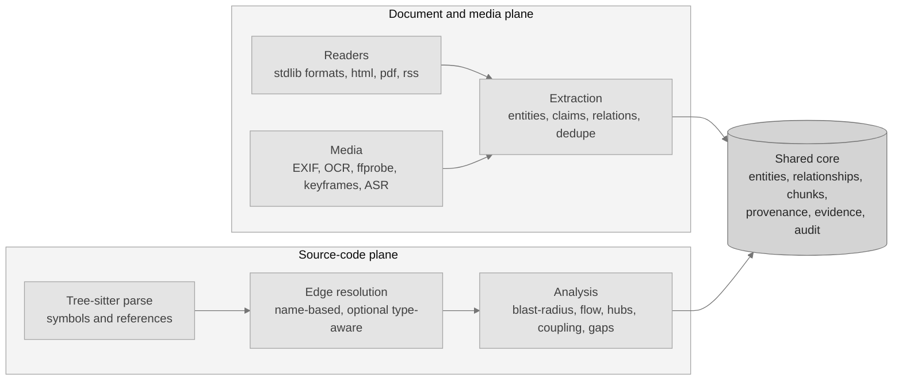

查询从不靠猜。它在各条检索路径上并行展开，融合结果，并为每一条命中附上证据。

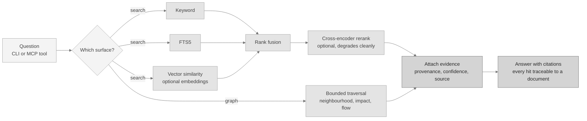

检索质量在 30 篇文档与 40 条查询上测量。仅用关键词匹配得到 MRR 0.9375 与 nDCG@10 0.9473。加入可选的嵌入模型与重排模型后，两项均达到 1.0，每次查询增加 205.84 ms。

### 一次实测的前后对比

类型感知解析是本项目中最清晰的一处实测改进，也最能说明为什么默认结果只是参考。仅按名称匹配会把一次调用解析到所有同名函数，于是变更影响查询会标出过多内容。装上语言服务器后，同一个查询只解析到一个目标。

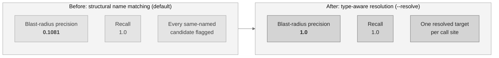

测量样本为每种语言 42 个评估节点与 24 条真实边，覆盖 Python 与 JavaScript。Go 保持结构化路径，因为此处没有为它安装语言服务器。两种设置下召回率都是 1.0，因此全部收益都体现在精确率上。

### 变更影响查询实际计算的是什么

它沿着代码图谱反向行走：从被改动的符号出发，跟随指向它的连接，到达深度上限即停止。它有意多报，因此结果只是参考，这也正是上面那组对比的意义。

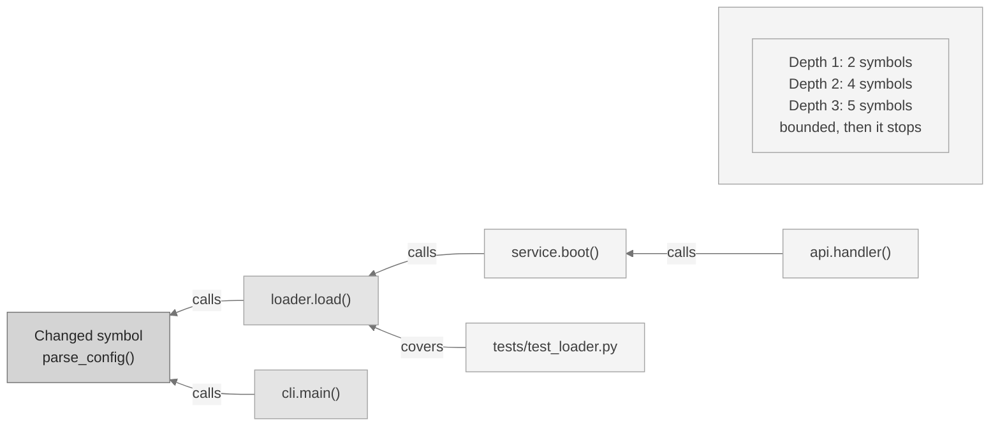

上图中的符号名称用于说明形状，而不是在报告某次测量。

### 只重新读取发生变化的部分

第二次运行不会重新解析整个仓库。增量路径向版本控制询问哪些文件发生了变动，只重新解析这些文件，并且只替换它们的符号与连接。

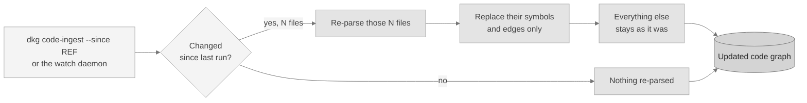

这条路径有测试覆盖，git 与 Subversion 都有。它的速度从未计时，因此本项目不为它发布任何时间宣称。

### 问全部内容，还是只问能回答你问题的那部分

图谱路径用能回答问题的节点，加上这些节点点名的文件，来回答一个结构性问题。在一个包含 38 个 Python 文件、12,620 个估算词元、289 个符号与 745 条连接的样本上，两条路径的开销如下：

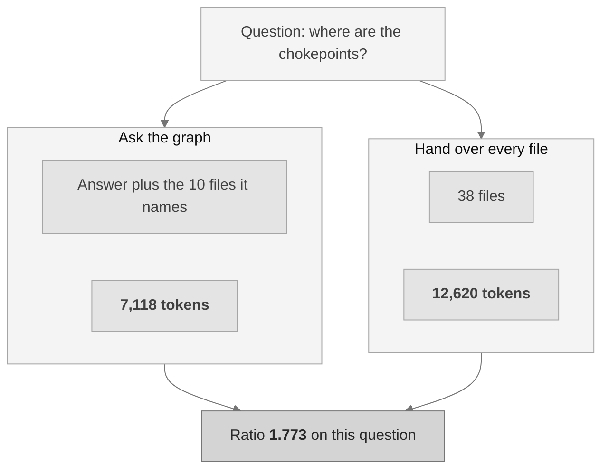

在该样本上的五个问题里，平均比值为 1.4232，区间从 0.6675 到 1.773。比值低于 1.0 意味着图谱路径的开销超过了直接交出全部文件，当一个问题的答案点名了整个仓库时就会如此。

对规模的依赖是实测而非假设：13 个文件时平均比值为 0.5838，23 个文件时为 0.9321，38 个文件时为 1.4232。**一个小到能装进上下文窗口的仓库，不需要靠图谱来节省词元。**

## Mnemosyne 与 Ariadne

任何有实际规模的图谱都大到无法通读。两个为本项目自行编写的检测器，把它变成少数几组你真正能处理的分组。两者默认都会运行，平台返回在测量上得分更高的那一个。

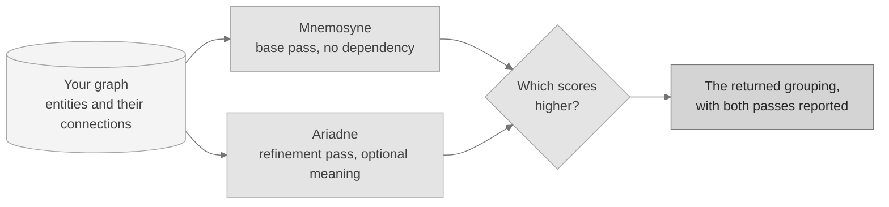

两者都在优化模块度，这是衡量一种分组比随机结果好多少的既有公开指标。模块度并非本项目的发明，本项目也不作此宣称。这两个检测器才是。

### Mnemosyne，基础检测器

**它做什么。** Mnemosyne 只读取连接本身，找出其中隐藏的分组。它让每个实体先各自成组，再把每个实体移入最能提升分数的相邻分组，然后把每个分组当作单个实体，在更小的图上重复这一过程。小的簇聚成主题，主题聚成领域。

**它为什么有用。** 它不需要模型、不需要下载、不需要任何可选组件。在一个最简安装上，它依然能把一堵连接之墙变成一张可读的地图。它还是完全确定性的：同一张图谱总是产生完全相同的分组，逐字节一致。

```bash
dkg community --detector mnemosyne
```

**实测结果。** 在一个 80 个实体、16 个已知分组的样本上，它精确还原了分组，一致度 **Rand 1.0**，模块度 0.846591，耗时 1.196 ms。在一个 40 个实体、5 个主题且连接被刻意设计成对称的样本上，它得到 Rand 0.641，当答案并不在连接结构里时，这正是应有的结果。

完整说明、数学推导与结果见 [`docs/MNEMOSYNE.md`](docs/MNEMOSYNE.md)。

### Ariadne，精化检测器

**它做什么。** Ariadne 接手同一张图谱，修正基础流程无法处理的三件事。它会拆开那些实际上由两个互不相连的部分拼成的分组，使它返回的每个分组都是真正连成一片的。当本地文本模型可用时，它可以按两端在语义上的相似度为每条连接加权。它还能通过尝试一组取值并保留最佳结果，自行选择分组的粗细。

**它为什么有用。** 两个簇可以有完全相同的连接方式，却在讲完全不同的事情。仅凭结构无法区分它们，而 Ariadne 可以。

```bash
dkg community --detector ariadne
```

**实测结果。** 在结构样本上两个检测器 **打平于 Rand 1.0**：基础流程本已精确，精化流程无可修正。在语义样本上 Ariadne 领先，**Rand 0.7641 对 0.641**，它找到 8 个分组（真实为 5 个），而基础流程找到 4 个。

一处需要如实说明的细节。在该语义样本上 Ariadne 的模块度更低，0.42 对 0.5，而默认路径返回得分更高的那个分组，因此那里返回的是基础流程的结果。选择依据是测量而绝非偏好，所以打平或得分更低都会保留基础结果。当你的图谱中语义比连接结构更重要时，请用上面的命令直接指定 Ariadne。

完整说明、数学推导与结果见 [`docs/ARIADNE.md`](docs/ARIADNE.md)。

## 能力

除非最后一列点名了某个可选附加项，下面的一切都仅依赖 Python 标准库运行。附加项均为可选，用 `pip install -e ".[name]"` 安装。

| 能力 | 它做什么 | 需要 |
|---|---|---|
| 知识图谱存储 | 带全文检索、稳定标识符、来源记录与可发现篡改审计日志的 SQLite。 | 内置 |
| 抽取 | 实体、论断与关系，无需任何模型。 | 内置 |
| 检索 | 关键词、全文，以及会报告哪些引擎参与的混合路径。 | 内置 |
| 本地嵌入 | 来自本地模型的向量相似度，按模型分别存储，两个模型绝不混用。 | `embeddings` |
| 重排 | 对检索结果做本地重排。缺失时干净降级。 | `reranker` |
| 证据与置信度 | 逐条论断的证据、可读的置信度，以及一个矛盾扫描器。 | 内置 |
| 分组 | [Mnemosyne 与 Ariadne](#mnemosyne-与-ariadne)，两者默认都运行。 | 内置 |
| 助手连接 | 面向 AI 助手的只读工具面，另有仅限本机的 HTTP 选项。 | 内置 |
| 图谱分析 | 枢纽、桥接、咽喉点、出人意料的连接、缺口、审查问题与图谱差异。 | 内置 |
| 编辑器配置 | 为编辑器写入助手条目，支持试运行与干净卸载。 | 内置 |
| 智能体工作流 | 确定性的研究、校验、矛盾与安全审查智能体。 | 内置 |
| 源代码平面 | 42 种语言与容器格式、代码图谱、变更影响、执行流转与可选的类型感知解析。 | `code`、`code-extended`、`code-full` |
| 图像检测 | 本地零样本图像标注。 | `media-detect` |
| 媒体增强 | 图像解码与 EXIF、OCR、视频元数据、关键帧与语音转写。 | `media-image`、外部工具 |
| 交付 | 仓库监视器、离线图谱查看器、导出与 GitHub Action。 | 内置；`watch` 可选 |
| 基准测试 | 一条带随机种子的命令重新生成每一个实测数字。 | 内置 |

其中几行值得再多说一句。

**矛盾扫描器**会把讲同一主题的论断归拢到一起，哪怕两份文档的措辞不同，再检验它们在数字、否定与反义上是否冲突。它是词法扫描器而非推理模型，因此输出仅供参考：实测召回率 0.6667，精确率 0.75。

**交付层是内置的，仓库监视器也是。** 该守护进程开箱即用，运行在标准库提供的轮询后端上。安装可选的 `watch` 附加项会把它换成事件驱动的监视，响应更快、空闲时开销更低。交付层中的其他部分不需要任何附加项。用 `dkg registry add <name> <path>` 管理仓库，用 `dkg daemon` 运行监视器。

**导出包含 Obsidian 库。** `dkg export --format obsidian --out ./vault` 会把你的图谱写成一个由互相链接的 Markdown 笔记组成的文件夹：每个实体一篇笔记，其连接写成 `[[wikilinks]]`。用 Obsidian 笔记应用打开该文件夹，就能在 Obsidian 自带的图谱视图中看到你的图谱。Obsidian 是本平台写出内容的目标，而不是它运行或依赖的东西。其他格式为 `json`、`markdown`、`csv`、`graphml`、`dot`、`cypher`、`svg`，以及一个自包含的 `html` 查看器。

### 支持的输入

这些格式除 Python 标准库外不需要任何东西：

| 内置输入 | 格式 |
|---|---|
| 文本与 Markdown | `.txt`、`.md`、`.markdown`、`.rst`、`.log` |
| 结构化数据 | `.json`、`.csv`、`.tsv` |
| Word 文档 | `.docx`，用标准库读取并禁用外部实体展开 |
| RSS 与 Atom | 使用标准库 XML 解析器解析订阅源 |

这些在运行时被探测。当附加项或外部工具缺失时，该输入会给出明确原因并让开，而不是失败：

| 可选输入 | 需要 |
|---|---|
| HTML | `html` 附加项 |
| PDF | `pdf` 附加项 |
| 网页抓取 | `web` 附加项，外加显式的 `--allow-network` |
| 图像、EXIF、OCR | `media-image` 附加项，OCR 需要 tesseract |
| 视频元数据、关键帧、场景 | 外部的 ffprobe 与 ffmpeg |
| 语音转写 | 由 `DKG_ASR_MODEL` 指向的本地模型 |
| 源代码 | 先装 `code` 附加项，语言集见下 |

### 语言覆盖

42 种语言与容器格式，分为四个可选层级，外加一个完全不需要层级的，因此最简安装依然最简。所有随附的语法都是宽松许可，并且没有任何一个被复制进本仓库。

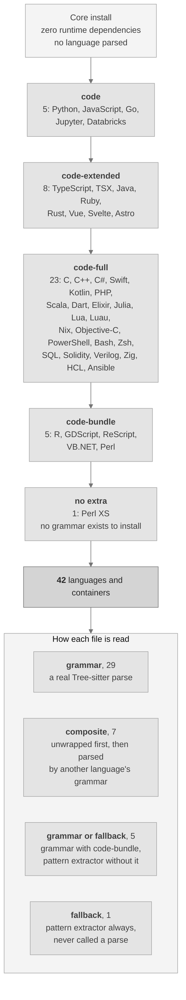

运行 `dkg code-languages` 可查看你机器上的实时集合。带扩展名与许可证的完整清单见 [`docs/LANGUAGES.md`](docs/LANGUAGES.md)。

| 附加项 | 语言与容器格式 |
|---|---|
| `code` | Python、JavaScript、Go、Jupyter 笔记本、Databricks 笔记本 |
| `code-extended` | TypeScript、TSX、Java、Ruby、Rust、Vue、Svelte、Astro |
| `code-full` | Ansible、Bash、C、C++、C#、Dart、Elixir、HCL 与 Terraform、Julia、Kotlin、Lua、Luau、Nix、Objective-C、PHP、PowerShell、Scala、Solidity、SQL、Swift、Verilog、Zig、Zsh |
| `code-bundle` | R、GDScript、ReScript、VB.NET、Perl |
| 无需附加项 | Perl XS |

解析准确度按语言在两个带标注的样本上测量，并发布于 [`docs/BENCHMARKS.md`](docs/BENCHMARKS.md)。若某语言的可选语法未安装，会被报告为未测量，绝不记为零分。

**Perl XS 的读取方式不同，标注方式也不同。** 本项目所能触及的任何来源都没有面向 `.xs` 文件的宽松许可语法，因此没有任何附加项能改变它的读取方式：

| 方面 | Perl XS 的处理方式 |
|---|---|
| 如何读取 | 一个有文档记录的模式抽取器，绝非完整解析 |
| 如何报告 | 标注为 `fallback` 保真度，图谱节点上与每份报告中都是如此 |
| 对结果的影响 | 从此类文件出发的每条连接，其置信度都会被下调 |
| 实测准确度 | 在留出样本上精确率 0.875、召回率 0.7778 |

## 安装

**环境要求。** Python 3.10 或更新版本。核心安装不引入任何运行时依赖。macOS 与 Linux 是经过测试的目标平台。

```bash
# from a clone of the repository
python3 -m venv .venv
./.venv/bin/python -m pip install --upgrade pip
./.venv/bin/python -m pip install -e ".[dev]"
./.venv/bin/dkg --version        # dkg 0.1.0
```

只在需要时添加可选附加项，例如 `pip install -e ".[embeddings,reranker,code]"`。每个可选组件在不可用时都会报告确切原因。

### 快速上手

```bash
dkg init                                   # create a project-local .dkg home
dkg ingest ./my-notes --recursive          # ingest text, markdown, json, csv, docx
dkg status                                 # print counts and configuration
dkg search "confidence formula"            # keyword, fts, or hybrid (default hybrid)
dkg graph "beta" --depth 2                 # bounded graph neighbourhood
dkg evidence <claim-id>                    # evidence packet for a claim
dkg community                              # group the graph with both detectors
dkg code-ingest ./my-repo                  # parse a repository into the code graph
dkg code-hubs                              # most connected symbols and chokepoints
dkg code-gaps                              # isolated symbols and untested hotspots
dkg code-questions                         # review questions generated from the graph
dkg code-architecture                      # component overview with coupling warnings
dkg graph-snapshot before.json             # snapshot now, diff later with graph-diff
dkg export --format html --out graph.html  # offline viewer, or json / csv / dot / cypher / obsidian
dkg audit --verify                         # verify the audit log
dkg mcp-stdio                              # start the read-only assistant server
```

### 如果你不熟悉命令行

1. 从 python.org 安装 Python 3.10 或更新版本，然后在项目文件夹中打开终端。
2. 把上面四条安装命令逐行复制执行。最后一行应当打印 `dkg 0.1.0`。
3. 运行 `dkg init`，再让 `dkg ingest` 指向你存放笔记的文件夹，然后执行 `dkg search "a phrase you expect to find"`。

每条命令默认打印可读文本，加上 `--json` 则打印机器可读的 JSON。除非你传入 `--allow-network`，否则没有任何一步会接触网络。

### 一种安装方式，适用于所有受支持平台

各处的安装路径完全相同，因为核心只依赖标准库。没有需要对应操作系统的轮子包，没有编译步骤，也没有需要常驻的服务。

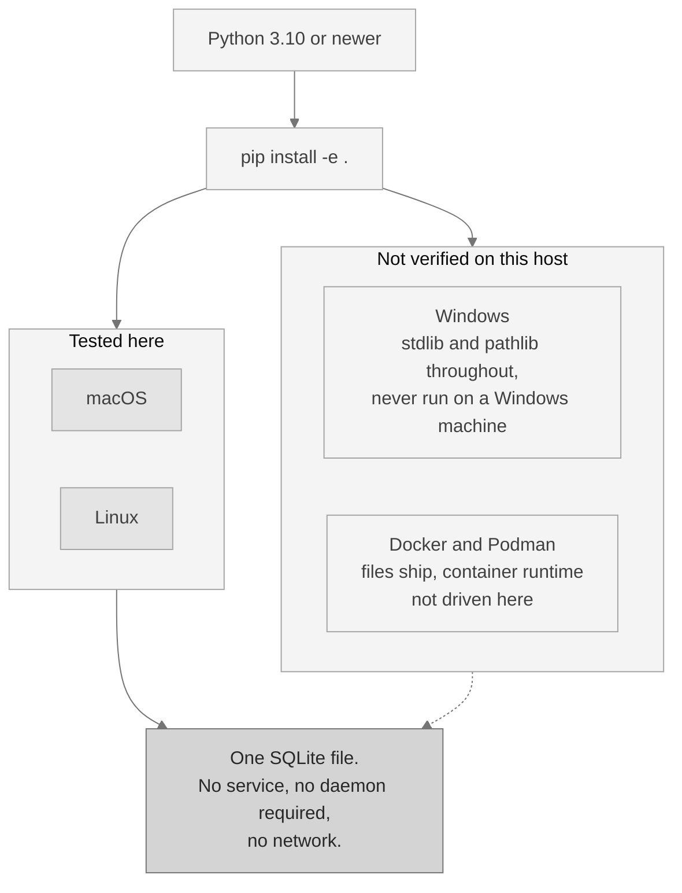

那条虚线是有意为之。macOS 与 Linux 是经过测试的目标平台。Windows 与容器镜像随附发布，但没有在本机上运行过，本文如实说明这一点，而不因为代码看上去可移植就假定它可移植。

## 接入 AI 助手

助手集成使用 Model Context Protocol（MCP）：这是一种标准化的只读连接，AI 助手可用它查询你的图谱。它通过标准输入输出运行，另有一个仅限本机的 HTTP 选项，需要令牌并校验请求来源。

**只注册查询类工具。任何会写入的工具都不会暴露**，因此一个依据所读内容行事的助手，无法通过这条连接改动你的图谱。

```mermaid
%%{init: {"theme":"base","themeVariables":{"primaryColor":"#e4e4e4","primaryTextColor":"#404040","primaryBorderColor":"#a5a5a5","lineColor":"#757575","secondaryColor":"#d4d4d4","tertiaryColor":"#f4f4f4","clusterBkg":"#f4f4f4","clusterBorder":"#a5a5a5","edgeLabelBackground":"#f4f4f4","textColor":"#404040"}}}%%
flowchart LR
    asst["Your assistant<br/>any model, any vendor"]
    asst -->|"JSON-RPC over stdio"| srv["dkg mcp-stdio<br/>read-only tool surface"]

    subgraph guards["Enforced outside the model"]
        direction TB
        g1["Query tools only<br/>no write tool registered"]
        g2["Path reads confined to a root<br/>and size-capped"]
        g3["Node and edge reads bounded together,<br/>truncation reported"]
        g4["Fetched content labelled<br/>untrusted evidence, never instructions"]
    end

    srv --> guards
    guards --> db[("Local SQLite graph<br/>opened read-only")]
    db --> ans["Answer with provenance,<br/>confidence, and the source it came from"]
    ans --> asst

    classDef inner fill:#e4e4e4,stroke:#a5a5a5,color:#404040
    classDef strong fill:#d4d4d4,stroke:#757575,color:#282828
    classDef outer fill:#f4f4f4,stroke:#a5a5a5,color:#404040
    class asst outer
    class g1,g2,g3,g4 inner
    class srv,ans inner
    class db strong
```

用 `dkg mcp-install --client <name>` 配置一个编辑器，用 `--dry-run` 预览，用 `dkg mcp-uninstall` 撤销，后者只移除它自己写入的内容。运行 `dkg mcp-tools` 可列出它能配置的编辑器。每个工具的参数见 [`docs/COMMANDS.md`](docs/COMMANDS.md)。

### 工具面

| 工具 | 它返回什么 |
|---|---|
| `dkg.status` | 数据库计数与应用版本。 |
| `dkg.orient` | 对陌生图谱的紧凑导览：它的形状、最大的组成部分，以及从哪里入手。 |
| `dkg.search` | 对文本块的混合检索，融合关键词与 FTS5，并报告哪些引擎参与。 |
| `dkg.search.keyword` | 对文本块的关键词检索。 |
| `dkg.search.fts` | 对文本块的 FTS5 检索。 |
| `dkg.graph.neighbourhood` | 某个实体周围有界的图谱邻域。 |
| `dkg.graph.community` | 用模块度优化在实体图上划分社区。 |
| `dkg.graph.community.split` | 同上，然后拆分任何超过阈值的社区。 |
| `dkg.graph.diff` | 比较由 `dkg graph-snapshot` 写出的两份代码图谱快照。 |
| `dkg.evidence.claim` | 单条论断的证据包，附带可解释的置信度。 |
| `dkg.facets.source` | 每个来源及其对应的文本块数量。 |
| `dkg.code.languages` | 该平面解析的每种语言、各自的读取方式，以及在此处是否可用。 |
| `dkg.code.symbols` | 解析单个源文件并返回其符号，不写入数据库。 |
| `dkg.code.search` | 在代码符号与代码文本上检索。 |
| `dkg.code.impact` | 某个符号或文件的结构化影响范围。多报且仅供参考。 |
| `dkg.code.impact_radius` | 影响范围，且每个受影响符号都带有各自的理由与距离。 |
| `dkg.code.flow` | 结构化执行流转追踪，从入口符号出发的前向调用链。 |
| `dkg.code.flows` | 已编目的执行流转，按排序返回。 |
| `dkg.code.flow.get` | 按名称或标识符取回单条已编目流转及其步骤。 |
| `dkg.code.flows.affected` | 哪些已编目流转经过了一组变更文件。 |
| `dkg.code.callers` | 调用指定符号的符号，以节点级切片而非整个文件返回。 |
| `dkg.code.callees` | 指定符号所调用的符号，以节点级切片返回。 |
| `dkg.code.neighbours` | 双向相关的符号，涵盖调用、导入与继承。 |
| `dkg.code.importers` | 导入指定模块的模块，各自附带边置信度。 |
| `dkg.code.base_types` | 指定类型所继承的类型，各自附带边置信度。 |
| `dkg.code.implementations` | 继承自指定类型的类型，各自附带边置信度。 |
| `dkg.code.tests_for` | 覆盖指定符号的测试，各自附带边置信度。 |
| `dkg.code.hubs` | 连接最多的符号与架构上的咽喉点。 |
| `dkg.code.coupling` | 在周围结构映衬下显得出人意料的边。 |
| `dkg.code.gaps` | 孤立符号、未测试的热点与稀薄的社区。 |
| `dkg.code.questions` | 由图谱生成的审查问题，每条都点明促成它的测量。 |
| `dkg.code.architecture` | 组件级的地图，附带耦合告警。 |
| `dkg.code.communities` | 预先计算的逐社区摘要：成员、文件与内部结构。 |
| `dkg.code.change` | 服务器所限定仓库的结构化摘要。 |
| `dkg.code.review_context` | 审查者关于某个符号所需的一切，一次调用返回。 |
| `dkg.code.criticality` | 从入口点出发的每条执行流转，按加权关键度打分。 |
| `dkg.code.risk` | 对一组变更给出 0 到 1 的参考性风险评分。 |
| `dkg.code.risk.index` | 预先计算的逐符号结构化风险指数，从高到低。 |
| `dkg.code.confidence` | 代码图谱的三档置信度画像。 |
| `dkg.code.dead` | 候选死代码：没有任何入向引用边的定义。 |
| `dkg.code.large` | 记录行跨度达到给定规模的符号。 |
| `dkg.code.refactor` | 由社区结构推导出的重构建议。 |
| `dkg.code.rename.preview` | 以只读编辑清单形式呈现的符号重命名。它只预览，绝不写入。 |
| `dkg.code.slices` | 针对单个结构性问题的答案形态节点级切片。 |
| `dkg.code.traverse` | 从任意节点出发的自由遍历，广度优先或深度优先。 |
| `dkg.code.framework` | 某个符号的框架关系：`routes_to`、`renders`、`relates_to`。 |
| `dkg.repos.list` | 每个已注册仓库及其各自的状态。 |
| `dkg.repos.search` | 跨全部已注册仓库检索，并给出逐仓库结果。 |
| `dkg.memory.list` | 记忆循环中保存的已记录答案。 |
| `dkg.prompts.list` | 面向常见审查任务的可复用提示模板。 |
| `dkg.prompts.get` | 按名称取回单个可复用提示模板。 |
| `dkg.docs.section` | 随附文档中的指定章节，限定在文档根目录内。 |

它们全部只读，没有任何一个会写入。那个确实会写文件的配置助手只在命令行提供，并被有意排除在这一工具面之外。

## 持续集成

一个开箱即用的 GitHub Action 会在仓库上运行分析，并把带风险评分的审查作为单条拉取请求评论发布，每次推送更新同一条评论而不是新增一条。把下面的内容复制到 `.github/workflows/`：

```yaml
name: code-review

on:
  pull_request:
    branches: ["**"]

permissions:
  contents: read
  pull-requests: write

jobs:
  review:
    runs-on: ubuntu-latest
    steps:
      - uses: actions/checkout@11d5960a326750d5838078e36cf38b85af677262 # v4.4.0
        with:
          fetch-depth: 0          # the base ref must be diffable
          persist-credentials: false

      - uses: scorpion1476-lgtm/D-Knowledge_Graph@v0.1.0
        with:
          repository-path: "."
          base-ref: ${{ github.event.pull_request.base.sha }}
          # Pin the analysed tool, not just the action. A floating ref here
          # would silently change what runs against your code.
          dkg-ref: "v0.1.0"
          dkg-repo-url: "https://github.com/scorpion1476-lgtm/D-Knowledge_Graph.git"
          comment: "true"
          pr-number: ${{ github.event.pull_request.number }}
          github-token: ${{ secrets.GITHUB_TOKEN }}
          # Off by default. Set to low, moderate, elevated, or high to gate.
          # Thresholds derive from your repository's own score distribution.
          risk-gate: "off"
```

> [!WARNING]
> 上面的单工作流形式会在持有写入令牌的作业中运行拉取请求的代码。在只有可信贡献者提交拉取请求的场景下这是安全的。**如果你接受来自派生仓库的拉取请求，请改用两段式形式**：一个工作流在没有写权限也没有机密的情况下生成审查内容，另一个工作流在从不检出拉取请求代码的作业中把它发布出去。这两个文件都随本仓库发布。

该 Action 的输入、输出与风险模型记录在 [`docs/CONSUMER_ACTION.md`](docs/CONSUMER_ACTION.md)。它从固定版本安装工具，把自己使用的子 Action 固定到确切提交，并且不需要任何服务或账号。

## 安全

本平台默认即安全。下面的每一项控制都在源码中实现并有测试覆盖。

| 控制 | 默认 | 细节 |
|---|---|---|
| 对外网络 | 关闭 | 对外访问需要显式的 `--allow-network` 开关与配置许可。 |
| 遥测 | 无 | 没有需要关闭的东西；它只可能被刻意打开。 |
| 助手连接 | 只读 | 只存在查询类工具。HTTP 选项绑定到本机，需要令牌，并限制请求体积与频率。 |
| 请求伪造 | 已阻断 | 地址在解析之后被检查，私有、回环与云元数据地址在任何抓取之前即被拒绝。 |
| 机密脱敏 | 开启 | 日志、审计行与导出都会经过一个脱敏器，掩蔽密钥、令牌与私钥块。 |
| 不可信内容 | 强制 | 抓取到的网页内容被标注为证据而绝非指令，并会被评估是否存在注入企图。 |
| 存储 | 参数绑定 | 每一次数据库查询都使用参数化；存储层拒绝拼接字符串构造的查询。 |
| 来源与证据 | 始终开启 | 每条记录都记录其来源，审计日志仅可追加并带有逐行哈希链。 |
| 供应链 | 已加固 | Action 固定到确切提交，依赖通过生成的锁文件与物料清单固定，许可与漏洞扫描在 CI 中运行。 |

完整模型，包括刻意排除在范围之外的部分，见 [`docs/SECURITY_MODEL.md`](docs/SECURITY_MODEL.md) 与 [`docs/THREAT_MODEL.md`](docs/THREAT_MODEL.md)。

## 基准测试

这里的准确度是测量出来的，而不是断言出来的。每一个数字都来自一个有文档记录的样本，使用固定的随机种子，一条命令即可全部重新生成：

```bash
python scripts/benchmark.py
```

| 测量对象 | 样本 | 结果 |
|---|---|---|
| 检索质量 | 30 篇文档、40 条查询 | 仅关键词得到 MRR 0.9375 与 nDCG@10 0.9473。加上可选的嵌入模型与重排模型后，两项均达到 1.0。 |
| 变更影响精确率 | 每种语言 42 个评估节点、24 条真实边 | 默认精确率 0.1081，加 `--resolve` 后为 1.0，两种情况下召回率均为 1.0，覆盖 Python 与 JavaScript。 |
| 代码解析准确度 | 13 种语言中的 113 个符号，标注早于任何解析 | 精确率 0.982，召回率 0.9646。 |
| 分组质量 | 80 个实体分 16 组，以及 40 个实体分 5 个主题 | 两个检测器在结构上打平于 Rand 1.0。当语义更重要时，精化检测器以 Rand 0.7641 对 0.641 领先。 |
| 执行流转准确度 | 逐语言手工标注的调用图 | Python、JavaScript 与 Go 的精确率与召回率均为 1.0。 |
| 矛盾检测 | 18 个留出案例 | 召回率 0.6667，精确率 0.75。仅供参考，且属于词法而非推理。 |
| 媒体准确度 | 渲染生成的样本，而非自然照片 | OCR 的字符与词错误率为 0.0，图像标注 top-1 为 0.9375。 |

本页不会宣称两件事。图谱路径带来的是**正确性**结果而非节省：与一个有能力的检索加阅读基线相比，它大约多用一倍词元，71,088 对 34,744，同时平均正确率为 1.0 对 0.6206。另外，若某项基准所需的可选工具或模型未安装，会被报告为此处未运行，绝不记为零分，也绝不记为通过。

完整结果、样本规模、方法以及每个样本的局限，见 [`docs/BENCHMARKS.md`](docs/BENCHMARKS.md)。

## 使用场景

本平台是一个私有且可核查的研究与知识底座。因为它离线运行并记录每条记录的出处，所以适合那些答案来源与答案本身同等重要的工作。

| 团队或角色 | 用它来做什么 | 收获 |
|---|---|---|
| 研究与分析 | 摄入笔记、报告与订阅源，然后检索、遍历，并对照来源交叉核对论断。 | 一张可检索的图谱，每条论断都能链回它的文档。 |
| 合规与法务审查 | 把敏感材料保留在本地或断网机器上，并产出带可读置信度的证据。 | 一份可辩护的离线记录，说明发现了什么以及在哪里发现。 |
| 知识管理 | 把散落的文件变成一张连通的图谱，把相关材料分组，并导出到 Obsidian 或 Graphviz。 | 一份持续维护的自有知识地图，不被任何厂商锁定。 |
| 调查与尽职调查 | 在多个来源之间找出矛盾，并在实体之间进行有界查询。 | 一份可复核的地图，显示来源在哪里一致、在哪里分歧。 |

在完全不接入任何模型的情况下，在图谱上运行确定性的智能体工作流；当你需要更高召回时，再把本地模型注册到适配器接口之后：

```bash
dkg agent research        --input '{"query":"knowledge graph"}'
dkg agent contradiction   --input '{}'
dkg agent security-review --input '{"limit":500}'
```

### 面向工程团队

| 工程场景 | 平台如何支撑 |
|---|---|
| 代码理解 | 把仓库解析成代码图谱，从入口点查询符号、调用结构与执行流转。 |
| 架构审查 | 找出连接最多的符号、移除后会切断图谱的关键点、组件之间的环，以及跨越边界的连接。 |
| 审查陌生的改动 | 由图谱生成审查问题，每条都点名一个符号与背后的测量，再对比两份快照看清什么发生了变化。 |
| 变更影响审查 | 为变更文件计算参考性的影响集合，可选在 CI 中设卡，通过 GitHub Action 或 `dkg code-report` 使用。 |
| 离线知识图谱 | 在一个自包含的 HTML 查看器中构建并浏览图谱，它不从网络加载任何东西。 |
| 隔离网络部署 | 从源码安装且无运行时依赖，在断网状态下运行每一项核心能力。 |

在默认路径下，变更影响与执行流转有意多报。可选的 `--resolve` 路径会在装有语言服务器的地方，用类型感知解析收窄有歧义的调用。

## 常见问题

这里是简短回答。更长的回答，包括与语言服务器、相似度检索和纯文本检索的坦诚对比，见 [`docs/FAQ.md`](docs/FAQ.md)。

| 问题 | 回答 |
|---|---|
| 这是开源项目吗？ | 不是。它是源码可见且非商业的。商业使用、修改以及分发修改版都被禁止。见下面的许可章节。 |
| 它能取代语言服务器吗？ | 不能，而且在装有语言服务器时它会使用它。默认代码路径会多报；`--resolve` 会在有服务器的地方收窄结果。 |
| 它能取代文本检索吗？ | 不能。对于"这个确切字符串出现在哪里"，纯检索胜出，这里没有任何东西能超过它。图谱面向的是那些不是字符串的问题。 |
| 它能取代向量数据库吗？ | 不能。它把相似度检索作为一个选项包含进来，并在其外围加上结构、来源与证据。若只需要对文本做语义检索，向量数据库更简单。 |
| 它会回传数据吗？ | 不会。没有遥测，对外访问需要显式的 `--allow-network` 开关与配置许可。 |
| 它会下载模型吗？ | 运行期间绝不会。模型需事先放在磁盘上并仅从本地文件加载；模型缺失时会让位给有文档记录的回退路径。 |
| 我怎么知道安装正确？ | 依次运行 `dkg --version`、`dkg init`、`dkg capabilities`、`dkg doctor`，然后摄入并检索一些内容。全新安装上出现一长串不可用的可选能力是正常的，不是坏了。 |
| 我如何区分安装问题与环境问题？ | `python scripts/probe_environment.py` 会打印解释器、已安装的附加项、找到的外部工具与本地模型，以及软件包索引是否可达。 |
| 什么时候不该用它？ | 当你需要确定结论而非参考结果时，当你的资料规模极其庞大时，当你需要托管服务时，或者当你需要商业使用时。 |

## 疑难排解

[`docs/TROUBLESHOOTING.md`](docs/TROUBLESHOOTING.md) 中的每一条都包含症状、原因与修复办法，覆盖安装与路径问题、服务器启动失败、数据库锁定与陈旧、缺失的可选组件，以及 Windows 与 Linux 子系统相关的问题。Windows 相关条目被标注为由代码推断而非实际观察，因为没有使用过 Windows 机器。

在你读任何东西之前，两条命令就能回答大多数问题：

```bash
dkg doctor                          # the application's self-check, as JSON
python scripts/probe_environment.py # the environment around it, as JSON
```

把两者的输出都贴进缺陷报告。后者对软件包索引的检查是它唯一可能发出的对外请求，它会在自己的输出中写明该地址，加 `--offline` 即可跳过。

## 文档

| 文档 | 内容 |
|---|---|
| [`docs/QUICKSTART.md`](docs/QUICKSTART.md) | 通往可用图谱的最短路径。 |
| [`docs/USER_GUIDE.md`](docs/USER_GUIDE.md) | 研究、验证、矛盾、导出、备份与恢复的完整工作流。 |
| [`docs/COMMANDS.md`](docs/COMMANDS.md) | 每个子命令与每个助手工具，附参数与默认值。 |
| [`docs/MNEMOSYNE.md`](docs/MNEMOSYNE.md) | 基础分组检测器，包含通俗说明与完整技术细节。 |
| [`docs/ARIADNE.md`](docs/ARIADNE.md) | 精化检测器，包含通俗说明与完整技术细节。 |
| [`docs/BENCHMARKS.md`](docs/BENCHMARKS.md) | 每一个实测数字，附样本规模与随机种子。 |
| [`docs/LANGUAGES.md`](docs/LANGUAGES.md) | 每种被解析的语言、其扩展名、读取方式与语法许可证。 |
| [`docs/FAQ.md`](docs/FAQ.md) | 坦诚的对比、它不能取代什么，以及如何验证安装。 |
| [`docs/TROUBLESHOOTING.md`](docs/TROUBLESHOOTING.md) | 真实发生的问题的症状、原因与修复办法。 |
| [`docs/ADMINISTRATOR_GUIDE.md`](docs/ADMINISTRATOR_GUIDE.md) | 运行一套安装：主目录、备份、保留策略与审计日志。 |
| [`docs/DEPLOYMENT_GUIDE.md`](docs/DEPLOYMENT_GUIDE.md) | 本地、容器与自托管部署，含反向代理与 TLS。 |
| [`docs/DEVELOPER_GUIDE.md`](docs/DEVELOPER_GUIDE.md) | 仓库布局、本地开发、测试套件，以及如何新增命令或适配器。 |
| [`docs/ARCHITECTURE.md`](docs/ARCHITECTURE.md) | 内核与两个平面如何组合在一起。 |
| [`docs/CONSUMER_ACTION.md`](docs/CONSUMER_ACTION.md) | 该 GitHub Action：输入、输出、风险模型与派生仓库安全形式。 |
| [`docs/SECURITY_MODEL.md`](docs/SECURITY_MODEL.md) 与 [`docs/THREAT_MODEL.md`](docs/THREAT_MODEL.md) | 各项控制，以及它们所针对的对手。 |
| [`docs/ROADMAP.md`](docs/ROADMAP.md) | 已交付、进行中、计划中与不打算做的。 |
| [`CONTRIBUTING.md`](CONTRIBUTING.md) | 在克隆中开发、各项门禁命令，以及一次改动必须满足什么。 |
| [`SECURITY.md`](SECURITY.md) | 受支持版本、私密上报渠道与响应时限。 |
| [`CODE_OF_CONDUCT.md`](CODE_OF_CONDUCT.md) | 行为准则、适用范围与如何反映问题。 |

## 许可

源码可见，个人与非商业用途免费。**这不是一个开源许可**：不允许商业使用，也不允许修改或分发修改后的版本。

| 组成部分 | 许可 | 条款 |
|---|---|---|
| 整个仓库，包含 Ariadne | D-Knowledge Graph Source-Available Non-Commercial Licence（PolyForm Noncommercial 1.0.0 加上一条禁止修改的条款） | 可为任何非商业目的阅读、运行并使用其输出。可连同 `LICENSE` 与 `NOTICE` 原样重新分发。禁止商业使用。禁止修改，也禁止分发修改版。 |
| 可选的第三方依赖 | 各自的宽松许可（Apache-2.0、MIT、BSD、ISC、HPND） | 不受上述条款影响。完整清单见 `THIRD_PARTY_NOTICES.md`。 |

一份许可覆盖全部内容。没有单独授权的模块，也没有被排除在构建之外的组成部分。默认运行时只使用 Python 标准库，且没有从任何其他项目复制源码。

2026-08-05 之前分发的版本以 Apache-2.0 发布。该授权对那些版本以及据此获得副本的人仍然有效；本条款自本版本起适用。见 `LICENSE` 与 `NOTICE`。
