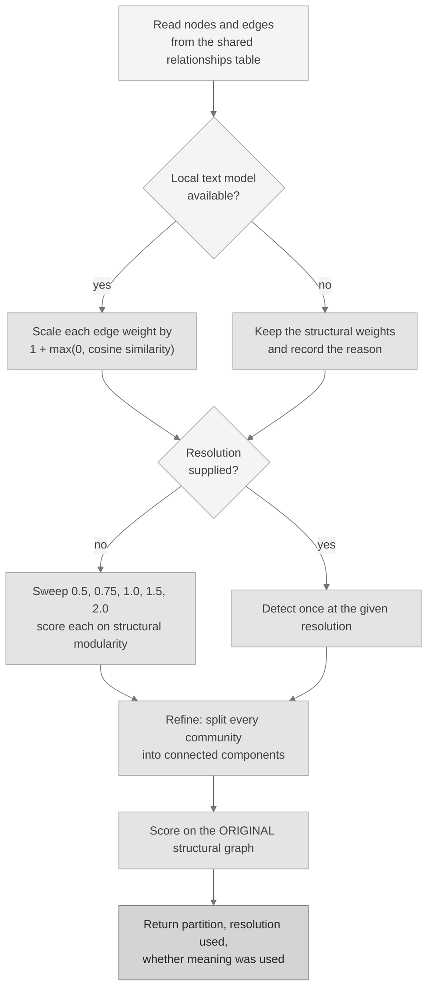

# Ariadne

**The refinement community detector.** Ariadne takes the same graph the base
detector reads and produces a better-behaved grouping: every group it returns is
internally connected, it can weight connections by meaning rather than by
structure alone, and it can choose its own granularity instead of being told.
It is this project's own implementation.

Implementation: [`src/dkg/ariadne/detector.py`](../src/dkg/ariadne/detector.py).

---

## Part 1: in plain language

### The problem it fixes

The base detector, [Mnemosyne](MNEMOSYNE.md), groups entities by looking at who
is connected to whom. That works well, and it has three blind spots.

**Blind spot one: a group can be in two pieces.** Greedy grouping can produce a
"group" that is really two separate clumps which never touch, held together only
because merging them scored well at some intermediate step. That is a group in
name only.

**Blind spot two: structure is not meaning.** Two clusters of entities can be
wired identically and still be about completely different things. If your only
evidence is the wiring, the two are indistinguishable.

**Blind spot three: how fine should the groups be?** A single knob controls
whether you get a few large groups or many small ones, and the right setting
depends on the graph in front of you, which you cannot know in advance.

Ariadne addresses all three.

### A worked example anyone can follow

Go back to the office where you only know who talks to whom.

**Splitting groups that are not really groups.** Suppose the process hands you a
"department" of twelve people, but on inspection it is really six people who talk
to each other and six other people who talk to each other, with no conversation
at all crossing between the halves. Calling that one department is wrong.
Ariadne checks each group and splits it wherever it falls into disconnected
pieces, so what you are handed is always a group you could actually walk around.

**Using what the conversations are about.** Now suppose you get a transcript
summary as well as the call log, so you know that one cluster talks about
invoices and another talks about hiring. Two clusters can have identical calling
patterns and still be clearly different teams once you know the subject.
Ariadne, when a local text model is installed, boosts the weight of each
connection by how similar the two endpoints are in meaning. Connections between
things that are about the same subject count for more. Structure and meaning
vote together instead of structure voting alone.

**Choosing the zoom level for you.** Instead of accepting one setting for how
fine the groups should be, Ariadne tries a range of settings, scores the result
of each one on the original connections, and keeps the best. You do not have to
guess.

### Why this is useful in the product

Your graph is not only shapes. A knowledge graph of documents, media, and code
has meaning attached to every node, and Ariadne is the detector that can use it.
On a graph where two topics are wired the same way, the base detector cannot tell
them apart and Ariadne can.

### What it is not

Ariadne is a better reading of the same evidence, not a source of certainty. The
groups are still advisory, and the connections underneath them are still
over-approximate. It also does not always win: on a graph whose structure is
already clean, it ties with the base detector, and the platform reports the tie
rather than dressing it up.

---

## Part 2: the technical description

### The problem

Same as the base detector: partition an undirected weighted graph into
communities without being told how many there are. Ariadne adds three
requirements on top:

1. Every returned community must be a single connected component in the
   structural graph.
2. Where semantic information about the nodes exists, it must be able to
   influence the partition.
3. The granularity parameter must be selectable from the data rather than
   assumed.

### The objective

Ariadne optimises the same published objective, **modularity**, which this
project did not invent and does not claim to have invented:

```
Q = SUM over communities c of [ ( SIGMA_in(c) / m ) - gamma * ( SIGMA_tot(c) / (2m) )^2 ]
```

The symbols are as in [`docs/MNEMOSYNE.md`](MNEMOSYNE.md): `m` is total edge
weight, `SIGMA_in(c)` is the weight inside community `c`, `SIGMA_tot(c)` is the
summed degree of its nodes, and `gamma` is the resolution.

One detail matters for fairness and is worth stating clearly. Ariadne may
**detect** on semantically reweighted edges, but it always **reports** its
modularity and coverage on the original structural graph. Both detectors are
therefore scored on the same objective over the same edges, and neither can win
the comparison by being measured on a graph of its own making.

### The three additions

#### 1. Refinement into connected components

After a coarse partition is produced, each community is split into its connected
components by breadth-first search over the structural adjacency. Every returned
community is then a single connected component by construction. This is the
well-connectedness property the plain greedy method does not guarantee.

The search is written iteratively with an explicit queue, so a deep graph cannot
exhaust the Python call stack.

#### 2. Semantic edge weighting

When the optional `embeddings` extra is installed and its model is pre-staged,
each node's display text is embedded locally and every edge weight is scaled:

```
w'(u, v) = w(u, v) * ( 1 + max(0, cosine(embed(u), embed(v))) )
```

The `max(0, ...)` clamp means a semantically unrelated pair is never penalised
below its structural weight; similarity can only add. An edge between two nodes
about the same subject can be worth up to twice its structural weight.

The model runs locally with no network access and is never downloaded at run
time. When it is absent, Ariadne runs structurally and records the reason in its
own output rather than failing or pretending.

#### 3. Auto-tuned resolution

When no resolution is supplied, Ariadne sweeps

```
gamma in (0.5, 0.75, 1.0, 1.5, 2.0)
```

For each value it produces a coarse partition, refines it, and scores the result
with **structural** modularity at `gamma = 1.0`. It keeps the best score, with
ties broken toward fewer communities so the outcome is deterministic.

Note the asymmetry, because it is the point: the sweep varies the resolution
used to *find* the partition, and scores every candidate on one fixed common
yardstick. Scoring each candidate at its own resolution would be comparing
scores from different scales.

### Parameters

| Parameter | Default | Effect |
|---|---|---|
| `resolution` | `None` in the Python API | `None` triggers the sweep above. A number pins the resolution and skips the sweep. |
| `use_embeddings` | `True` | Enables semantic edge weighting when the model is present. Set `False` to force a structural run. |
| `label` | `False` | Adds a short deterministic per-community label built from member tokens, computed locally. |
| `tenant_id` | `"local"` | Which tenant's relationships to read. |

**One behaviour to know about.** The `dkg community` command supplies a
resolution of `1.0` by default, and the combined default path passes `1.0`
through as well. So the sweep runs when you call the Python API without a
resolution, and does not run through the command line unless you invoke the
Python API directly. This is described as it is rather than as it might read.

### The algorithm



In steps:

1. Read nodes, edges, and display names from the shared tables. Read only.
2. If the local text model is available, scale every edge weight by its
   endpoints' clamped cosine similarity. Otherwise keep structural weights and
   record why.
3. Build the coarse partition with the base modularity optimisation, either once
   at a given resolution or once per swept resolution.
4. Refine each community into its connected components.
5. Score the refined partition on the original structural graph at `gamma = 1.0`.
6. Return the partition, the resolution actually used, whether meaning was used,
   modularity, coverage, and the members of each community, largest first.

### Determinism

The same graph and the same staged model always give the same partition. Nodes
are sorted before embedding and before traversal, the sweep breaks ties toward
fewer communities, and the underlying base pass is itself deterministic. There
is no random seed because there is no randomness.

### Complexity

Let `n` be the node count, `m` the edge count, `R` the number of swept
resolutions (5), and `d` the embedding dimension.

| Stage | Cost |
|---|---|
| Semantic reweighting | `O(n * d)` to embed, `O(m * d)` for the cosine per edge |
| One coarse detection | near-linear in `m`, as for the base detector |
| Refinement | `O(n + m)`, one breadth-first pass over each community |
| Auto-tuned sweep | `R` times the coarse detection plus refinement |

So a swept run costs about five times a pinned run plus the one-off embedding
cost. Memory is `O(n + m)` plus `O(n * d)` while vectors are held.

The recorded latency on the structural sample is **7.86 ms** for 80 nodes and
176 edges, against 1.196 ms for the base pass. The refinement and the sweep are
what that difference buys.

### Using it

From the command line:

```bash
dkg community --detector ariadne
dkg community --detector ariadne --resolution 0.75
```

From Python, where leaving the resolution out is what enables the sweep:

```python
from dkg.ariadne import detect_communities_ariadne

result = detect_communities_ariadne(db)              # sweeps the resolution
result = detect_communities_ariadne(db, resolution=1.0)   # pins it
result = detect_communities_ariadne(db, label=True)       # adds short labels

result["resolution"]           # the resolution actually used
result["auto_tuned_resolution"]  # True when the sweep chose it
result["embeddings_used"]      # True when meaning contributed
result["modularity"]           # scored on the structural graph
result["communities"]          # members with display names, largest first
```

To enable semantic weighting, install the optional extra and pre-stage its
model. Nothing downloads at run time:

```bash
pip install -e ".[embeddings]"
python scripts/prestage_models.py
```

If the model is absent, the call still succeeds structurally and
`result["embeddings_note"]` says exactly why meaning was not used.

### How it is measured

- **Harness.** [`scripts/community_quality.py`](../scripts/community_quality.py),
  run inside the single seeded pass of
  [`scripts/benchmark.py`](../scripts/benchmark.py).
- **Seed.** `PYTHONHASHSEED=0`.
- **Samples.** [`tests/graph/corpus/graph_corpus.json`](../tests/graph/corpus/graph_corpus.json),
  generated by a documented in-repo generator so the correct answer is known by
  construction.
  - Structural sample: 80 nodes as 16 cliques, 176 edges, 16 true groups. Both
    detectors run structurally here, so this measures the refinement alone.
  - Semantic sample: 40 entities across 5 topics, 80 edges, 5 true groups. The
    topics are wired symmetrically on purpose, so structure alone cannot
    separate them. This is the sample that measures semantic weighting, and it
    runs only when the model is staged; otherwise it is reported not measured,
    never scored zero.
- **Metrics.** Modularity and coverage on the structural graph, community count,
  latency, and the **Rand index** against the known truth, which scores every
  pair of nodes on whether the two partitions agree about keeping that pair
  together or apart.
- **Artifact.** [`test-evidence/community_quality.json`](../test-evidence/community_quality.json).

### Measured results

Taken verbatim from the recorded artifact.

| Sample | Detector | Communities | Modularity | Rand index |
|---|---|---|---|---|
| Structural, 80 nodes in 16 cliques | Mnemosyne | 16 | 0.846591 | **1.0** |
| Structural, 80 nodes in 16 cliques | Ariadne | 16 | 0.846591 | **1.0** |
| Semantic, 40 entities in 5 topics | Mnemosyne | 4 | 0.5 | 0.641 |
| Semantic, 40 entities in 5 topics | Ariadne | 8 | 0.42 | **0.7641** |

Recorded verdicts: structural `tie (rand 1.0)`, semantic
`ariadne better (rand 0.7641 vs 0.641)`.

Read plainly:

- **On the structural sample the two tie at Rand 1.0.** Both recover the true
  grouping exactly. The refinement had nothing left to fix, and the platform
  reports the tie rather than manufacturing a difference. Ariadne's coverage is
  0.909091 at a chosen resolution of 0.75.
- **On the semantic sample Ariadne is closer to the truth**, 0.7641 against
  0.641, and it finds 8 groups against the true 5 while the base pass finds 4.
  This is the case the sample exists for: the two detectors see the same wiring,
  and only one of them can also see what the entities are about.
- **Ariadne scores lower modularity on the semantic sample**, 0.42 against 0.5.
  That is not a contradiction. Modularity measures structure, and this sample
  was built so that structure does not carry the answer. It has a direct
  consequence for the default path, described below.

---

## Part 3: its role in the running system

### Where it sits

Ariadne reads the shared `relationships` table and groups the shared `entities`
table, using the `weight` column as edge confidence. It writes nothing. Both
analysis planes feed that one table, so a community can span a document and the
code it describes.

### The default path runs both detectors

`dkg community` defaults to `--detector both`. The base pass builds the
partition, the refinement pass refines it, and the platform returns one of them.

Selection is **by measured modularity, never by preference**:

```python
use_refined = refined_modularity > base_modularity
```

Strictly greater, so a tie deterministically keeps the base partition. The
result reports both passes, which one was selected, and the reason in words.

### What that means in practice, stated honestly

The selection rule is a structural score, so it does not always pick the
partition that agrees best with a known truth. On the two samples above:

| Sample | Base modularity | Refinement modularity | Returned by default |
|---|---|---|---|
| Structural | 0.846591 | 0.846591 | Base pass, on the tie rule |
| Semantic | 0.5 | 0.42 | Base pass, higher modularity |

So on the semantic sample the default path returns the base partition even
though the refinement agrees better with the topics. That is the selection rule
working as designed rather than a defect: the platform will not prefer a
detector, it will only take a higher measured score, and on that graph the
higher structural score belongs to the base pass.

**If you want the semantic reading, ask for it.** `dkg community --detector
ariadne` runs the refinement pass alone and returns its partition. On a graph
where meaning matters more than wiring, that is the call to make, and the
measured result above is the evidence for making it.

### Capability detection

Ariadne is optional to the base detector. When the module cannot be imported,
the default path returns the base partition on its own and records the reason in
its output, so an install without it still works. Semantic weighting is
independently optional: without the staged model, Ariadne runs structurally and
says so.

### Reading the output responsibly

Community indices are arbitrary labels produced independently on each run.
**Never compare a community index across two runs.** Compare which entities sit
together instead. The grouping is advisory, because the edges beneath it are
structural and over-approximate.

---

## Related

- [`docs/MNEMOSYNE.md`](MNEMOSYNE.md), the base detector this one refines.
- [`docs/BENCHMARKS.md`](BENCHMARKS.md), every measured number with its sample size and seed.
- [`docs/COMMANDS.md`](COMMANDS.md), the full command and tool reference.

## Licence

Ariadne is part of this repository and is covered by the same licence as
everything else in it: the D-Knowledge Graph Source-Available Non-Commercial
Licence. See [`LICENSE`](../LICENSE) and [`NOTICE`](../NOTICE). It is not
separately licensed, not premium, and not excluded from the built wheel.
