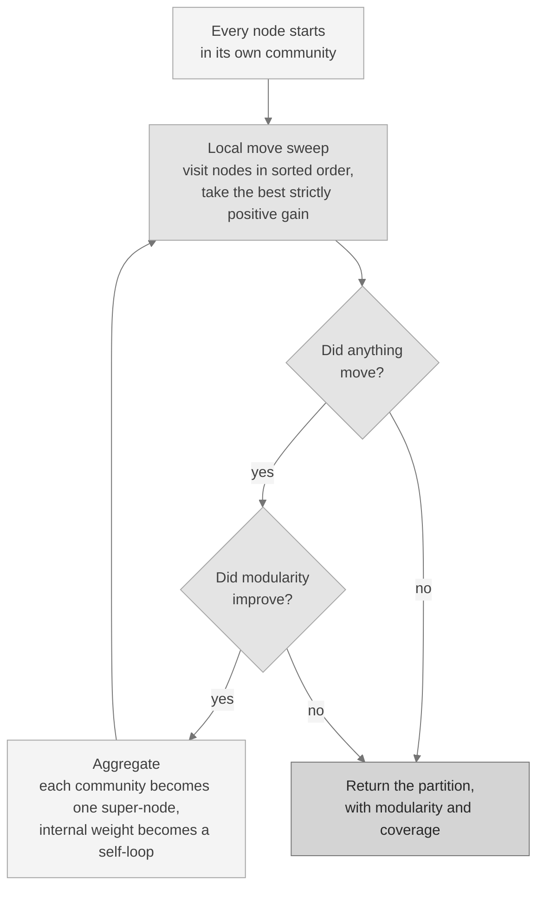
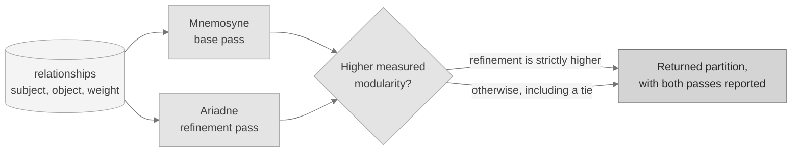

# Mnemosyne

**The base community detector.** Mnemosyne reads the graph's link structure and
groups entities that belong together, using no third-party library and no model.
It is this project's own implementation, written from scratch in pure Python,
and it is what makes the platform able to summarize a graph on a bare install
with nothing optional present.

Implementation: [`src/dkg/graph/community.py`](../src/dkg/graph/community.py).

---

## Part 1: in plain language

### The question it answers

You have a pile of connected things. Documents that cite each other, people who
appear in the same reports, functions that call each other. You can see the
connections, but nobody has written down the groups.

Mnemosyne finds the groups.

### A worked example anyone can follow

Imagine a large office where you have one piece of information and one only: a
log of who talks to whom, and how often. Nobody gives you the org chart. You
want to work out the departments.

Here is the reasoning Mnemosyne uses.

**Step one: a fair yardstick.** Suppose you simply grouped the ten chattiest
people together. Of course they talk to each other a lot, because they talk to
everyone a lot. That tells you nothing. So the yardstick is not "how much do
these people talk", it is **"how much more do these people talk to each other
than you would expect by chance, given how talkative each of them is"**.

That comparison is the whole idea. A quiet pair who only ever talk to each other
is far stronger evidence of a real team than a loud pair who talk to everybody.

**Step two: let everyone pick a group.** Start with every person in a group of
their own. Walk through the office one person at a time. For each person, look at
the groups their conversation partners are in, and move them to whichever group
improves the yardstick the most. If no move improves it, they stay where they
are. Repeat until nobody wants to move.

**Step three: zoom out and do it again.** Now treat each group you just found as
a single person. Two groups that talked a lot to each other become two people
who talk a lot to each other. Run the same process on this smaller office. Small
teams merge into departments; departments merge into divisions.

Stop when zooming out stops helping. What you are left with is a nesting of
groups discovered purely from who talked to whom.

### Why this is useful in the product

Once your files, media, and code are in one graph, the graph is usually too big
to look at. Mnemosyne turns it into a handful of clusters you can actually read:
these forty entities are one topic, those twenty are another. It is the
difference between a wall of connections and a map.

It also runs on nothing. No model, no download, no extra to install. On a fresh
install with zero optional components, this still works.

### What it is not

Groups are a reading of the link structure, not a statement of fact about
meaning. Two entities land together because of how they are connected, and
connection is not the same as being about the same thing. Treat the output as an
exploratory lens, and read the members before you rely on the grouping.

---

## Part 2: the technical description

### The problem

Given an undirected, weighted graph `G = (V, E, w)`, partition `V` into disjoint
communities so that edge weight concentrates inside communities and thins
between them. The number of communities is not known in advance and is not
supplied; it is an output.

### The objective: modularity

Mnemosyne optimises **modularity**, the standard published objective for this
problem. Modularity is not this project's invention and is not claimed as one.
It scores a partition by comparing the edge weight observed inside each
community against the weight a random graph with the same degree sequence would
put there.

For a partition `C` of a weighted undirected graph:

```
Q = SUM over communities c of [ ( SIGMA_in(c) / m ) - gamma * ( SIGMA_tot(c) / (2m) )^2 ]
```

where

| Symbol | Meaning |
|---|---|
| `m` | total edge weight in the graph, self-loops included |
| `SIGMA_in(c)` | total weight of edges with both endpoints inside community `c` |
| `SIGMA_tot(c)` | sum of the weighted degrees of the nodes in `c` |
| `gamma` | the resolution parameter |

The first term rewards weight kept inside a community. The second term is the
null model: it subtracts what you would expect from chance alone. That
subtraction is what stops the trivial answer of putting every node in one
community from winning.

`Q` is bounded above by 1. In practice a well-separated graph scores somewhere
between 0.3 and 0.9, and a graph with no real community structure scores near 0.

### Parameters

| Parameter | Default | Effect |
|---|---|---|
| `resolution` (`gamma`) | `1.0` | Scales the null-model term. Raising it penalises large communities harder, so you get more and smaller communities. Lowering it merges them. |
| `max_levels` | `50` | Upper bound on the number of zoom-out rounds. A safety bound, not a tuning knob; the loop normally stops on its own well before it. |

Both are inputs. Neither is fitted to any sample, and no constant in the
implementation is tuned to a particular graph.

### The algorithm

Two stages, alternating, repeated per level.



**Stage 1, the local move sweep.** Every node begins alone. Visit each node `i`
in sorted order. Remove `i` from its community, then for each neighbouring
community `c` compute

```
gain(c) = k_i_in(c) - gamma * SIGMA_tot(c) * k_i / (2m)
```

where `k_i_in(c)` is the weight from `i` into `c` and `k_i` is the weighted
degree of `i`. This quantity is the change in `Q` multiplied by the positive
constant `m`, so maximising it maximises `Q`. Place `i` in the community with
the largest gain. Staying put is evaluated on the same footing as moving, so a
node only moves on a strict improvement. Repeat the sweep until no node moves.

**Stage 2, aggregation.** Collapse each community into a single super-node. Edge
weight between two communities becomes the weight between two super-nodes; edge
weight inside a community becomes a self-loop, which preserves it exactly so the
totals at the next level stay correct. Then run stage 1 again on the smaller
graph.

Stop when a level produces no move, or when modularity fails to improve.
Finally, fold each level's labels back down to the original nodes and compact
them into stable community indices.

### Determinism

The same graph always gives the same partition, byte for byte. Three properties
deliver this together, and all three are needed:

1. Nodes are visited in sorted order, never in hash or insertion order.
2. A tie keeps the current community, so equal-scoring options cannot flip.
3. Only a strict improvement triggers a move, so a sweep cannot oscillate.

There is no random seed because there is no randomness.

### Complexity

Let `n` be the node count and `m` the edge count.

- A single local move sweep costs `O(m)`: each node examines its own incident
  edges, and the incident edges over all nodes sum to `2m`.
- A level runs sweeps until nothing moves. Each sweep that changes anything
  strictly increases `Q`, which is bounded, so a level terminates.
- Aggregation costs `O(m)` and produces a graph no larger than the one before.
  In practice each level shrinks the graph substantially.
- Levels are bounded by `max_levels`.

Overall the running time is near-linear in the number of edges on the graphs
this platform builds. Memory is `O(n + m)`.

The recorded latency on the structural sample below is **1.196 ms** for 80 nodes
and 176 edges.

### Using it

From the command line, over the entity graph in your project's `.dkg` home:

```bash
dkg community --detector mnemosyne
dkg community --detector mnemosyne --resolution 1.5
```

Every command prints JSON, so the partition is directly consumable.

From Python, over a bare node and edge list with no database involved:

```python
from dkg.graph.community import detect_communities

nodes = ["a", "b", "c", "d"]
edges = [("a", "b", 1.0), ("c", "d", 1.0), ("b", "c", 0.1)]
result = detect_communities(nodes, edges, resolution=1.0)

result["num_communities"]   # 2
result["modularity"]        # the score of the returned partition
result["coverage"]          # fraction of edge weight kept inside communities
result["assignment"]        # {"a": 0, "b": 0, "c": 1, "d": 1}
```

Over a database, returning per-community member lists with display names, read
only and largest community first:

```python
from dkg.graph.community import communities_from_db

communities_from_db(db, resolution=1.0)
```

Through the read-only assistant surface, the tools are `dkg.graph.community` and
`dkg.graph.community.split`.

### How it is measured

- **Harness.** [`scripts/community_quality.py`](../scripts/community_quality.py),
  run as part of the single seeded pass in
  [`scripts/benchmark.py`](../scripts/benchmark.py).
- **Seed.** `PYTHONHASHSEED=0`. The detector itself is deterministic, so the
  seed fixes the surrounding environment rather than the result.
- **Samples.** [`tests/graph/corpus/graph_corpus.json`](../tests/graph/corpus/graph_corpus.json),
  generated by a documented in-repo generator so the correct answer is known by
  construction rather than by judgement.
  - Structural sample: 80 nodes arranged as 16 cliques, 176 edges, 16 true
    groups.
  - Semantic sample: 40 entities across 5 topics, 80 edges, 5 true groups. Its
    link structure is symmetric between topics on purpose, so structure alone
    cannot separate them.
- **Metrics.** Modularity and coverage of the returned partition, the number of
  communities found, and the **Rand index** against the known truth. The Rand
  index scores every pair of nodes on whether the two partitions agree about
  keeping the pair together or apart, so 1.0 is exact agreement.
- **Artifact.** [`test-evidence/community_quality.json`](../test-evidence/community_quality.json).

### Measured results

Taken verbatim from the recorded artifact.

| Sample | Communities found | True groups | Modularity | Coverage | Rand index |
|---|---|---|---|---|---|
| Structural, 80 nodes in 16 cliques | 16 | 16 | 0.846591 | 0.909091 | **1.0** |
| Semantic, 40 entities in 5 topics | 4 | 5 | 0.5 | not recorded | **0.641** |

On the structural sample Mnemosyne recovers the true grouping exactly, and the
refinement detector [Ariadne](ARIADNE.md) ties with it at Rand 1.0.

On the semantic sample it scores 0.641. That is the honest and expected result:
the sample is built so that link structure alone cannot tell the topics apart,
and Mnemosyne reads nothing but link structure. Ariadne reaches 0.7641 there
because it can weight edges by meaning. Read both figures together, in
[`docs/BENCHMARKS.md`](BENCHMARKS.md).

---

## Part 3: its role in the running system

### Where it sits

Mnemosyne reads the shared `relationships` table and returns a grouping over the
shared `entities` table. It uses the `weight` column as the edge weight, which is
the edge confidence the extractors recorded, defaulting to 1.0 when absent. It
writes nothing. Both planes, documents and media on one side and source code on
the other, feed that one table, so a community can span a document and the code
it describes.



### The default path runs both detectors

`dkg community` defaults to `--detector both`. That runs a Mnemosyne base pass
and then an Ariadne refinement pass over the same graph, and returns one of them.

Selection is **by measured modularity, never by preference**:

```python
use_refined = refined_modularity > base_modularity
```

The comparison is strictly greater, so a tie keeps the base partition. The
result reports both passes, which pass was selected, and the reason in words, so
the choice is visible rather than implied.

Two consequences worth stating plainly.

**A tie keeps Mnemosyne.** On the structural sample both detectors reach
modularity 0.846591, so the base partition is returned. Both genuinely ran; the
refinement simply did not improve the score.

**Higher agreement with the truth does not win by itself.** On the semantic
sample Ariadne's partition agrees better with the known topics (Rand 0.7641
against 0.641), but scores lower modularity (0.42 against 0.5), so the default
path returns the Mnemosyne partition there. Modularity is the selection
criterion, and modularity is a structural score. When you want the semantic
reading on such a graph, ask for it directly with `dkg community --detector
ariadne`. This is described in full in [`docs/ARIADNE.md`](ARIADNE.md).

### Why the base pass exists at all

It keeps the core self-sufficient. Mnemosyne has no third-party dependency, so
community detection works on an install with no optional extra, no staged model,
and no network. The refinement pass is optional; when it is absent the base pass
is returned on its own and the result records why.

### Reading the output responsibly

Community indices are arbitrary labels produced independently on each run.
**Never compare a community index across two runs.** Compare which entities sit
together instead. Every result carries a note saying the grouping is structural
and advisory, because the edges underneath it are themselves over-approximate.

---

## Related

- [`docs/ARIADNE.md`](ARIADNE.md), the refinement detector that runs alongside this one.
- [`docs/BENCHMARKS.md`](BENCHMARKS.md), every measured number with its sample size and seed.
- [`docs/COMMANDS.md`](COMMANDS.md), the full command and tool reference.

## Licence

Mnemosyne is part of this repository and is covered by the same licence as
everything else in it: the D-Knowledge Graph Source-Available Non-Commercial
Licence. See [`LICENSE`](../LICENSE) and [`NOTICE`](../NOTICE). There is no
separately licensed component here.
